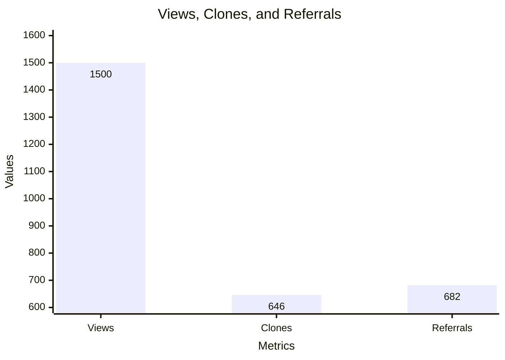
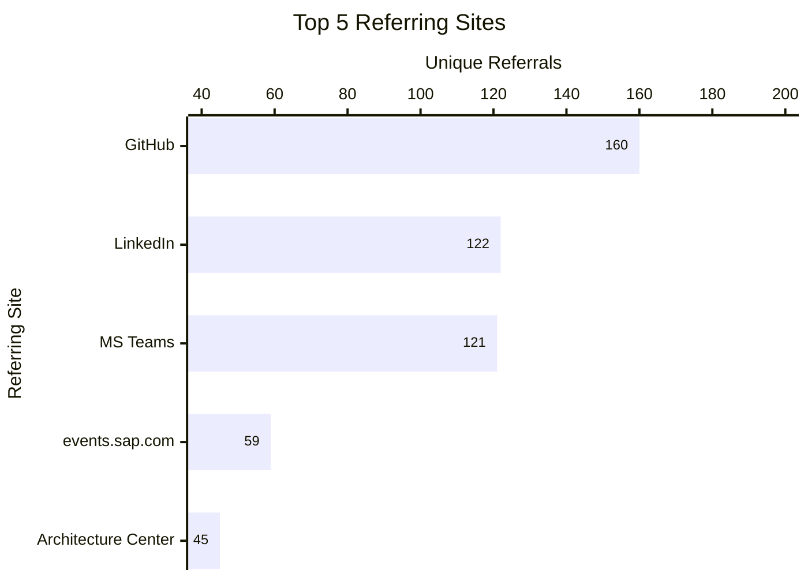

## What's New in the SAP Architecture Center

We're excited to share the latest updates and additions to the SAP Architecture Center since our last major release in Q2-2025! Our community has been hard at work expanding the collection of reference architectures and welcoming new contributors along the way. This will be a quarterly recurring post going forward, where we spotlight newly released, updated, or retired content, along with members of the SAP ecosystem who have made their first contribution to our repository. It's also our chance to share some insights about how people are finding our site and repository.

<!-- truncate -->

We hope you find this list useful and join us in thanking our contributors for their efforts in building the SAP Architecture Center together.

### New Reference Architectures

We've added several new top-level reference architectures to provide even more guidance and best practices for building robust solutions with SAP technologies. Here are the latest additions, from newest to oldest:

*   **[Extend Joule with Joule Studio](https://architecture.learning.sap.com/docs/ref-arch/06ff6062dc)** - Utilize AI capabilities with Joule Studio in SAP Build. Create custom Joule Skills and AI Agents for seamless integration across SAP and non-SAP systems, driving automation and innovation.

*   **[DevOps with SAP BTP](https://architecture.learning.sap.com/docs/ref-arch/1c5706feb5)** - Adopt agile DevOps principles on SAP BTP with cloud services and tools for streamlined application lifecycle management.

*   **[API Managed Integration](https://architecture.learning.sap.com/docs/ref-arch/309338f0eb)** - Enable secure, omni-channel API access to business apps with SAP Integration Suite, simplifying governance, security, and API consumption.

*   **[Application to Application Integration](https://architecture.learning.sap.com/docs/ref-arch/58f6d88e9a)** - Enable seamless App2App integration with SAP Integration Suite for near real-time transactional data exchange across internal processes.

*   **[Business to Business Integration](https://architecture.learning.sap.com/docs/ref-arch/61f6a1db63)** - Optimize B2B integration with SAP Integration Suite for secure, scalable electronic document exchange with trading partners.

*   **[SAP IAM integration with SAP Cloud Identity Services](https://architecture.learning.sap.com/docs/ref-arch/20c6b29b1e)** - Design authentication and role management flows for SAP SaaS with SAP Cloud Identity Services.

*   **[Integrate and Extend with SAP Build Process Automation](https://architecture.learning.sap.com/docs/ref-arch/99fd0564be)** - Automate processes with SAP Build Process Automation, integrating workflows across SAP and non-SAP systems.

*   **[Connect Business Applications with SAP Master Data Integration](https://architecture.learning.sap.com/docs/ref-arch/7adaecbbaf)** - Synchronize and manage business-critical data across SAP and third-party systems using SAP Master Data Integration.

*   **[Secure Service Consumption Across Hyperscalers](https://architecture.learning.sap.com/docs/ref-arch/7e558be8f1)** - This architecture outlines a cloud-agnostic approach for securely consuming services offered by hyperscalers from applications running outside their environments.

*   **[Business to Government Integration](https://architecture.learning.sap.com/docs/ref-arch/c5f6fe6cf1)** - Streamline compliance with SAP's Business-to-Government Integration for secure electronic document exchange.

*   **[Understanding Network Performance in a Multi Regional Solution](https://architecture.learning.sap.com/docs/ref-arch/0ec83f98fe)** - Optimize multi-regional cloud solutions with insights into network design, provider usage, and service placement for superior performance.

### Reference Architectures with New Content

We've also expanded existing reference architectures with new content, providing deeper insights and broader coverage on key topics:

*   **Generative AI on SAP BTP**
    *   **[Vibe Coding with Cline and SAP AI Core](https://architecture.learning.sap.com/docs/ref-arch/e5eb3b9b1d/10)**  - Learn how to set up and use Cline, an autonomous coding agent, with SAP AI Core to accelerate your development workflows.
    *   **[Agent2Agent Interoperability](https://architecture.learning.sap.com/docs/ref-arch/e5eb3b9b1d/8)** - Enable interoperability between AI agents with Agent2Agent protocol, fostering collaboration across enterprise landscapes.
    *   **[Partner Models](https://architecture.learning.sap.com/docs/ref-arch/e5eb3b9b1d/9)** - Benefit from partner models like the IBM Granite foundation model for the increasing demand of generative AI features in business scenarios with emphasis on data security, IP Protection and enterprise-grade governance and compliance.

### Welcoming New Contributors

We are thrilled to welcome new contributors who have joined our efforts to expand and enrich the SAP Architecture Center. Their expertise and dedication are invaluable to our community. A big thank you to:

*   [uklasing](https://github.com/uklasing)
*   [kshanth](https://github.com/kshanth)
*   [AjitKP91](https://github.com/AjitKP91)
*   [avikSap](https://github.com/avikSap)
*   [alperdedeoglu](https://github.com/alperdedeoglu)
*   [sapgunnar](https://github.com/sapgunnar)
*   [bzarske](https://github.com/bzarske)
*   [maria-kondratyeva](https://github.com/maria-kondratyeva)
*   [miguelmezamartinez](https://github.com/miguelmezamartinez)

### SAP Architecture Center - At a Glance

In the 3 months since we launched the SAP Architecture Center, we've seen a tremendous spike in traffic to our repository! Here are some quick figures on the popularity of the site and how people are findings us:

This equates to around 500 unique visitors per month, with around 200 of those cloning the repository! As for those referring sites, here is a breakdown of the 'Top 5' drivers of traffic:

While organic search on GitHub.com remains our number one source of referral traffic, posts on LinkedIn and direct links between colleagues on MS Teams continue to push people into the repository. Our recent [SAP Open Source Webinar](https://vods.dm.ux.sap.com/ospo-webinar-series/vods/start_your_architecture_journey_with_open_sourced_sap_architecture_center.mp4) also drove some traffic, alongside referrals from within our static website on https://architecture.learning.sap.com

Finally, here is a snapshot of the Top 5 Google queries that lead people to the SAP Architecture Center:

| Query | Clicks |
|-------|--------|
| sap architecture | 665 |
| sap reference architecture | 62 |
| project agent builder sap | 24 |
| sap a2a | 24 |
| sap ai architecture | 20 |

This shows that general searches for SAP architectures drive the majority of traffic but that people are also finding us by way of our latest content on the topic of Business AI and AI Agents.

We hope you enjoyed reading these details. Please join us in shaping the future of SAP architecture and [start contributing](/community/contribution) today!

