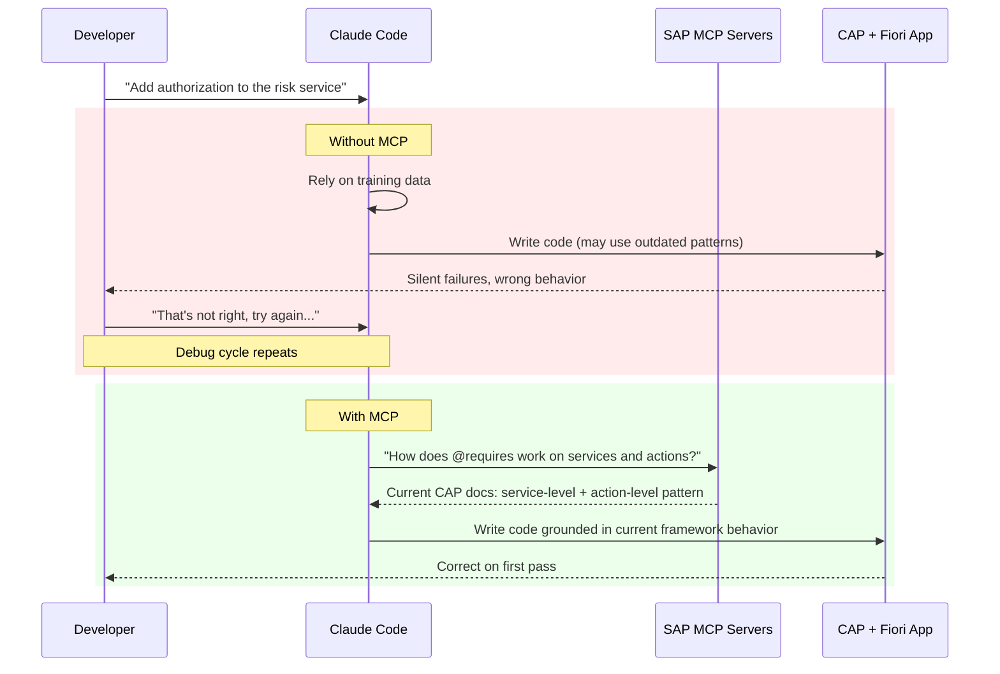
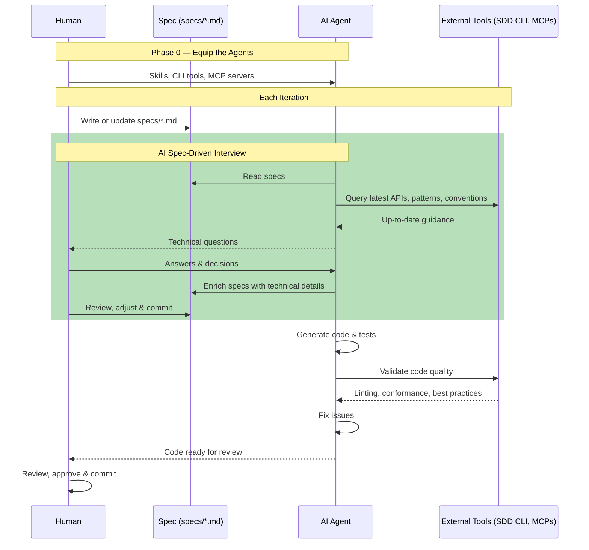

The prototype took less than thirty minutes — CAP backend, Fiori Elements frontend, OData endpoints, the whole Financial Risk Analyzer scaffolded by Claude Code and Opus 4.6. It compiled. It rendered. Then I opened it and got a blank page.

Several debugging rounds later the page showed up — but columns came up empty, buttons did nothing, and the risk data never reached the frontend. The root cause wasn't one bug. It was a pattern: deprecated annotations the runtime silently ignored, naming mismatches between the controller and what Fiori Elements actually looks for, and OData wiring that looked correct but had no execution path in V4.

Coding agents write code fast. But debugging after the fact was the most expensive way to use AI. Each fix cycle — wait for a new attempt, test again — turned enthusiasm into frustration. The answer isn't just writing code faster. What we found changed how we approach AI-assisted SAP development.

The project was a **Financial Risk Analyzer** — a CAP backend with a Fiori Elements frontend that reads GL transaction data, runs anomaly detection through SAP AI Core, and surfaces risk classifications in a List Report. Every code example in this post comes from building it. The full source is on [GitHub](<!-- TODO: add repo URL -->).


## The SAP MCP Servers Advantage

Frontier models aren't lacking intelligence. They're really good. But SDKs, APIs, tools, and frameworks evolve rapidly. New library versions ship constantly, yet these models are trained on specifications that become obsolete by the time they ship. They can't be trained at the speed that tools and frameworks evolve. The challenge becomes feeding the model with the right context — grounded in best practices and sources of truth that are up to date.

SAP MCP servers give the coding agent real-time access to domain expertise — not static documentation, but callable tools it consults while it works. Skills complement them with procedural knowledge: your team's deploy process, review checklist, CDS modeling conventions. 

For my SAP projects, three MCP servers made the biggest difference:

- **CAP MCP Server** — guides CDS entity modeling, service definitions, and backend patterns according to current CAP conventions
- **Fiori MCP Server** — ensures Fiori Elements applications follow SAP UX guidelines, annotation patterns, and page configurations
- **UI5 MCP Server** — provides UI5 Web Components guidance, control usage, and binding patterns

Once I equipped Claude Code with these servers, it stopped guessing at SAP conventions. It checked. The agent queried the CAP MCP server before defining an entity, consulted the Fiori MCP server before configuring a list report page, and validated control usage against the UI5 MCP server before writing a view.

### The Development Loop, Before and After

Here is how that improves the development loop:


We ran a two-pass review. First: Claude reviews the prototype using only its training knowledge. Second: we validate every recommendation against the three MCP servers.

### 27% of Recommendations Were Wrong

General knowledge produced 15 recommendations. Four were wrong:

| Recommendation | What MCP Said | Verdict |
|---|---|---|
| Rename `GLTransactions` to singular `GLTransaction` | CAP MCP: "Entities should be plural" | **Wrong.** Plural is correct per CDS convention. |
| Add KPI header facets to the List Report | Fiori MCP: KPI facets require the Analytical List Page floorplan | **Wrong.** Runtime error on a List Report. |
| Use `cuid` aspect for auto-generated keys | CAP MCP: composite keys are valid for ERP-sourced data | **Wrong.** Would break the data pipeline from source systems. |
| Refactor to Composition pattern | CAP MCP: flat entities are fine for read-heavy ML result tables | **Wrong.** Unnecessary complexity. |

A 27% error rate on architectural decisions from a frontier model. These aren't cosmetic — renaming an entity breaks every OData URL, KPI facets on the wrong floorplan crash at runtime, and `cuid` would force a restructure of the entire data ingestion from SAP.

### The Button That Did Nothing: Wiring Unbound Actions

The Analyze Risks button was the worst offender. The agent had wired it via a `UI.DataFieldForAction` CDS annotation pointing to an unbound action:

```cds
// ❌ Without MCP — DataFieldForAction for unbound action
annotate RiskService.GLTransactions with @(
  UI.LineItem: [
    // ... data field columns ...
    { $Type: 'UI.DataFieldForAction', Action: 'RiskService.analyzeRisks', Label: '{i18n>Analyze}' }
  ]
);
```

The button rendered in the toolbar. Looked correct. But clicking it — nothing. No network request, no error, completely silent. The Fiori MCP server flags this pattern: `UI.DataFieldForAction` with an unbound action has no execution path in OData V4. The runtime renders the button but never wires it. With MCP, the agent was guided to a manifest custom action instead:

```json
// ✅ With Fiori MCP — manifest custom action for unbound actions
"controlConfiguration": {
  "@com.sap.vocabularies.UI.v1.LineItem": {
    "actions": {
      "analyzeRisksAction": {
        "press": "risk.analysis.ext.controller.ListReportExt.analyzeRisks",
        "text": "{{AnalyzeRisks}}",
        "requiresSelection": false
      }
    }
  }
}
```

### Virtual Fields: The Performance Bug MCP Would Have Prevented

This one cost us real debugging time. The Fiori Elements list report loaded slowly and the browser console was full of errors:

```
Failed to drill-down into (...)/anomalyScoreResult, invalid segment: anomalyScoreResult
```
Hundreds of these, one per row per render cycle. The root cause: the `after('READ')` handler only set virtual fields when a cached prediction existed. Before the user clicks "Analyze," the cache is empty — so the handler left the fields unset:

```javascript
// ❌ Before — virtual fields missing from response when uncached
this.after('READ', 'GLTransactions', (results) => {
    for (const row of results) {
      const cached = riskCache.get(`${row.DocumentNumber}_${row.LineItem}`);
      if (cached) {
        row.riskClassification = cached.riskClassification;
        row.criticality        = cached.criticality;
        // ...
      }
      // No else — fields left undefined
    }
});
```

OData V4's `$select` included these fields because the annotations reference them. But the server omitted them from the response payload because they were `undefined`. The client then failed the property drill-down on every row, every read — producing both the console noise and measurable performance degradation.

The fix is one `else` branch:

```javascript
// ✅ With Fiori MCP — virtual fields always present in OData response
this.after('READ', 'GLTransactions', (results) => {
    for (const row of results) {
      const cached = riskCache.get(`${row.DocumentNumber}_${row.LineItem}`);
      row.riskClassification = cached ? cached.riskClassification : null;
      row.riskExplanation    = cached ? cached.riskExplanation    : null;
      row.anomalyScoreResult = cached ? cached.anomalyScoreResult : null;
      row.criticality        = cached ? cached.criticality        : 0;
    }
});
```

This is exactly the kind of bug that sits at the intersection of CAP virtual field semantics and OData V4 client behavior. General training knowledge does not cover it. An MCP-grounded agent that understands how CAP serializes virtual fields into OData responses would not leave them undefined.

### Criticality Values: One Number, Wrong Dashboard

Without Fiori MCP, the agent got the criticality mapping wrong:

```javascript
// ❌ Without MCP — agent guessed criticality values
const RISK_LABELS = {
  "Normal": {
    criticality: 0  // Agent assumed 0 = positive/green
  },
  "High_Amount_Deviation": { criticality: 1 },
  "New_Combination": { criticality: 2 }
};
```

The Fiori MCP server returned the actual OData V4 vocabulary values — `0` means Neutral (grey), `3` means Positive (green). One number, but it determines whether your risk dashboard communicates anything at all:

```javascript
// ✅ With Fiori MCP — grounded in OData V4 vocabulary
const RISK_LABELS = {
  "Normal": {
    criticality: 3  // 3 = Positive/green per OData spec
  },
  "High_Amount_Deviation": { criticality: 1 },
  "New_Combination": { criticality: 2 }
};
```

### CDS Enum Types and Naming Conventions

But the CAP MCP server went further than just correcting the value. It confirmed that CDS enum types are the right pattern for fields with a fixed set of valid states — and flagged a detail you won't find in most training data: **Integer enums require explicit values.** Omit them and the CDS compiler errors out:

```cds
// ❌ Without MCP — raw types, no documentation, no compiler safety
virtual riskClassification : String;
virtual criticality        : Integer;

// ✅ With CAP MCP — enum types with explicit values
type Criticality : Integer enum {
  Neutral  = 0;
  Negative = 1;  // red
  Critical = 2;  // orange
  Positive = 3;  // green
};

type RiskClassification : String enum {
  Normal          = 'Normal';
  UnusualAmount   = 'Unusual Amount';
  HighAmountNew   = 'High Amount + New Pattern';
  // ... 10 more classifications
};

virtual riskClassification : RiskClassification;
virtual criticality        : Criticality;
```

The enum is the source of truth — not a comment, not a wiki page, not tribal knowledge.

Naming conventions were another quiet catch. The 24 ML feature columns came from the Python model using `snake_case` — `anomaly_score`, `peer_amount_stddev`, `posting_delay_days`. But every CDS example the CAP MCP server returned used `camelCase`. That's not a style preference — it's how Fiori Elements generates labels. Rename `anomaly_score` to `anomalyScore` and the table header reads "Anomaly Score" automatically. Keep `snake_case` and you ship a professional risk dashboard with column headers like `anomaly_score`.

### Beyond MCP: Playwright and the Filter Bar

Code that compiles isn't code that works. **Playwright MCP** gave the agent eyes on the running application. Without browser access, the coding agent couldn't catch blank pages or broken wiring — I'd open the app, see the failure, paste the error back, and repeat. With Playwright, the agent launched a headless browser, took screenshots, and iterated without waiting for me. That's the concrete mechanism behind agentic engineering: coding agents that create, test, iterate, and debug *independently*.

One of the first things Playwright caught was a usability problem no linter would flag. Twenty-four fields in the filter bar. My Financial Risk Analyzer has 24 ML feature columns — `anomalyScore`, `peerAmountStddev`, `postingDelayDays` — and every single one showed up as a filter option. Nobody filters risk transactions by `peerAmountStddev`. The Fiori MCP server pointed to `@UI.HiddenFilter`:

```cds
// ❌ Without Fiori MCP — feature columns clutter the filter bar (28 fields)
anomalyScore @title: '{i18n>feat_anomalyScore}' @UI.Importance: #Low;

// ✅ With Fiori MCP — hidden from filters, still available in table personalization
anomalyScore @title: '{i18n>feat_anomalyScore}' @UI.Importance: #Low @UI.HiddenFilter;
```

For date and amount fields, Fiori MCP pointed to `Capabilities.FilterRestrictions` — not something you'll find in a typical CAP tutorial:

```cds
// ✅ Fiori MCP: 'SingleRange' enables date/amount range pickers
annotate RiskService.GLTransactions with @(
  Capabilities.FilterRestrictions: {
    FilterExpressionRestrictions: [
      { Property: PostingDate, AllowedExpressions: 'SingleRange' },
      { Property: Amount,      AllowedExpressions: 'SingleRange' }
    ]
  }
);
```

Four focused filter fields with proper range sliders instead of twenty-four. That's the line between a demo and a tool someone uses daily.

MCP servers, skills, and project instructions make this work. Here's how they fit together.

## How to Equip Your Agent to Get It Right

In practice, four configuration layers work together:

```json
// .claude/settings.json — MCP server configuration
{
  "mcpServers": {
    "cap": { "command": "npx", "args": ["@cap-js/mcp-server"] },
    "fiori": { "command": "npx", "args": ["@sap-ux/fiori-mcp-server"] },
    "ui5": { "command": "npx", "args": ["@ui5/mcp-server"] },
    "playwright": { "command": "npx", "args": ["@anthropic-ai/playwright-mcp", "--headless"] }
  }
}
```

```markdown
# CLAUDE.md — SAP project instructions

## Query SAP MCP Servers to write and validate code.
Before writing, modifying, or debugging any SAP-specific code,
query the relevant MCP server first. Trust MCP over your training knowledge.

| Working on...                          | Query this MCP server         |
|----------------------------------------|-------------------------------|
| CDS entities, types, services          | CAP (`@cap-js/mcp-server`)    |
| CDS annotations (`@UI`, `@Common`)     | Fiori (`@sap-ux/fiori-mcp-server`) |
| SAPUI5 controllers, XML views          | UI5 (`@ui5/mcp-server`)       |
```

CLAUDE.md provides *context* — the coding standards the agent should follow. But context alone doesn't guarantee the agent will query MCP servers before writing code. That's what skills do. A skill activates automatically when the agent encounters specific file types and tells it which MCP server to consult. I started with a single umbrella skill that had a routing table mapping tasks to servers. It worked — until the agent edited an annotation file (`app/risks/annotations.cds`) and queried the CAP server instead of the Fiori server. Both matched `.cds` files, and the description mentioned CAP first. The routing table was just text inside the skill body, not part of the activation mechanism.

Splitting into one skill per MCP server made activation deterministic. The path patterns do the routing — `app/**/*.cds` triggers the Fiori skill, `db/**/*.cds` triggers the CAP skill:

```markdown
# .claude/skills/sap-cap/SKILL.md
---
name: sap-cap
description: Query @cap-js/mcp-server for CDS entities, types, services, and backend handlers.
paths: ["**/db/**/*.cds", "**/srv/**/*.cds", "**/srv/**/*.js"]
---

# .claude/skills/sap-fiori/SKILL.md
---
name: sap-fiori
description: Query @sap-ux/fiori-mcp-server for CDS annotations, Fiori Elements config, and manifest.json.
paths: ["**/app/**/*.cds", "**/app/**/manifest.json"]
---

# .claude/skills/sap-ui5/SKILL.md
---
name: sap-ui5
description: Query @ui5/mcp-server for SAPUI5 controllers, XML views, and control APIs.
paths: ["**/app/**/*.xml", "**/app/**/ext/**/*.js", "**/app/**/ext/**/*.ts"]
---
```

Each skill also carries procedural knowledge specific to its domain — the Fiori skill includes Fiori Elements app rules (List Report/ObjectPage patterns, UUID keys, no screen personalization), the UI5 skill carries code standards (`sap.ui.define`, async loading, no deprecated APIs). Without the skill, the agent has the tools but no prompt to use them. Without settings, there's nothing to use. Without CLAUDE.md, there are no standards to follow. Each layer is insufficient on its own.

**A note on trust:** MCP servers execute with your local privileges: filesystem access, shell commands, network calls. A compromised or malicious server can exfiltrate code, inject backdoors, or leak credentials silently. Only adopt MCP servers that have been verified from a security standpoint. Claude Code's permission system lets you scope what each server can do — per-tool allow/deny lists, trust prompts on new servers, writes scoped to the launch directory — but the first line of defense is only installing servers you trust.

Keep your CLAUDE.md short — under 200 lines — and specific. Reference other markdown files there. Claude won't need them all, but they're available when relevant.

Correct SAP patterns aren't enough if the architecture is wrong.

## Beyond Correctness: Architecture Principles

I reviewed the working Financial Risk Analyzer — the one MCP had gotten right on the first pass — and found an unscoped OData endpoint and no input validation. The SAP patterns were correct but security was missing. And security was just the first gap. Performance efficiency, reliability, scalability — the principles you apply before designing any enterprise solution weren't considered for the generated code.

I needed a system design methodology. Traditionally, I'd write the technical specification with a certain level of detail. Even documenting just the important parts would take time. That led me to **GSD (Get Shit Done)**, a spec-driven development framework for Claude Code.

Before I let the agent produce any code, GSD interviewed me about each architecture principle — security posture, performance budgets, reliability expectations, scalability constraints. But only after I grounded it on my architectural principles from the SAP Architecture Center. Those were the questions I'd ask as an architect before designing any solution, but now the agent was asking them. My answers became a technical specification grounded in the same enterprise principles that the [SAP Architecture Center](https://architecture.sap.com) codifies as reference architectures.

The difference was immediate. With a spec shaped by architecture principles, the agent didn't just write correct SAP code — it wrote code that reflected the non-functional requirements an enterprise application actually needs. Every session inherited that spec. No context rot. No re-explaining the same constraints.

The agent built a working Risk Service — correct CDS entity, proper annotations, functional action handler. But it shipped without any authorization:

```cds
// ❌ Without architecture principles — wide open
service RiskService {
  entity GLTransactions as projection on risk.GLTransactions;
  action analyzeRisks() returns array of GLTransactions;
}
```

Every authenticated user could trigger AI Core inference. The CAP MCP server confirmed the two-level pattern: service-level access control plus action-level role restriction. That's not something you discover from CDS syntax guides — it comes from thinking about who should access what:

```cds
// ✅ With CAP MCP — service + action level authorization
service RiskService @(requires: 'authenticated-user') {
  @readonly
  entity GLTransactions as projection on risk.GLTransactions;

  @(requires: 'RiskAnalyst')
  action analyzeRisks() returns array of GLTransactions;
}
```

`authenticated-user` locks down the OData endpoint. `RiskAnalyst` restricts the expensive AI Core call to users who actually need it. The MCP server didn't invent the security requirement — the architecture spec did. MCP made sure the implementation followed current CAP conventions.

Whether GSD's interview process scales to a ten-person team or becomes a bottleneck — I don't know yet. For a solo architect driving an agent, it works. For a team of architects each with their own agents and their own specs, I'm watching.

## Secure the Code Your Agent Writes. It Won't Do It for You.

Even after equipping your agent, **always assume code is untrusted**. MCP servers teach convention. GSD captures the spec. But neither guarantees the generated code is hardened. Apply the same rigor you'd apply to human-written code — input validation, authorization checks, secrets management, OWASP top-10. Security hardening like CORS, CSP headers, and OData authorization scoping remains your responsibility. When a breach happens, the escalation lands on you, not your agent.

I was preparing the prototype for publication when an internal security scan flagged 53 dependency vulnerabilities. The agent had scaffolded the project with older versions of the libraries instead of pulling `@latest`, and those older versions carried vulnerable dependencies underneath. The application code was correct, every test passed — but the foundation was exposed.

The spec never told the agent to use `@latest` or run `npm audit` after scaffolding. Security starts in the spec — install dependencies at their latest versions, audit what's underneath, and make that a gate before any application code is written.

That covers what the agent produces. What about what you feed it? Anything it reads becomes model context — including files you didn't intend to share. List `.env`, `default-env.json`, and service keys in `.claudeignore` to keep them out of the agent's view. Only expose data the agent needs. Never enter personal or customer data into prompts.

## Protect What Your Agent Sends

When the coding agent sends code to a model provider, it carries business logic and intellectual property. I need a contractual guarantee that none of it gets used for training or sold to a third party. Going direct to model providers doesn't give me that through a single agreement. Running through SAP's **Gen AI Hub** does — SAP's agreements with providers ensure your data stays yours.

That same infrastructure solves a second problem. Agentic workflows benefit from multiple frontier models — strengths vary by task, and a second opinion from a different model is a real advantage. **LiteLLM** gives me a single gateway into Gen AI Hub: one integration point, one SAP API key, every frontier model available immediately, at volume pricing SAP negotiates with hyperscalers. Behind that gateway, Gen AI Hub handles content filters and PII masking on every request — guardrails I'd otherwise have built myself.

```yaml
# litellm_config.yaml — single gateway to SAP Gen AI Hub
model_list:
  - model_name: claude-sonnet
    litellm_params:
      model: sap_ai_core/anthropic--claude-4.6-sonnet
  - model_name: claude-opus
    litellm_params:
      model: sap_ai_core/anthropic--claude-4.6-opus
```

The full-stack picture: **Fiori** on the frontend, **CAP** on the backend, **Gen AI Hub** for intelligent services, **BTP** for runtime and backing services like Destination and HANA Cloud. The coding agent works across this entire stack, guided at every layer by SAP-specific tooling.

## What This Means For Your Team

The prototypes made one thing clear: agents write code fast, but they're working from training data that's already stale. SDKs, APIs spec change. The code written by AI compiles, but breaks at runtime — and AI can't fix them easily without several iterations leading to an enormous waste of time and effort.

SAP's extension ecosystem has always been powerful, and it has always demanded deep professional knowledge to get right. That knowledge barrier is real. It is why SAP projects take months and why extension backlogs grow faster than teams can deliver.

MCP servers do not eliminate that barrier. They democratize access to it. The servers encode the same best practices that senior SAP architects carry — CDS conventions, annotation semantics, authorization patterns, controller extension boundaries. An agent equipped with these servers reflects that expertise, even when the developer driving the session is building their first Fiori app.

Here's what that workflow looks like end to end:


 Your SAP investment already includes the platform. The question is whether you equip your agents to use it.

## References

**SAP MCP Servers**
- [CAP MCP Server](https://community.sap.com/t5/technology-blog-posts-by-sap/boost-your-cap-development-with-ai-introducing-the-mcp-server-for-cap/ba-p/14202849) — MCP server for SAP Cloud Application Programming Model (CAP) development
- [Fiori MCP Server](https://community.sap.com/t5/technology-blog-posts-by-sap/sap-fiori-tools-update-first-release-of-the-sap-fiori-mcp-server-for/ba-p/14204694) — Helps AI models create and modify SAP Fiori applications
- [UI5 MCP Server](https://community.sap.com/t5/technology-blog-posts-by-sap/give-your-ai-agent-some-tools-introducing-the-ui5-mcp-server/ba-p/14200825) — UI5 Web Components development assistance

**Agentic Engineering & Spec-Driven Development**
- [GSD (Get Shit Done)](https://github.com/gsd-build/get-shit-done) — Meta-prompting, context engineering, and spec-driven development system for coding agents
- [OpenSpec](https://github.com/Fission-AI/OpenSpec) — Spec-driven development tool that adds a lightweight specification layer before code is written

**Developer Tooling MCP Servers**
- [Playwright MCP](https://github.com/anthropics/anthropic-quickstarts/tree/main/playwright-mcp) — Headless browser automation for coding agents — navigate, screenshot, and verify UI

**SAP Platform**
- [LiteLLM SAP Provider](https://docs.litellm.ai/docs/providers/sap) — Gateway to SAP AI Foundation via Gen AI Hub
- [Claude Code Documentation](https://code.claude.com/docs) — Official Claude Code docs, skills, MCP, and quickstart guides