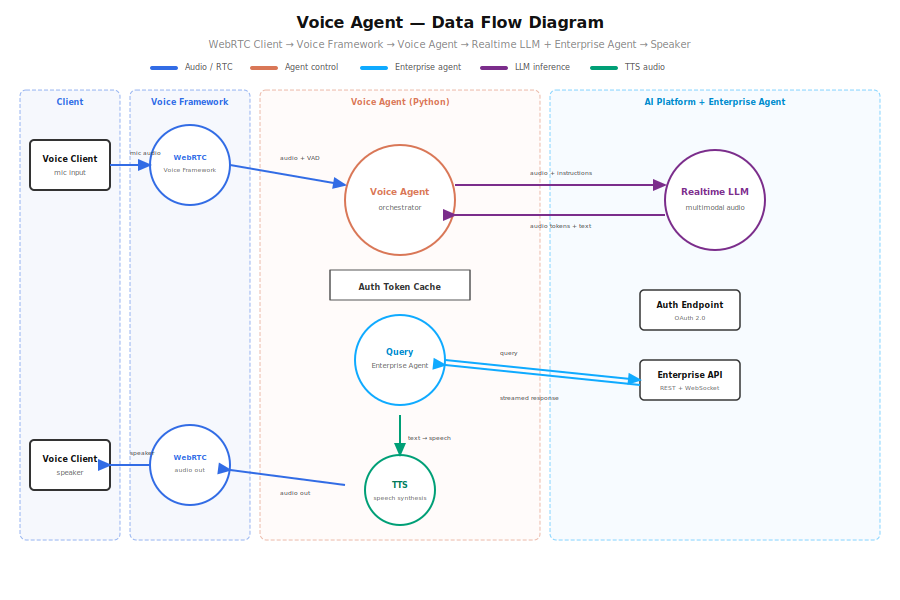
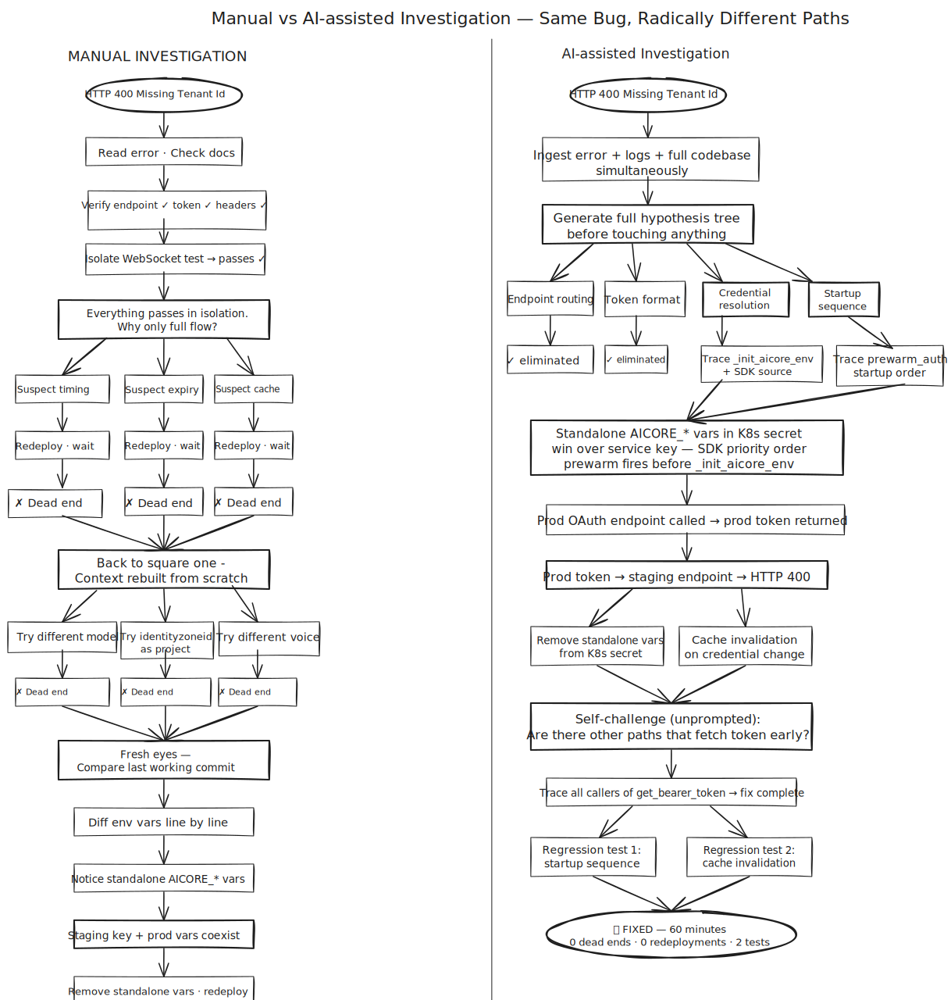
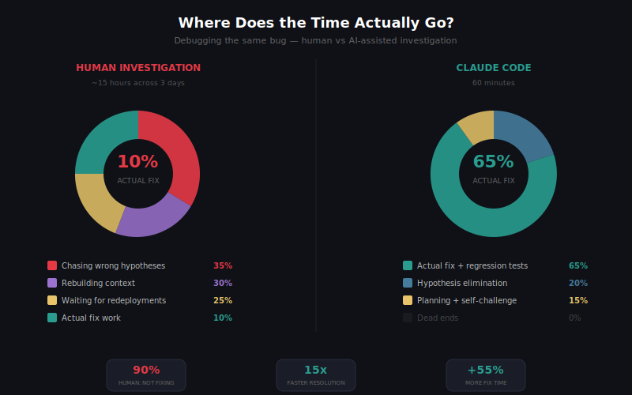
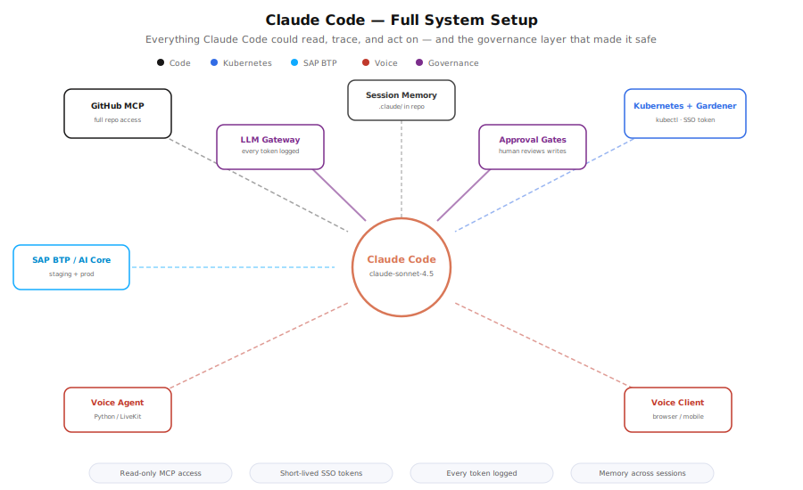

## What happens when you let Claude Code run the full debugging loop

**TL;DR:** Intermittent HTTP 400, full agent flow only, every isolated test passing. Root cause: two conflicting sets of SAP AI Core credentials coexisting silently in the same Kubernetes secret - standalone production vars that the SDK prioritised over the staging service key, causing every token request to fetch from the wrong OAuth endpoint. The agent connected to staging with a production token. SAP's proxy rejected it: tenant not found. We were stuck. Nothing pointed anywhere obvious. A team of 2–3 engineers would have spent 12–15 hours total on this. Claude Code did it in 60 minutes, on claude-sonnet-4.5, averaging ~20 tokens of human input per turn.

<!-- truncate -->

The prompt that unlocked it:

> "I have a bug that only reproduces in the full system flow. Here is the error and the logs. Read the code end-to-end, correlate log timestamps across all components, trace the full execution path from startup through the failure point. Use process of elimination - what do the logs rule out, what does the code rule out, what remains. Generate tests that reproduce the failure condition, not just unit tests for individual functions, but tests that exercise the sequence and state that leads to the bug."

### What We Were Dealing With



WebRTC based voice agent on Kubernetes, connected to SAP AI Core to reach a Speech to Speech model. Every staging deployment failing with HTTP 400: server rejected WebSocket connection. Live environment fine. Every isolated test passed. Direct WebSocket, raw SDK connect, synthetic session - all worked. Endpoint, headers, token format - all correct. The failure only appeared in the full agent flow, and only sometimes. The kind of intermittent bug where you can't even confirm it's real without spending half a day first. We tried everything we could think of. Nothing pointed anywhere obvious. That's when we handed it to Claude Code - not with a neat hypothesis, just the error, the logs, and "figure it out."

### The Scale Problem

The codebase spans multiple modules. Startup touches auth, plugin initialization, session construction, and model factory - each in a different file. Kubernetes adds environment variable injection from secrets, adding ordering sensitivity on top. The logs aren't a single file. They're timestamped output from the agent worker, WebRTC room, WebSocket handshake, and OAuth exchange - all interleaved. The signal was matching a WebSocket rejection at T+8s to a token fetch at T+0.2s during prewarm. Across multiple streams. Manually. Not hard to reason about - hard to hold all at once. Thousands of lines of code, megabytes of logs, a bug that only fires under a specific sequence.

### What Claude Code Found



The Kubernetes secret had been populated with two overlapping sets of AI Core credentials:

1. `AICORE_SERVICE_KEY` - the staging service key JSON (correct, for the STS model Live staging endpoint)
2. `AICORE_AUTH_URL`, `AICORE_BASE_URL`, `AICORE_CLIENT_ID`, `AICORE_CLIENT_SECRET` - standalone production credentials from a different service, left in by mistake

The SAP AI SDK's credential resolution priority: when individual `AICORE_*` vars are present in the environment, the SDK uses them directly and does not parse the service key JSON at all. The standalone vars pointed to SAP's production AI Core. The SDK fetched a production OAuth token. That token was then sent to the staging STS model endpoint. SAP's staging proxy decoded the JWT, found a tenant it didn't recognise, and returned:

```
HTTP 400 Bad Request
{"error": "Missing Tenant Id"}
```

The error was perfectly accurate. It just didn't name the cause.

What made this so hard to find: the conflict was invisible at the code level. `_init_aicore_env(service_key)` looked correct. But the SDK reads environment variables at token-fetch time, not at parse time. In the full agent flow, `prewarm_auth()` fires early during pod startup before model initialisation. The K8s secret injects all vars simultaneously at pod start. Isolated tests called setup directly and never triggered prewarm - the bug lived entirely in the gap between how tests run and how the agent actually starts in the cluster.

**The fix:** remove the conflicting standalone vars from the secret entirely. Keep only `AICORE_SERVICE_KEY` and `AICORE_RESOURCE_GROUP` - everything else is derived at runtime. Plus a defence-in-depth change to `_init_aicore_env` to detect credential changes and invalidate the token cache before overwriting env vars, so even if both paths are ever present again a credential switch forces a fresh token.

Then without being asked - Claude Code argued against its own fix. "Are there other code paths that could fetch a token before `_init_aicore_env` runs?" Traced the callers, confirmed `prewarm_auth()` now correctly initialises from the service key before fetching, wrote two regression tests that reproduce the exact startup sequence that triggers the conflict.

### The Numbers



- **617K output tokens** - code written, hypotheses reasoned, tests generated
- **166K token peak context** - codebase, logs, SDK source, all held simultaneously at peak
- **54K input tokens** - everything the human typed, entire session, ~20 tokens per turn
- **12–15 hours → 60 minutes**

Twenty tokens of human input per turn driving 617K tokens of reasoning and fixing.

One more thing: this ran across multiple days. Claude Code's automatic context compaction summarized earlier history as the session grew, keeping the window within limits without losing conclusions. Without it, a multi-day investigation stalls. With it, the session just keeps going.

### Governance First

Claude Code was routed through an internal LLM gateway. Every token in, every token out, every model call logged, attributed, and visible centrally. No API keys scattered across laptops. No blind spots on spend. No model version drift across teams. For enterprise environments, the ability to answer "what did our AI tooling do last month, who used it" without scraping individual machines is non-negotiable.

On top of that:

- **Short-lived SSO credentials** for cluster access - rotated per session, same permissions as the engineer's terminal
- **Explicit approval gates** for every write - nothing touched the cluster without a human reviewing first
- **Read-only MCP access** for logs and code - observe everything, change nothing without approval

The governance layer isn't friction. It's what makes it safe to give the AI real access to real systems in the first place. Get that right first. Then give it access. In that order.

### The Setup



**GitHub MCP server** - full repo read access. Claude Code traced imports, followed call chains, read any file without being handed anything manually.

**Kubernetes context** - kubectl from the shell session, short-lived SSO token from our Gardener cluster, same permissions as the engineer's terminal. Every write operation required explicit approval. Reads ran uninterrupted.

We run on Gardener - SAP's opinionated Kubernetes distribution with its own concepts (shoot clusters, seed clusters, gardenlets). Claude Code doesn't know Gardener out of the box. We dropped a documentation link into the session. It read it and reasoned correctly from there. General rule: if your infrastructure deviates from vanilla, hand it the docs.

**Memory on by default** via `.claude/` in the repo root. Findings carried across sessions - no re-running tests already run, no re-reading files already understood.

### What Actually Made It Work

**The plan came first.** Before any code was written or command run, Claude Code produced a plan - hypotheses, layers to eliminate, sequence to follow. We reviewed it and pushed back on assumptions that didn't match how the system actually behaves at runtime. That review was the highest-leverage moment in the session. A wrong plan executed fast still produces the wrong result. A few minutes challenging the plan saved hours of misdirected work.

**We kept correcting it mid-investigation.** Claude Code made assumptions about startup sequence, which environment variables were authoritative, what test results implied. Several were wrong. Saying "that's not how this works" changed direction immediately. It doesn't defend wrong assumptions - it incorporates corrections and re-traces. Human operational knowledge combined with AI tracing is what got there in 60 minutes. Neither alone would have.

**We gave it operational context, not just code.** Claude Code reads code structure. It can't know runtime behavior - deployment order, environment injection timing, what actually happens when the pod starts. Telling it "this variable comes from the K8s secret, not the code" cut entire categories of wrong hypotheses before they started. Think of it as onboarding a very fast engineer who has read all the code but never run the system.

**No context-switching penalty.** This is the real reason it's fast. A human loses the mental model a little every time they switch between files, log streams, and components. Rebuilding it costs minutes each time and compounds over hours. Claude Code held the full startup sequence, token cache state, log timestamps, and test results in context simultaneously for the entire session. It wasn't faster because it worked in parallel. It was faster because it never lost the thread.

### Try It

If you have a bug that only shows up in the full system flow - give Claude Code the error, the logs, and codebase access together, not sequentially. Ask it to correlate timestamps, trace from startup to failure, use process of elimination.

Tell it to generate tests that reproduce the failure condition, not just unit tests for individual functions.

Review the plan it produces before you let it run. Push back on anything that doesn't match how your system behaves at runtime. Give it the operational context it can't get from reading code alone - deployment sequence, environment assumptions, how you actually test things.

Set up MCP access. Use short-lived credentials. Gate writes behind approval. Enable memory. Hand it docs for anything non-vanilla.

Then watch it curl through logs, write and validate tests and re-direct it when needed (i.e. provide more context) while sipping your coffee….
