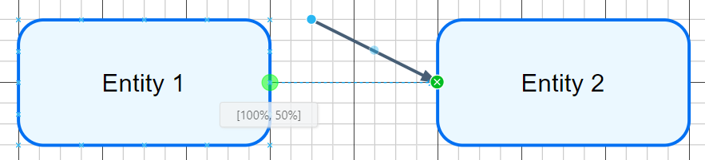
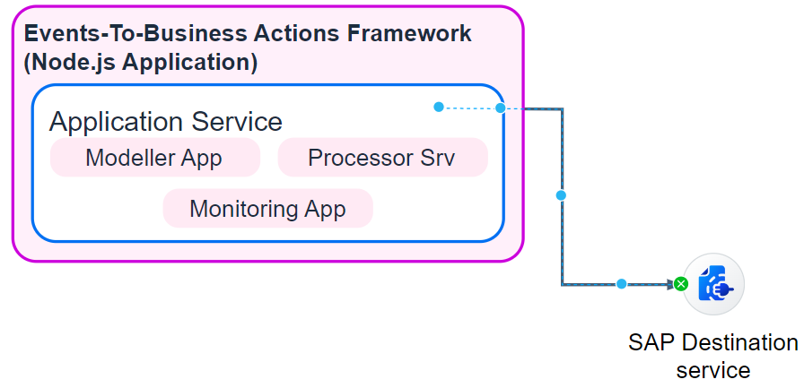

**Users should first read and follow the official [SAP Solution Diagram Guidelines](https://sap.github.io/btp-solution-diagrams/docs/solution_diagr_intro/big_picture/)**, which define the standardized visual language, iconography, and layout conventions used for representing SAP solution architectures. Following these guidelines helps ensure diagrams are consistent, clear, and easier for others to interpret.

Because the Architecture Validator analyzes the **draw.io XML structure** (not just the visual layout), a set of **additional modeling guidelines** is provided to ensure diagrams can be interpreted and validated accurately.

## Guidelines

As the validator works on the underlying Draw.io XML structure, it is important that diagrams are modeled not only for visual clarity but also so that **logical connections** between components are accurately represented in the XML.

While some heuristics marked with ✅ can compensate for diagrams that do not fully follow the recommended modeling practices, it is still strongly advised to adhere to the guidelines. Heuristics cannot reliably cover all edge cases, and deviations may result in **missing information** or **inaccurate validation results**. Guidelines that currently lack sufficient heuristic support are marked with a ❌.

### ✅ Connectors

The most critical guideline is to ensure that entities are **logically connected using proper connectors**. A connector must snap to the target entity so that the relationship remains intact even if the diagram is rearranged. This is done by dragging the connector endpoint to a **snap point** on the entity until the connector highlights in green. To verify the connection, move either the source or target entity—if the connector remains attached, the connection is valid.

The following examples illustrate common issues observed in diagrams. In the first case, the connector pointing to **"Secrets Manager"** does not originate from a valid source entity; instead, it attaches to an intermediate point on another connector leading to **"Amazon Rekognition PPE Detection"**.

This becomes clearer when the connector to **"Amazon Rekognition PPE Detection"** is removed.

Another example shows a connector that does not attach to any source entity at all. While heuristics exist to infer the intended connection, these mechanisms operate within defined distance thresholds. In this case, the connector exceeds that threshold, so **proper modeling is required** to avoid misinterpretation.

### ✅ Text Fields / Annotated Text 

Text in Draw.io can be added in several ways, and it plays a significant role during validation because it conveys key information about the components and services in an architecture.

The most reliable approach is to **add text directly to an entity by double-clicking the entity**. This ensures clear association between the text and the component during validation.

Where this is not feasible, a text field may be placed **inside a shape**. In such cases, both the text and the text field boundaries must be fully contained within the shape. Otherwise, the validator may not correctly detect the associated text.

If adding text directly to an icon is not appropriate, a text field may instead be placed **immediately below the icon**. This relationship is inferred through a heuristic; however, as with any heuristic, it may not work in all scenarios. To improve detection, ensure that the **center of the text field’s top edge aligns closely with the center of the icon’s bottom edge**.

### ✅ Legend / Additional Text

If a legend is included in the architecture, all legend elements must be placed within a container that includes the text **"Legend"**. This is necessary because the validator currently **ignores any objects located outside the main architecture area**.

For descriptive or explanatory text placed inside the architecture, ensure there is **at least 50 pixels of spacing** between the text and the actual architecture so that it can also be excluded during validation.

### ❌ Layering

Layering two identical icons on top of each other is currently not being handled.

###  ✅ Grouping

Grouping multiple entities into a single draggable object is a common modeling practice. However, this introduces challenges during extraction, as the coordinates of child elements become **relative to the group**, requiring adjustments before further processing. Although a heuristic exists to handle grouped structures, it is recommended to **avoid grouping** or remove groups before running validation. Testing has shown that grouping can create numerous edge cases, particularly when combined with other guideline deviations.

**While the extraction process continues to improve, the most reliable validation results are achieved when the guidelines above are followed. This includes using proper connector links, annotating text by double-clicking directly on entities, and avoiding grouping.**
