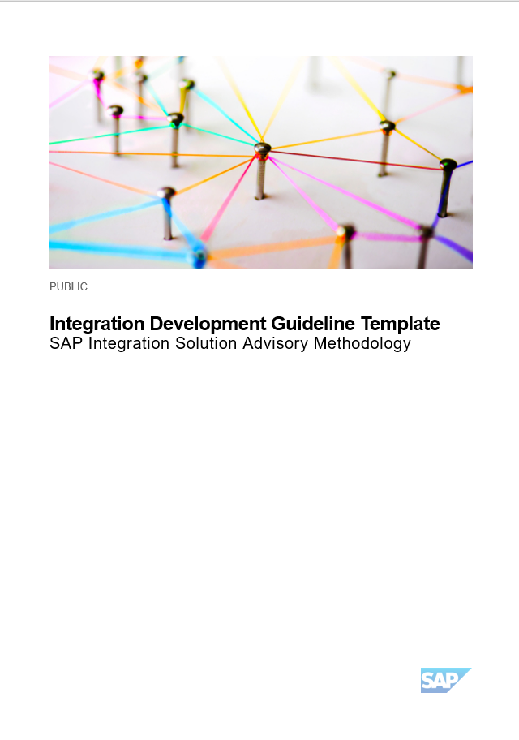

<!-- loio2442284884a04489854908d48707f85a -->

# Create Tailored Development Guidelines

Provide integration developers detailed guidance by creating development guidelines for integration technologies.

***

<a name="loio2442284884a04489854908d48707f85a__section_qfk_tqq_swb"/>

## Context

Integration development guidelines \(often also called integration handbooks, integration best practices, or similar\) are a common means for sharing integration best practices across distributed integration development teams. The objective of such guidelines is to ensure that integration flows are being designed and implemented in a robust fashion to safeguard your company's mission-critical business processes. Implementation guidelines address both technical and organizational aspects of integration developments. Examples of the latter one are for instance naming conventions for developed integration artifacts, processes for integration governance, and quality assurance.

An implementation guideline should cover the following best practices:

|Topic|Examples|
|-----|--------|
|Design of integration scenarios|-   Definition of reusable building blocks, such as enterprise integration patterns
-   Naming conventions for integration artifacts
-   Documentation of integration scenarios

|
|Integration qualities|-   Designing reliable, resilient, secure, well performing integration scenarios

|
|Back-end configuration|-   Integration-related configurations of connected business applications \(such communication arrangements and scenarios in SAP S/4HANA\)

|
|Lifecycle management|-   Releasing, updating, and deprecating integration scenarios
-   Testing integration scenarios \(unit tests, end-to-end tests\)
-   Transporting integration content and configurations across multi-tier-landscapes
-   Monitoring integration scenarios \(for technical experts, for business users, end-to-end integration monitoring\)

|

As such guidelines are defined for specific integration technology products, you may check for best practices offered by the respective technology vendor. For example, for the Cloud Integration capability within SAP Integration Suite a comprehensive set of integration flow design guidelines is available covering the following topics:

|Guideline|Scope \(examples\)|
|---------|------------------|
|Learn the basics|-   Configuration
-   Configuration · Exception handling
-   Content transport
-   Monitoring

|
|Guidelines to implement specific integration patterns|-   Enterprise integration patterns such as aggregator, splitter, content enricher, content filter

|
|Guidelines to design enterprise-grade integration flows|-   Run an integration flow under well-defined boundary conditions.
-   Relax dependencies to external components.
-   Apply the highest security standards.

|

For more information, see: [Integration Flow Design Guidelines](https://help.sap.com/docs/SAP_INTEGRATION_SUITE/51ab953548be4459bfe8539ecaeee98d/6803389050a0487ca16d534583414d2b.html?locale=en-US).

The lifecycle management of integration scenarios isn’t limited to the actual integration technology as it also needs to include connected business applications. Concluding guidelines for integration lifecycle management need to address integration scenarios end-to-end, reflecting lifecycle management aspects of related business applications, too. As a best practice for SAP-centric integration scenarios it’s recommended that you use SAP Solution Manager or SAP Cloud ALM to manage integration scenarios end-to-end.

Implementation guidelines are typically defined by integration architects with expert knowledge in specific integration technologies.

***

<a name="loio2442284884a04489854908d48707f85a__section_d1c_trq_swb"/>

## How to Apply

If you don’t have a kind of integration development guideline in place, you can use the SAP delivered template as a starting point. This step is not supported by the Integration Assessment capability within SAP Integration Suite as it relates to the integration development process that is not addressed by this tool.

1.  Templates-based approach

      
      
    **Integration Development Guideline Template**

    

    Download the "Integration Development Guideline Template" and fill it out as follows:

    1.  Check the scope of sections. Add and/or remove sections as needed.
    2.  For every section, specify your customer context-specific integration best practices.

2.  Tool-based approach

    This step is not supported by the Integration Assessment capability within SAP Integration Suite. Please use the templates-based approach instead.

**Related Information**  

[SAP Solution Manager](https://help.sap.com/docs/SAP_Solution_Manager)

[SAP Cloud ALM](https://help.sap.com/docs/CloudALM)

[Download the Integration Development Guideline Template](https://d.dam.sap.com/a/FDotZ9S?rc=10)

