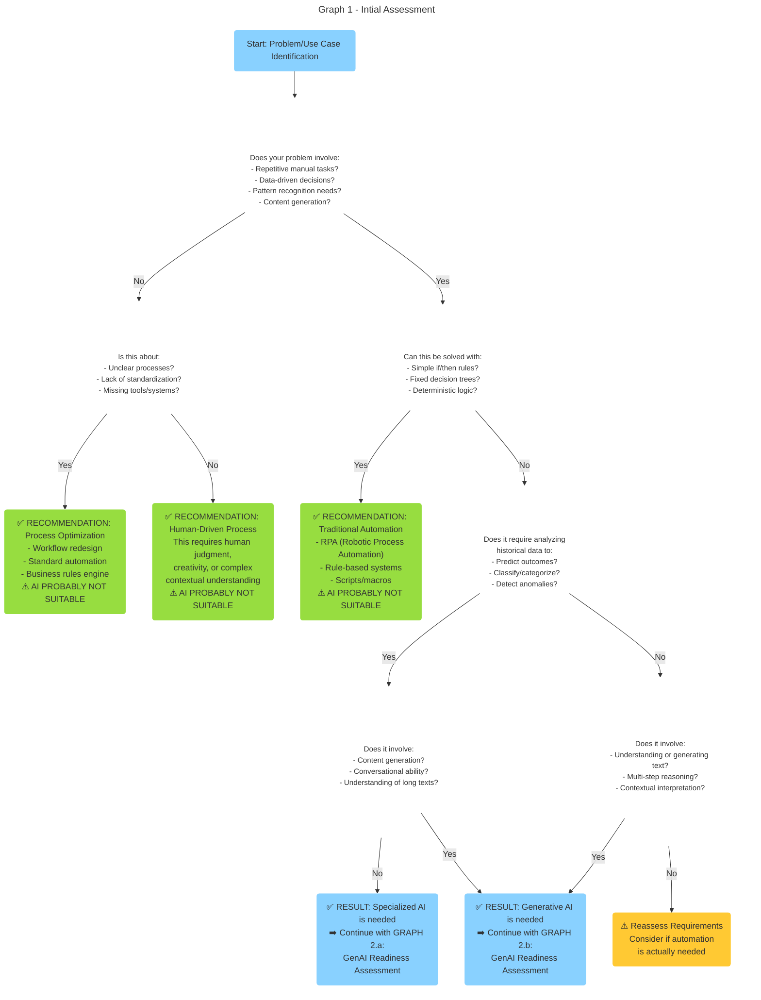
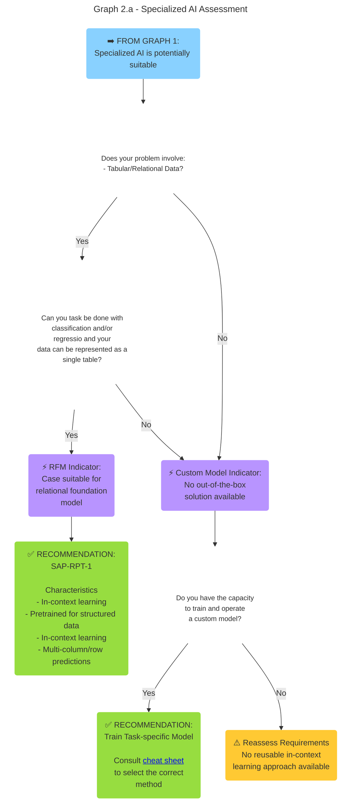
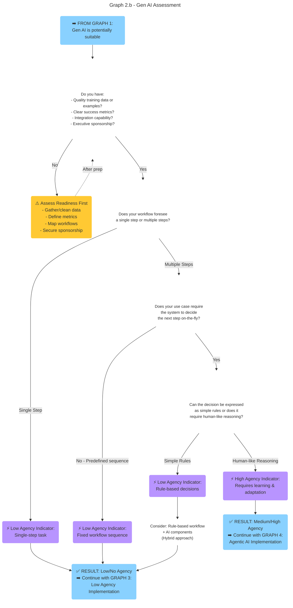
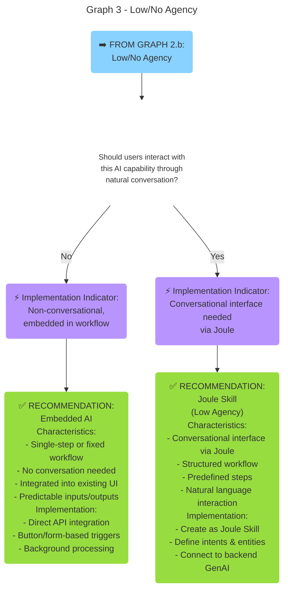
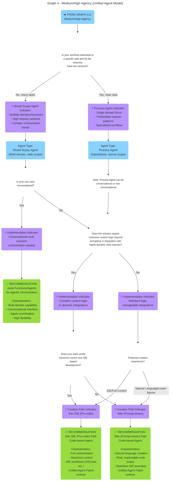

# Technology Decision Tree for AI

## When to use AI

The journey to successful AI implementation begins with a sobering reality: 95% of enterprise AI initiatives deliver zero measurable return. Success isn't determined by model quality or regulatory constraints — it is determined by the value provided. Organizations must move beyond the technology hype and, instead, ground their AI exploration in concrete business problems where the technology's strengths genuinely align with operational needs.

Evaluate potential AI initiatives across four dimensions:

- *Business Impact*: Does this problem create measurable cost, delay, or quality issues?
- *Data Availability*: Is quality training and evaluation data available or can it be collected?
- *Technical Feasibility*: Can AI systems learn, adapt, and integrate with existing workflows?
- *Organizational Readiness*: Are stakeholders prepared for adoption and change management?

Before pursuing an AI solution, answer these questions honestly:

- Where do employees spend disproportionate time on repetitive, rule-based tasks?
- Where do delays occur due to information bottlenecks or manual data synthesis?
- Which decisions require rapid analysis of complex data patterns?
- Is this a genuine operational pain point or trend-chasing?

Double-check if AI really is a feasible approach for the problem you identified:

- Would process optimization or traditional automation solve this more effectively?
- Does the problem require pattern recognition, prediction, or content generation at scale?
- Will the AI system integrate smoothly with existing workflows, or create friction?
- Can the solution learn from feedback and adapt as processes evolve?

Proceed with AI if:

- The problem involves repetitive cognitive tasks requiring speed, consistency, and scale.
- You have identified an approach with learning capabilities and deep workflow integration.
- You can start simple/narrow and expand based on demonstrated value.

Be careful using AI when:

- Process redesign would solve the core issue more effectively.
- You are pursuing AI to match competitors rather than solve a real pain point.
- The problem requires judgment, empathy, or complex contextual understanding current AI cannot provide.
- Implementation timeline or cost exceeds the potential operational benefit.

## Choosing the Right Approach

Building AI-powered systems today involves a growing range of tools and paradigms. Each has its strengths, trade-offs, and ideal scenarios. Understanding when to use **classic machine learning (ML)**, **relational foundation models (e.g., `sap-rpt-1`)**, **large language models (LLMs)**, **agentic workflows**, or **AI agents** is therefore essential.

### 1. Relational Foundation Models (e.g., `sap-rpt-1`)

**When to use:**

* You have **structured data** (e.g., tabular/relational structure, including numerical, textual or categorical fields).
* You can formulate your problem as a task with **clearly defined output** (e.g., a label, score, numeric value).
* You want high **predictive accuracy / prediction quality**.
* You have historical data or another way of creating labeled reference examples.
* Your problem can be expressed as a classification, regression or scoring problem (for the time being `sap-rpt-1` does not fully support time series forecasting or clustering, for example)
* You have successfully tested that `sap-rpt-1` can deal with your task (conduct experiments via the [SAP-RPT-1 (External) Playground](https://rpt.cloud.sap/) for productive state)

**Examples:**

* Predicting customer churn or credit risk.
* Predicting payment delays.
* Completing sales orders or other missing data.
* Recommending offers.

**Why choose RPT:**
It offers instant predictive insights from structured business data through in-context learning that eliminates the need for costly and time-consuming model training while typically deliverying improved prediction quality compared to classic AI models, and increased flexibility, e.g., regarding changing data or data models.

### 2. Classic Machine Learning (ML)

**When to use:**

* You have **structured data** (e.g., tabular/relational structure, with mostly numerical or categorical fields).
* You can formulate your problem as a task with **clearly defined output** (e.g., a label, score, numeric value).
* You can **engineer features** and have historical data for training.
* Interpretability, explainability, and performance tuning are important.
* For **classification/regression**: you have evaluated `sap-rpt-1` first (required per the Feb 2026 decision) and it cannot meet your specific requirements (e.g., latency &lt;200ms, data gravity, context window limits, or GPU availability). For **time series, anomaly detection, clustering**: classic ML (e.g., HANA PAL) is the default choice.
* You can bear costs and complexity of lifecycle management of per-customer trained models, or you do not have per-customer trained model.
* Processing needs to happen close to the data via in-database ML.

**Examples:**

* Detecting anomalies in sensor data.
* Forecasting demand over a longer period of time.
* Ranking search results
* Recommendations an item from a large catalog.

**Why choose classic ML:**
It can offer very low latency predictions, and high control over data and models. Use it when you need maximum control over model properties, and are willing to bear the additional model lifecycle management efforts across multiple customers and use cases.

### 3. Large Language Models LLMs, including Retrieval Augmented Generation

**When to use:**

* You work with **unstructured or semi-structured data** (text, documents, conversations, code).
* The task involves **language understanding, generation, or transformation**.
* You need **semantic reasoning** over diverse inputs without retraining.
* The task requires **limited and programmable orchestration** with other tools (e.g. only provide documents for grounding)

**Examples:**

* Summarizing, rewriting, or translating text or semi-structured data.
* Extracting structured information from documents or semi-structured data.
* Support conversational interfaces or question answering, e.g. via a Joule function.
* Code generation or documentation assistance.
* Create semantic representations of text using embedding models, to support similarity search

**Why choose LLMs:**
They provide flexible, high-level reasoning without custom model training. Use them when language processing is required and a *single call to an LLM*, possible with a RAG step is sufficient

### 4. AI Agents

AI agents are autonomous systems that can make decisions, plan actions, execute tasks, and adapt over time. They go beyond single LLM calls by maintaining state, using tools, and orchestrating multi-step reasoning across multiple tasks and data sources.

**When to use AI Agents:**

* You want **multi-step reasoning or decision making** across multiple tasks, tools, and data sources.
* You require **planning, tool use, or iterative refinement** rather than a single inference call.
* The system must **act autonomously**, make decisions over time, and **integrate reasoning with external actions**.
* You need **composable AI behaviors** that can be orchestrated (e.g., chaining LLM calls, calling APIs, using business rules).
* You require **persistent memory**, **replayability**, and **auditability**.
* You need control and flexibility on the agent flow (e.g., pre/post-processing, error handling, reflection steps).
* You require fine-grained control over memory and tool use.

**Examples:**

* Coordinate tasks between humans, LLMs, and external systems.
* LLM chaining and multi-agent orchestration.
* Constraint-driven, goal-oriented, and context-aware execution of tasks.
* Running experiments, managing business processes, or controlling digital systems.
* Research automation, conversation management, and complex workflows.

**Why choose AI Agents:**
Use them when the problem requires **reasoning over time, calling external tools, or coordinating multiple AI and non-AI tasks**. Agents are ideal when the system must act autonomously, integrate reasoning with external actions, and maintain state across interactions.

**Get started:** [Build AI Agents on SAP BTP](../2-build-and-deliver/7-build-ai-agents/readme.md)

## Technology Assessment Framework

Selecting the right approach for implementing AI solutions requires careful evaluation of your use case, technical requirements, and organizational capabilities. This comprehensive decision framework guides you through a structured assessment process, helping you determine whether your problem truly requires AI, and if so, which type of AI solution best fits your needs. The framework is organized into progressive decision trees that narrow down from broad feasibility questions to specific implementation recommendations, ensuring you invest in the most appropriate technology for your specific scenario.

The decision trees work sequentially: you'll start with basic qualification questions to determine if AI is even necessary, then proceed through specialized assessments based on whether you need traditional machine learning or generative AI, and finally arrive at concrete implementation recommendations including specific platforms and tools. Each graph builds upon the results of the previous one, creating a clear path from problem identification to solution design.

### Initial Assessment - Graph 1

Before investing in any AI solution, it's critical to establish whether your problem actually requires AI or if it can be better solved through traditional automation, process optimization, or standard business rules. This initial assessment helps you avoid the common pitfall of applying AI where simpler, more reliable, and cost-effective solutions would suffice. Graph 1 evaluates your use case against fundamental AI characteristics such as the need for pattern recognition, data-driven decision making, and the complexity of the logic required. By the end of this assessment, you'll know whether to proceed with AI exploration, implement traditional automation, or reconsider your approach entirely.

### Specialized AI Assessment - Graph 2.a

If Graph 1 determined that your use case requires specialized AI (traditional machine learning rather than generative AI), this section helps you identify the most appropriate approach for your data and problem type. Specialized AI excels at tasks involving structured data analysis, classification, regression, and prediction based on historical patterns. Graph 2.a distinguishes between scenarios where you can leverage pretrained foundation models for tabular data versus cases requiring custom model development. This assessment is particularly relevant for use cases involving relational databases, numerical predictions, customer segmentation, fraud detection, and other structured data analytics challenges.

### Gen AI Assessment - Graph 2.a

For use cases identified in Graph 1 as requiring generative AI capabilities—such as content generation, natural language understanding, multi-step reasoning, or conversational interfaces—this assessment evaluates your organizational readiness and determines the level of autonomy (agency) your solution requires. Generative AI implementations can range from simple single-step transformations to complex multi-step workflows with dynamic decision-making. Graph 2.b first ensures you have the necessary foundations in place (quality data, clear metrics, integration capabilities, and executive support) before classifying your use case by its agency requirements. Understanding whether your workflow involves predefined sequences or requires adaptive, human-like reasoning is crucial for selecting the right implementation approach in subsequent graphs.

### Gen AI Non-Agent Assessment - Graph 3

When your generative AI use case requires low or no agency — meaning it follows predictable patterns with single-step operations or fixed multi-step sequences—the implementation approach becomes straightforward. Graph 3 focuses on a single but important distinction: whether your users need to interact with the AI through natural conversation or whether the capability can be embedded directly into existing workflows and user interfaces. This decision determines whether you should build a conversational Joule Skill or integrate the AI functionality as a background service triggered by buttons, forms, or automated processes. Both approaches leverage generative AI's power while maintaining predictable, controlled behavior suitable for production environments where consistency and reliability are paramount.

### Gen AI Agent Assessment - Graph 4

AI agents represent the most sophisticated and autonomous category of generative AI solutions, capable of dynamic decision-making, multi-step reasoning, and adaptive behavior. Following the **unified target model**, all agents are now code-based, with two creation paths available: **Dev IDE (pro-code)** for maximum flexibility and control, or **Vibe (prompt-driven)** for a lower barrier to entry while still producing real, inspectable code. Both paths produce the same portable, versionable artifact deployed to the unified Agent Fabric runtime.

Graph 4 navigates the complexity of implementing AI agents by first distinguishing between process agents (specialized for specific tasks with predictable patterns) and broad-scope agents (handling multiple domains with high variance). The assessment then considers whether conversational interaction is required, the complexity of custom logic needed, and your team's technical preferences. These factors guide you to the appropriate creation path while ensuring all agents benefit from the unified runtime's consistency in lifecycle management, observability, and governance.

