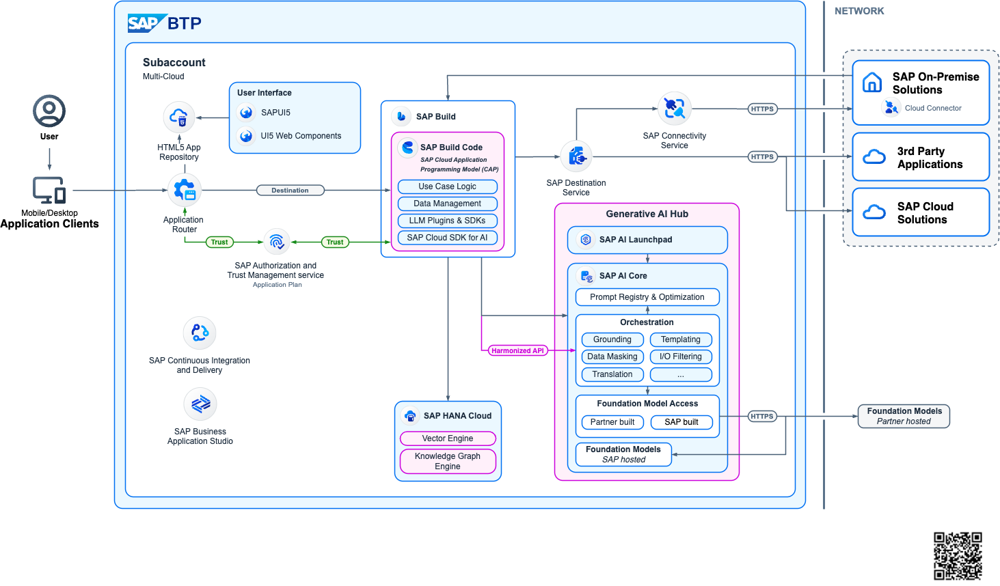
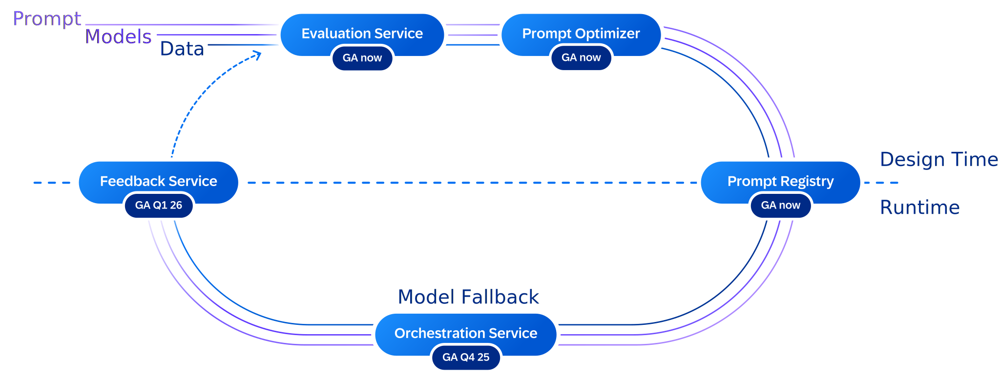

# How to build, deploy and run LLM/GenAI Applications

## What you will build

With the advancements in Generative AI, the need for applications to integrate AI technologies, especially large language models (LLMs), to enhance business processes or build high-value use cases is increasing. This section provides the key resources required to develop, operate, and monitor such applications on SAP BTP (Business Technology Platform). 

A central capability in this context is [SAP AI Core](https://help.sap.com/docs/sap-ai-core/sap-ai-core-service-guide/what-is-sap-ai-core) a service within the SAP BTP designed to manage the execution and operation of AI assets. Within SAP AI Core, the Generative AI Hub offers streamlined access to a range of foundation models, enabling enterprises to build and scale LLM-powered applications more efficiently. The Generative AI Hub abstracts provider-specific differences and simplifies consumption across different model families.

By leveraging these services, teams can accelerate prototyping and deliver production-ready Generative AI solutions across diverse business scenarios. 

## Prerequisites & setup

*   **SAP BTP Account**: Ensure that the required entitlements are assigned for developing the application in the SAP BTP Cloud Foundry environment, such as SAP Cloud Identity Services, SAP HANA Cloud, and SAP AI Core. This list is only as an example, depending on the scope of your application, all relevant [services](https://discovery-center.cloud.sap/viewServices) must be properly entitled and configured.
*   **Development Environment**: A local or cloud-based IDE is required, such as Visual Studio Code. For a cloud-based development environment, [SAP Business Application Studio](https://discovery-center.cloud.sap/serviceCatalog/business-application-studio?region=all), available on SAP BTP, is a recommended option.
*  **[SAP Cloud Application Programming Model](https://cap.cloud.sap/docs/)**: CAP is a framework of languages, libraries, and tools for building enterprise-grade cloud applications on SAP BTP. The CAP framework must be installed and properly configured. This includes setting up the required runtime environment (Node.js or Java), installing the SAP CAP development tools, and preparing the project structure for deployment to the SAP BTP Cloud Foundry environment.
*   **[SAP Cloud SDK for AI](https://sap.github.io/ai-sdk/)**: This is the official Software Development Kit (SDK) for Generative AI Hub and its Orchestration Service in SAP AI Core. SDKs are available for Java, JavaScript and Python.
* **[CAP LLM Plugin](https://github.com/SAP-samples/cap-llm-plugin-samples/tree/main)**: helps developers create tailored Generative AI based CAP applications.

## Architecture at a glance

To harness the power of Generative AI within applications on SAP Business Technology Platform (SAP BTP), the following Reference Architecture offers a robust and flexible framework. It is designed to support a variety of application scenarios, from lightweight APIs to full-stack web applications that augment and extend core business processes.

At the center of this architecture is a CAP-based backend that manages application logic. Data is stored in SAP HANA Cloud, which also houses embeddings used for similarity search via its built-in Vector Engine. The Generative AI Hub acts as the central access point to a range of Foundation Models and Large Language Models (LLMs), enabling seamless integration with SAP AI Core. This setup supports advanced use cases such as Retrieval Augmented Generation (RAG), where proprietary content can be grounded using embeddings to provide more accurate and context-aware outputs.

This architecture is designed to be runtime-agnostic, supporting both Cloud Foundry and Kyma environments. Its flexibility allows developers to choose the runtime best suited to their needs while maintaining consistency in the deployment of GenAI capabilities. Whether integrating with SAP S/4HANA, SAP SuccessFactors, or SAP Ariba, this framework accelerates development and ensures seamless extension of enterprise processes.

Key features include secure connectivity to SAP backends through Destinations, support for role-based access control, and efficient retrieval of vector data from HANA Cloud. It also enables invoking enterprise tools and workflows using the SAP Integration Suite and SAP Build Process Automation, streamlining business orchestration.

This reference architecture serves as a reliable starting point for developers, providing patterns and templates that simplify the adoption of Generative AI. Whether you're implementing a chat-based assistant, similarity search with vector embeddings, or a RAG solution, the components provided by SAP BTP and AI Core make it faster and more efficient to deliver intelligent enterprise-grade applications.

## Build

This code sample [GenAI Mail Insights - Develop a CAP-based application using GenAI and RAG on SAP BTP](https://github.com/SAP-samples/btp-cap-genai-rag) presents an application on SAP Business Technology Platform (SAP BTP). This scenario presents a comprehensive solution for enhancing customer support within a travel agency, utilizing advanced email insights and automation. The system analyzes incoming emails using Large Language Models (LLMs) to offer core insights such as categorization, sentiment analysis and urgency assessment. It goes beyond basic analysis by extracting key facts and customizable fields like location, managed through a dedicated configuration page. Additionally, another [project](https://github.com/SAP-samples/btp-cap-genai-semantic-search) is a basic sample for a semantic search engine built on SAP Business Technology Platform (BTP). It uses the Cloud Application Programming (CAP) model and integrates Generative AI Hub and SAP HANA Cloud’s Vector Engine to offer scalable and powerful search capabilities on any kind of text data like product or material descriptions.

Some of the key steps in the development process:

### 1. Project Setup
Initialize a new project using CAP framework and then expand it to a full-stack application if you want a complete end-to-end application including [approuter](https://www.npmjs.com/package/@sap/approuter). Prepare and subscribe to all the necessary services on SAP BTP. This [estimator](https://discovery-center.cloud.sap/estimator/?commercialModel=btpea) helps in sizing and estimating the costs incurred for the necessary BTP services. 

### 2. Access to Generative AI models
Once the SAP AI Core service with Extended plan is setup, different models are available for consumption individually or via orchestration.  Orchestration in SAP AI Core is a managed service that enables unified access, control, and execution of generative AI models through standardized APIs. Refer to [SAP Note 3437766](https://me.sap.com/notes/3437766) for an up-to-date overview of available models and their versions. There is also an [estimator](https://discovery-center.cloud.sap/ai-estimator-v1) available which helps in estimating the costs incurred for the necessary AI services. On top of this, there is also [SAP Document AI](https://discovery-center.cloud.sap/serviceCatalog/sap-document-ai?region=all) available on SAP BTP if there is a necessity to process documents in the scope of your application.

### 3. Prompting
Prompt engineering is a critical step in building reliable LLM-powered applications. It involves designing clear and structured prompts that guide the model to produce accurate, consistent, and business-relevant outputs. This includes defining system and user prompts, controlling parameters such as temperature and token limits, and enforcing structured responses (e.g., JSON schemas) when integrating outputs into downstream systems.

### 4. Integration with SAP Systems
This typically involves connecting to systems such as SAP S/4HANA, SAP SuccessFactors, or other SAP solutions via secure APIs (e.g., OData or REST services), leveraging destinations configured in SAP BTP.

### 5. Logging & Observability
Logging and observability are critical to operating LLM-powered applications reliably in production. All interactions with generative models—including prompts, responses, token usage, response times, and error messages—should be logged in a controlled and secure manner. This enables traceability, troubleshooting, and auditability, while ensuring that sensitive data is handled according to enterprise compliance policies through masking or filtering.

## Deploy

Deploying the application to SAP BTP involves packaging and releasing the solution into the target runtime environment, such as Cloud Foundry through Multi-Target Application (MTA) model. This includes binding the application to required services like SAP AI Core, SAP HANA Cloud, and SAP Cloud Identity Services, as well as configuring environment variables and service credentials securely. A structured deployment strategy should define separate landscapes (e.g., Development, Test, Production) to ensure controlled releases and proper validation before going live. [CI/CD](https://help.sap.com/docs/btp/sap-business-technology-platform/continuous-integration-and-delivery-ci-cd) pipelines can automate build, test, and deployment steps, enabling consistent release of the application. 

## Run

In the Run phase of an SAP BTP application consuming SAP AI Core and the Generative AI Hub, particular attention must be given to model depreciation and operational stability. [Prompt registry](https://help.sap.com/docs/sap-ai-core/generative-ai/prompt-registry) described in the best practices section below will thoroughly help you in this regard. Teams should continuously monitor model availability, version updates, and deprecation notices to ensure that production applications are not impacted by retired or upgraded foundation models. A clear versioning and fallback strategy—combined with regression testing when switching model versions—helps maintain consistent output quality.

## Best Practices

| Do | Don't |
|---|---|
| Use Joule Studio to build a custom skill when your use case is designed to be accessed purely as a conversational interface | Design user interfaces to function purely for conversation |
| Use Prompt Registry to manage prompts  | Hardcode your prompts |
| Use the SAP AI SDK for LLM interactions | Build custom LLM integrations from scratch |
| Follow the MTA deployment model | Deploy without proper CI/CD pipelines |
| Implement proper tracing and metering | Ignore cross-cutting concerns |

### Tutorials

The following tutorials and repositories provide a helpful starting point for developing applications and consuming the SAP AI Core service on SAP BTP:

* [Navigating Large Language Models fundamentals and techniques for your use case](https://learning.sap.com/courses/navigating-large-language-models-fundamentals-and-techniques-for-your-use-case)
* [Tutorial: GenAI Mail Insights - Develop a CAP-based application using GenAI and RAG on SAP BTP](https://github.com/SAP-samples/btp-cap-genai-rag?tab=readme-ov-file#getting-started) & [DC Mission](https://discovery-center.cloud.sap/missiondetail/4371/) with Quick Account Setup
* This [repo](https://github.com/SAP-samples/btp-genai-starter-kit) gives users of the SAP Business Technology Platform (BTP) a quick way to learn how to use generative AI with BTP services.
* [SAP HANA Cloud with Vector Engine and GenAI Hub](https://github.com/SAP-samples/sap-genai-hub-with-sap-hana-cloud-vector-engine)
* [Examples for Generative AI Hub SDK (Python)](https://help.sap.com/doc/generative-ai-hub-sdk/CLOUD/en-US/examples.html)

### Use benchmark engineering to keep your application model agnostic

Applications should not be built for only one LLM. This prevents market disruptions (new models emerging, price changes, etc.) and avoids model migrations. It also prepares your application for deployment in regions with limited model availability, such as Sovereign Cloud landscapes.

Benchmark engineering with AI Core's generative AI hub makes your application independent from one specific LLM. It is illustrated by the following diagram:

The benchmark engineering toolset includes:

- The *Evaluation Service* allows users to test and benchmark AI use cases across different models using defined metrics against test datasets. Access this service through AI Launchpad to compare model performance across your specific use cases and select the most suitable model for your requirements.
    - [AI Launchpad Evaluation Documentation](https://help.sap.com/docs/sap-ai-core/generative-ai-hub-in-sap-ai-launchpad/evaluations)
    - [Generative AI Hub Evaluation Documentation](https://help.sap.com/docs/sap-ai-core/generative-ai-hub/evaluations)
- The *prompt optimizer* enhances and adapts prompts for various target models. Use this service to automatically refine your prompts for better performance across different LLMs, reducing the manual effort required when switching between models.
    - [Generative AI Hub Prompt Optimization Documentation](https://help.sap.com/docs/sap-ai-core/generative-ai-hub/prompt-optimization)
- The *prompt registry* manages prompt templates throughout their lifecycle, making them usable through the orchestration service. The registry supports both imperative API for design-time template refinement and declarative API for runtime applications and CI/CD pipelines, with full CRUD operations and version tracking.
    - [AI Launchpad Prompt Registry Documentation](https://help.sap.com/docs/sap-ai-core/generative-ai-hub-in-sap-ai-launchpad/view-saved-prompt)
    - [Generative AI Hub Prompt Registry Documentation](https://help.sap.com/docs/sap-ai-core/generative-ai-hub/prompt-registry)
- The *orchestration service* provides a harmonized API to access LLMs. It also incorporates a *model fallback* mechanism that selects the appropriate prompt template based on availability at runtime. This service offers templating, content filtering, data masking, grounding, and translation capabilities, allowing you to build robust applications that work consistently across different foundation models.
    - [AI Launchpad Orchestration Service Documentation](https://help.sap.com/docs/sap-ai-core/generative-ai-hub-in-sap-ai-launchpad/orchestration)
    - [Generative AI Hub Orchestration Service Documentation](https://help.sap.com/docs/sap-ai-core/generative-ai-hub/orchestration-8d022355037643cebf775cd3bf662cc5) ([Deployment Creation](https://help.sap.com/docs/sap-ai-core/generative-ai-hub/create-deployment-for-orchestration))
- The *feedback service* collects and stores all foundation model inference requests, responses, and customer feedback, enabling continuous improvement of evaluations and prompt performance. Use this service to capture user interactions and model responses, creating a feedback loop that helps optimize your prompts and evaluate model effectiveness over time.

:::info References
- [SAP Architecture Center](https://architecture.learning.sap.com/)
- [SAP Discovery Center](https://discovery-center.cloud.sap/)
- [SAP BTP AI Best Practices](https://btp-ai-bp.docs.sap/)
:::

