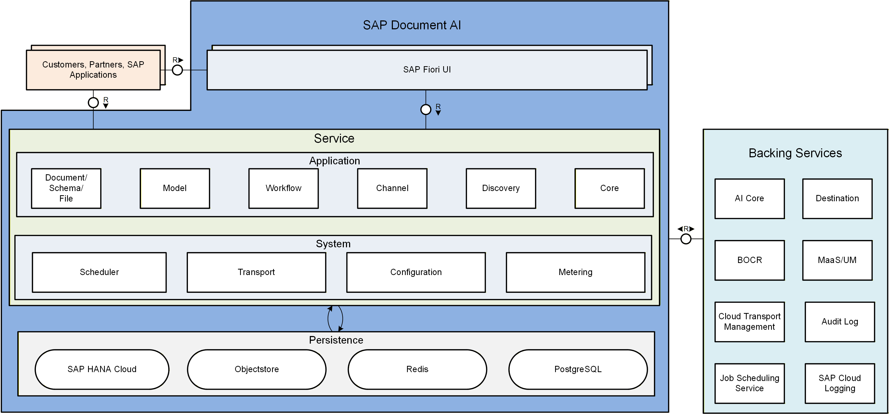

# How to build, deploy and run with Document AI

SAP Document AI is a cloud-based service that uses machine learning to extract structured data from unstructured documents. It can be used to automate data entry, improve document processing, and enhance business workflows.

## What you will build

SAP Document AI can be used in different scenarios. It can be used standalone as PaaS service, but it can also be integrated into applications as reuse instance (SaaS).
### PaaS service

When you decide to use it as a PaaS service, you can use the API to send documents and receive structured data in return. This allows you to automate data entry and improve document processing without having to build your own machine learning models.

### SaaS reuse instance

When you decide to use it as a SaaS reuse instance, you can integrate it into your application and use it to extract structured data from documents that are uploaded by users. This allows you to enhance your business workflows and improve the user experience.

## Prerequisites & setup

You need an SAP BTP account with the appropriate entitlements to use SAP Document AI. 
SAP Document AI offers different service plans which differentiates by features set and metering. The information can be found here: [Commercial Information](https://help.sap.com/docs/document-ai/sap-document-ai/commercial-information)

After you decided on the service plan, you can follow the instructions to set up the service and start using it right away.

## Architecture at a glance

SAP Document AI is a cloud-based service with a microservice architecture. It consists of several components, including:

- File handling
- Schema creation
- Document processing
- Channel management
- Metering
- Model management
- etc.

It uses the CAP Framework and is built on top of SAP BTP. It can be accessed via REST API and OData APIs and can be integrated into applications using SDKs.

## Build and Deploy

When using the service as a PaaS service you can use either Cloud Foundry or kubernetes to deploy your application. A guide how to set up the service can be found here: [Initial Setup](https://help.sap.com/docs/document-ai/sap-document-ai/initial-setup)

When using the service as a SaaS reuse instance,  you need to declare SAP Document AI as a dependency to the multitenant application. During onboarding a SAP Document AI tenant will be automatically onboarded. Details can be found here: [Run SAP Document AI in Multitenant Application](https://help.sap.com/docs/document-ai/sap-document-ai/run-sap-document-ai-in-multitenant-application)

## Run

When using the service via API, you need to have a proper authentication via XSUAA, IAS or certificates.

- XSUAA: [Get Access Token](https://help.sap.com/docs/document-ai/sap-document-ai/get-access-token)
- IAS: [Subscribing with Identity Authentication Service](https://help.sap.com/docs/document-ai/sap-document-ai/subscribing-to-sap-document-ai-workspace-with-identity-authentication-service)
- x509: [Enable x.509 Authentication](https://help.sap.com/docs/document-ai/sap-document-ai/enable-x-509-authentication)

The REST API definition can be found here: [Document Information Extraction API](https://api.sap.com/api/document_information_extraction_api/overview)

The latest OData reference can be found in the API Business Hub: [Document Information Extraction API v2](https://api.sap.com/api/document_information_extraction_api_v2/overview)

SAP Document AI also offers a dedicated UI. The UI is a web-based application which needs to be added as subscription to the SAP BTP subaccount. After the subscription, you can access the UI via the SAP BTP launchpad. The UI allows you to upload documents, view extracted data, and manage your SAP Document AI tenant.\
The information how to set up the latest Workspace UI which is based on the new OData APIs can be found here: [Using SAP Document AI Workspace](https://help.sap.com/docs/document-ai/sap-document-ai/using-sap-document-ai-workspace)

:::info References
**Most Important Links:**

- [SAP Architecture Center](https://architecture.learning.sap.com/)
- [SAP Discovery Center](https://discovery-center.cloud.sap/)
- [SAP Document AI](https://help.sap.com/docs/document-ai)

**Best Practices & Tutorials:**

- [Use Generative AI to Process Business Documents](https://help.sap.com/docs/link-disclaimer?site=https%3A%2F%2Fdevelopers.sap.com%2Fmission.gen-ai-process-business-documents.html?locale=en-US&state=PRODUCTION&version=SHIP) - Find out how to use the SAP Business Technology Platform service SAP Document AI with generative AI to automate the extraction of information from any type of document using large language models (LLMs).
- [Use Machine Learning to Process Business Documents](https://help.sap.com/docs/link-disclaimer?site=https%3A%2F%2Fdevelopers.sap.com%2Fmission.cp-aibus-extract-document-service.html?locale=en-US&state=PRODUCTION&version=SHIP) - Try out the SAP Document AI Trial UI to process business documents that have content in headers and tables.
- [Use Machine Learning to Extract Information from Business Documents and Enrich Data](https://help.sap.com/docs/link-disclaimer?site=https%3A%2F%2Fdevelopers.sap.com%2Fmission.cp-aibus-extract-document-enrich-data.html?locale=en-US&state=PRODUCTION&version=SHIP) - Process business documents that have content in headers and tables, and enrich the information extracted with your own master data records, using machine learning and Swagger UI.
- [Shape Machine Learning to Process Standard Business Documents](https://help.sap.com/docs/link-disclaimer?site=https%3A%2F%2Fdevelopers.sap.com%2Fmission.btp-aibus-shape-ml.html?locale=en-US&state=PRODUCTION&version=SHIP)  - Create your own header and line item fields, and edit extraction results for documents associated with templates to automate the extraction of information from standard business documents such as invoices and purchase orders.
- [Shape Machine Learning to Process Custom Documents](https://help.sap.com/docs/link-disclaimer?site=https%3A%2F%2Fdevelopers.sap.com%2Fmission.btp-aibus-shape-ml-custom.html?locale=en-US&state=PRODUCTION&version=SHIP) - Create your own header and line item fields, and edit extraction results for documents associated with templates to automate the extraction of information from custom documents (not supported out of the box) such as résumés and power of attorney.
:::

