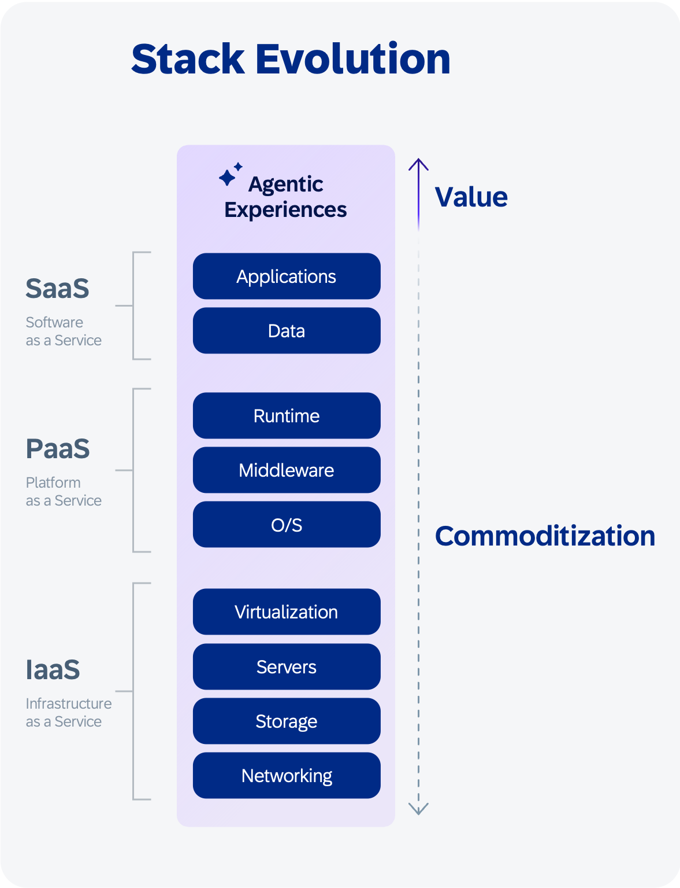
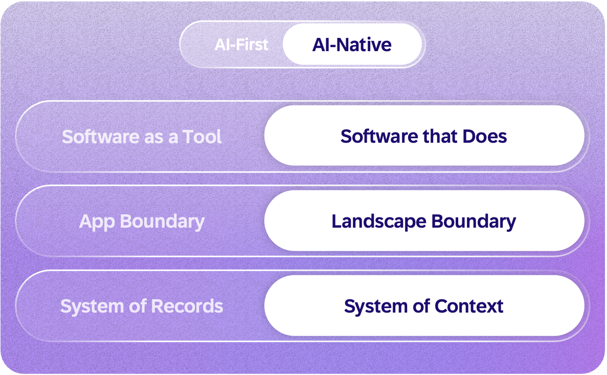
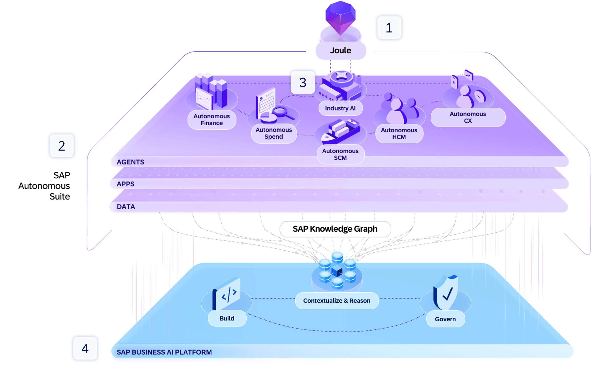
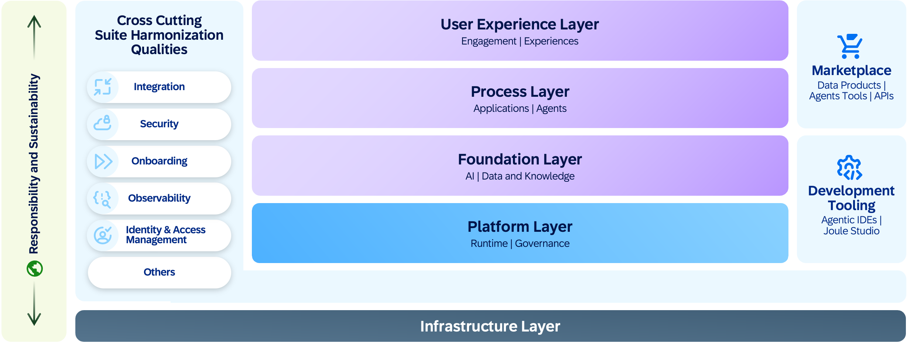
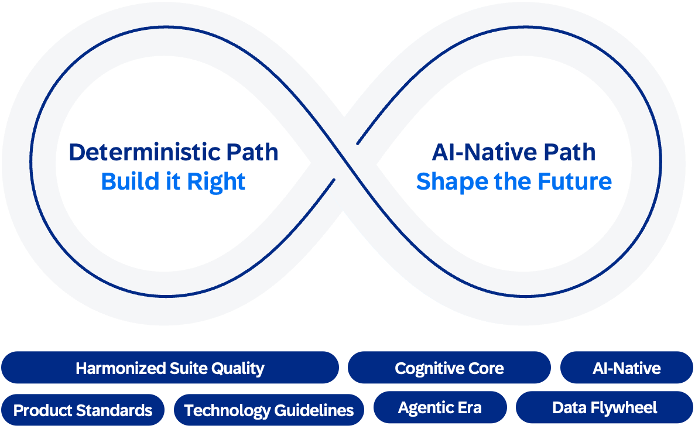

## The trillion-dollar shift
For decades, enterprise software has been a system of record: it stores transactions and facts, enforces rules, and reports what happened. But these elements remain isolated and lack the context needed to explain why decisions were made, what alternatives were considered, or what worked and what didn’t. The reasoning behind enterprise decisions has remained locked in human judgment, scattered across systems, and lost between interactions.

That is now changing. AI makes it possible to build a system of context blended with a system of record: an architecture where enterprise data, process knowledge, and decision history are connected across the enterprise landscape into a shared understanding, so that AI agents can reason over them. Agents participate in decisions as they happen, drawing on the full picture rather than fragments trapped in individual applications. Each correction refines the system. Each interaction adds to it. This learning evolves along two paths: continuous advances in underlying AI models and the compounding of enterprise context. While models provide general reasoning capability, context grounds that reasoning in business reality and allows it to improve with experience. The system of context adds a compounding advantage that the system of record alone never had.

The opportunity is massive. AI is on track to add trillions of dollars to global GDP over the coming decade with enterprise AI software expected to grow into hundreds of billions. AI-agent task duration is increasing rapidly: tasks that take minutes today are on a trajectory toward a full human workday within a few years. The trend is about duration, not scope. Agents will run longer on bounded tasks, while ambiguity, novel situations, and cross-domain reasoning will still require human judgment. The shift is redefining the value stack. Agentic experiences orchestrate outcomes across the enterprise, no longer confined to individual applications. Capabilities below this layer become increasingly commoditized and value shifts from software access to measurable outcomes. By 2028, pure seat-based pricing is expected to give way to outcome-based delivery.

The implication is clear: in enterprise AI, context is **the decisive advantage**. Frontier models continue to grow more capable, but model capability alone is becoming commoditized, since every vendor can access the same leading models. What varies is the context over which those models reason. With the right context, software goes beyond predefined paths and reasons go toward **outcomes**, application boundaries dissolve, and the enterprise learns. Five decades of business processes, master data, and domain knowledge make SAP’s business context the deepest in enterprise software. And no model, however capable, can replicate what it has never seen.

History shows that systems which learn from experience consistently discover strategies no human expert would have designed, and those strategies often become the winning move. Enterprise AI, grounded in SAP’s business context, operating across the full enterprise landscape, and acting on business intent, will uncover new paths to outcomes that no predefined playbook contains.

## From AI-first to AI-native

SAP has the deepest business context in enterprise software. The question is, which architecture can unlock it?

In an AI-first world, an AI feature in an ERP system can summarize an invoice or suggest a journal entry. But it operates within the boundaries of a single application. It cannot see that the same supplier has open disputes in service management, delayed shipments in logistics, and a renegotiated contract in procurement.

Three barriers keep AI-first confined. AI systems:
- Lack business and process context, leading to unreliable answers.
- Sit on disconnected systems without a shared data model, so they cannot coordinate across functions.
- Lack the governance to ensure accountability at scale.

**AI-native** solves all three. Software operates across landscape boundaries as a **system of context**, and this is what makes the compounding loop possible in enterprise software. Every interaction feeds intelligence, every correction becomes a learning signal, and the system continuously improves. The delivery model evolves with it: from **software as a service** to **outcome as a service**. Intent-driven, agent-enabled execution learns and adapts continuously.

## Leading the next era of enterprise applications toward the Autonomous Enterprise

The Autonomous Enterprise is SAP’s vision for the future of how a business runs. It enables companies to respond more quickly, operate more intelligently, and perform better by design, using AI assistants and agents to manage and execute processes across domains in one connected, adaptive system.

SAP delivers this through five reinforcing elements:
- The **Joule** solution as the new engagement layer, bringing together the right data, workflows, and agents across SAP software systems and beyond
- **SAP Autonomous Suite** reinventing how enterprises run, with AI assistants and agents executing work across finance, spend, supply chain management, human capital management, and customer experience
- **Industry AI** portfolio with built-in vertical process knowledge, data models, and regulatory logic
- **SAP Business AI Platform** unifying the SAP Business Data Cloud (SAP BDC) solution, SAP Business Technology Platform (SAP BTP), Business Transformation Management solutions, and the AI Foundation solution to deliver business context, unified data, models, and enterprise-grade governance
- **Accelerated adoption** of the Autonomous Enterprise through the RISE with SAP journey and SAP GROW offerings, enabled by an agent-led toolchain

These elements are realized through an AI-native architecture built on four reimagined layers: user experience, process, foundation, and platform. Together, they form the cognitive core: an enterprise intelligence system that integrates SAP’s business data, process knowledge, and reasoning models to enable enterprise systems to learn and adapt. 

Cross-cutting **SAP-managed** qualities helps ensure that integration, identity, extensibility, provisioning, and observability are harmonized across the suite of SAP solutions. The architecture follows a shift-left and shift-down approach where resilience, compliance, performance, responsibility and sustainability are delivered automatically by the platform.

**[Responsible and sustainable AI](https://www.sap.com/documents/2025/11/56a1a0fa-2e7f-0010-bca6-c68f7e60039b.html)** is embedded across each layer, generating ethical safeguards, transparency, and energy-efficient operations by design. This helps ensure that the shift to AI-native systems elevates trust, accountability, and long-term enterprise value while respecting planetary boundaries.

This is not a replacement for what already works. SAP pairs two complementary paths: the **deterministic path** to safeguard trust, compliance, and governance and the **AI-native path** to evolve learning systems with data and compute. 

The distinction matters. Deterministic systems are reliable, but rigid. AI without proper context and control behaves on instinct: fast and confident, but often wrong. The purpose of the AI-native architecture is to transform that raw capability into something closer to reasoning, grounded in business context, governed through guardrails, and continuously observable. Context engineering, guardrails, and observability are the mechanisms that make this possible.

Deterministic systems of record preserve reliability; adaptive systems add insight. Together, they define the architecture for the AI-native era.