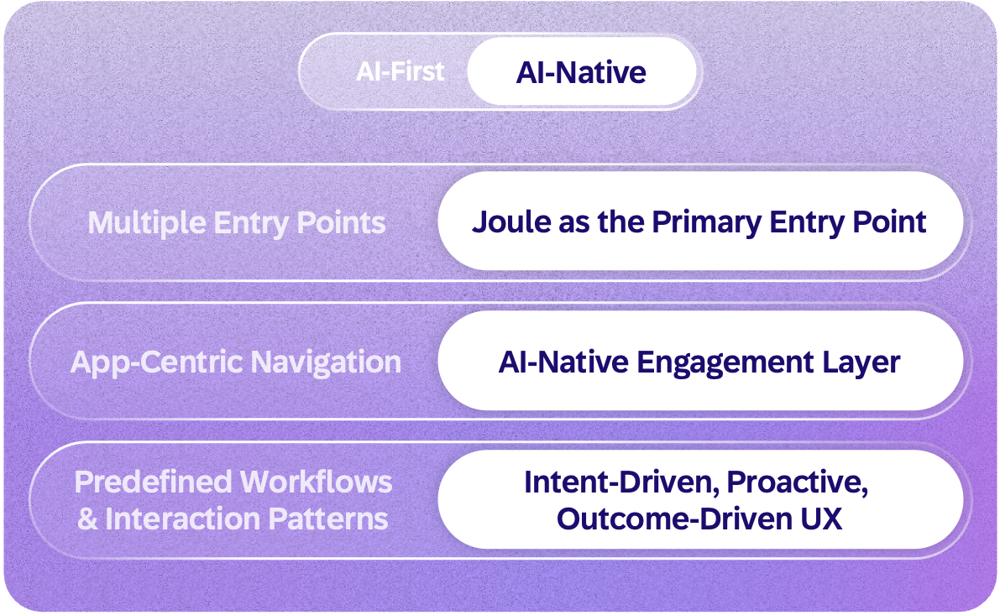
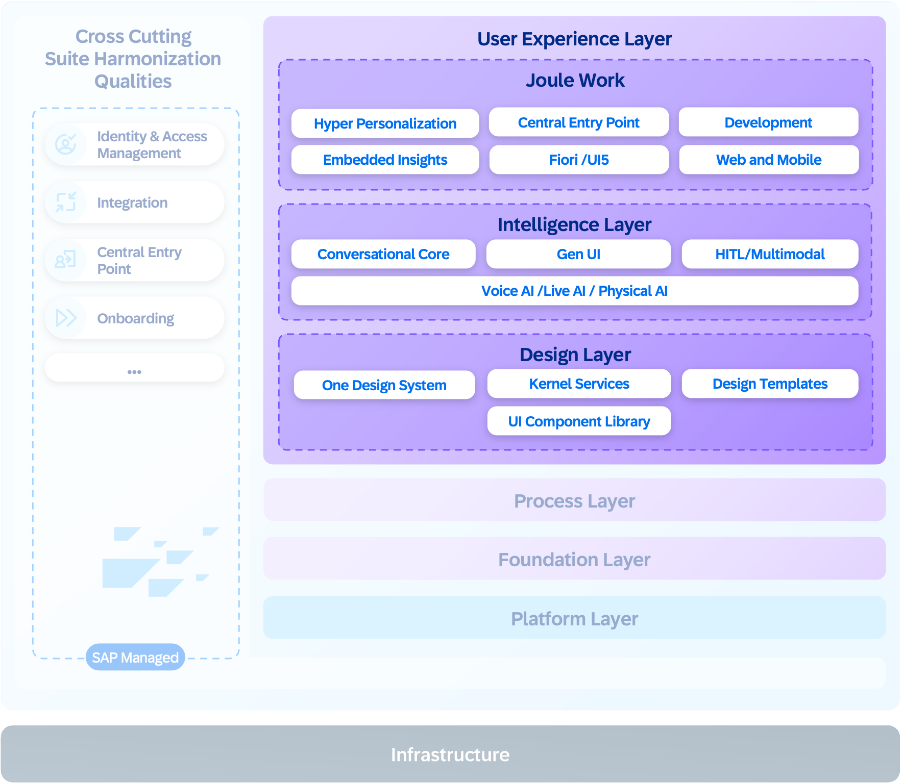

Today, users navigate between applications, follow predefined workflows, and manually piece together information across systems to get work done. AI-native experiences are assembled dynamically, surfacing relevant information and actions specific to each user’s intent, context, and goals, rather than being statically designed and delivered to serve the majority.

This requires a fundamental shift in how we design and deliver the user experience. Users will no longer navigate to applications but simply state intent, and the system assembles the experience around them. 

**The UX layer brings together three tiers:**

The **design layer** functions as a dynamic design service, translating the core design language into a toolkit for generative AI experiences. It establishes guardrails and provides AI with a library of semantically described, next-generation UI components, empowering it to compose experiences that are not only consistent, reliable, and compliant but feel native to the company’s brand.

The **intelligence layer** extends these interfaces with adaptive and conversational capabilities, embedding context-aware AI, voice support, and multimodal interaction while maintaining privacy boundaries, transparency, user control, and agency.

The **Joule Work** component brings these generative experiences together into a unified entry point
that interprets intent across natural language, voice, and multimodal inputs to personalize user days, automate routine work within defined guardrails, or turn business intent into agentic solutions.

These experiences are structured into five experience modes, each serving a particular intent and purpose for users:
- **Discover** for a personalized overview that learns over time
- **Conversations** to ask, search, act, and get insights
- **Spaces** as dynamic work environments for productivity assembled on the fly
- **Jobs** for making agentic work traceable for the business user, automating routine tasks within defined guardrails and escalating to humans only for key decisions.
- **Develop** for turning business intents into agentic solutions.

Joule Work is delivered as a service managed by SAP. This enables continuous improvement of the experience, delivering innovation without additional effort for customers. Embedded insights from the SAP Analytics Cloud solution bring real-time visibility. Integration with SAP Signavio, SAP LeanIX, and WalkMe solutions adds process transparency and guided adoption. 

Looking ahead, **voice AI** brings voice interaction to SAP applications, embedded as a core service across mobile and desktop, to make using enterprise software as natural as having a conversation while also preserving transparency, user control, and privacy by design.

By embedding semantic meaning directly into UI components, our design layer enables dynamic experience composition at runtime, responding intelligently to user intent and business context. This approach moves beyond static dashboards that demand manual interpretation. Instead, it delivers cohesive, AI-enhanced experiences that proactively explain what happened and why it matters while recommending the next logical action. Applications are transformed from passive tool containers into intelligent guides that actively understand user goals. The result is that users move smoothly from data to decision, guided by a system that serves as both interpreter and advisor.

With **physical AI**, Joule moves beyond the screen, bringing business logic from SAP into robotics and smart glasses to enhance the physical world.

While the experience layer allows users to articulate their needs, translating those intentions into tangible business outcomes demands a sophisticated orchestration of applications, intelligent agents, and interconnected business logic, the foundation of the process layer.
