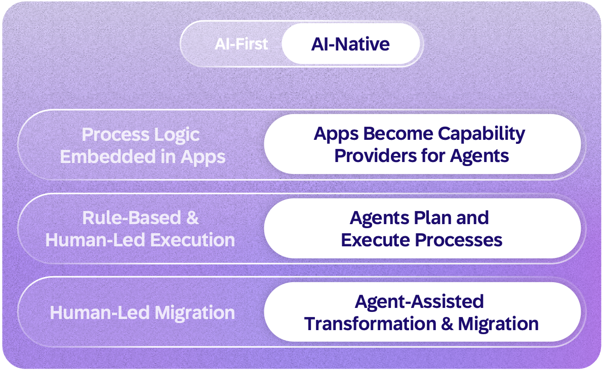
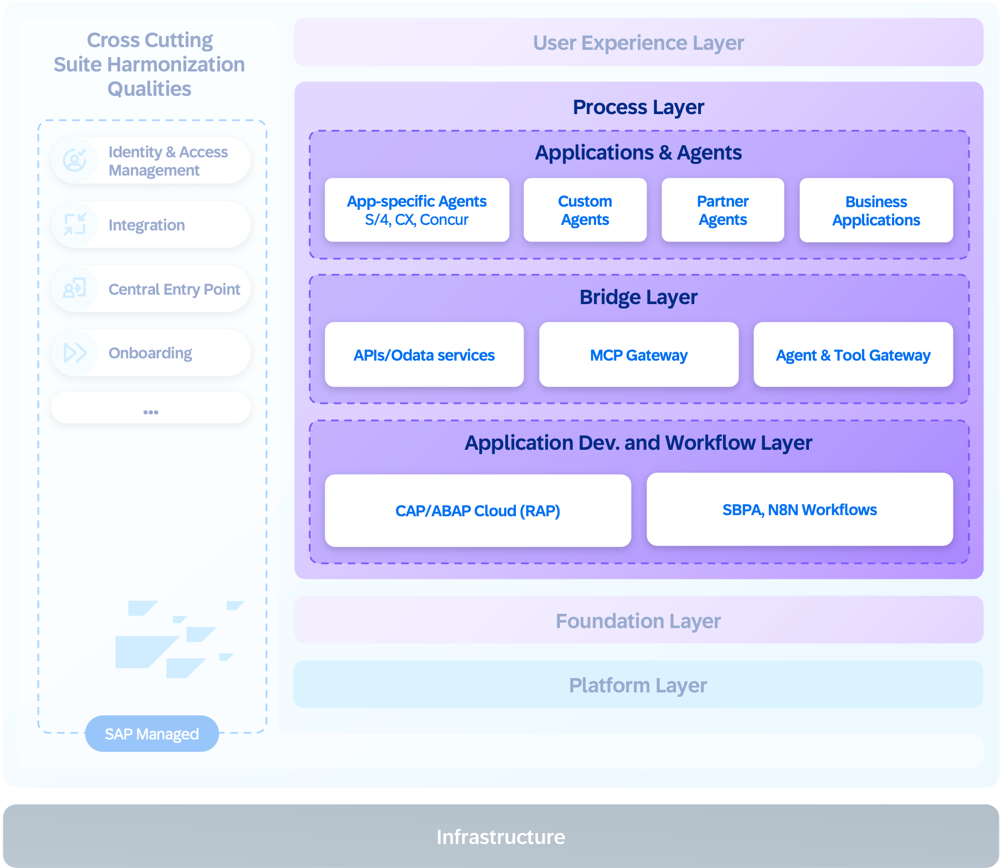
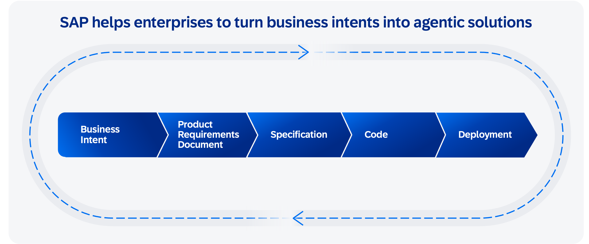

The process layer is where business logic is defined and where the shift from rigid, predefined paths to agent-enabled orchestration takes shape.

A simple request, such as hiring third-party developers, can involve procurement, legal, finance, IT, and supplier management—each with its own systems and approval chains. End-user workflows are constantly evolving and increasingly complex, spanning multiple stakeholders across heterogeneous landscapes. The AI-native architecture transforms how business processes are executed, from logic embedded in applications into a model in which applications, workflows, integration, and agents collaborate to deliver outcomes. 

The shift from AI-first to AI-native redefines how process logic is structured and executed.

In the AI-first model, AI assists process execution within application boundaries: automating steps and suggesting actions but scoped to individual products. In the AI-native model, applications become **capability providers**, exposing stable APIs, events, and data that agents can discover and invoke. This enables business-process innovation through a deliberate mix: AI handles tasks requiring complex reasoning, while deterministic execution helps ensure reliability for specific processes. Both paths extend the reach of the system of context across the enterprise.

Agents follow a reason-act-observe loop to decompose goals, execute actions using tools, and refine based on results. Execution can be optimized through scheduling and reuse strategies that minimize redundant inference and improve overall efficiency.

Agents are organized by business domain, not by individual systems. A procurement agent, for example, orchestrates across ERP, sourcing, supplier management, and third-party systems as a single domain-aware participant. To deliver this, agents need a consistent way to be created, tested, and deployed.

### How agents are built

SAP supports building solutions across the determinism-autonomy spectrum: deterministic apps and workflows for predictable control flow, bounded agents with defined toolsets and guardrails, and open-ended agents for complex reasoning with broader autonomy.

Two creation paths produce the same canonical artifact: a pro-code path where developers write agent logic directly with a standardized agent software development kit for full flexibility, and a prompt-driven path that translates natural language intent into a code-based agent through assisted authoring (Joule Studio solution), both deployed on the same agent runtime. Skills, which are reusable capabilities that agents invoke for specific tasks, will serve as building blocks that developers plug into agents in either path. All paths produce code as the canonical representation: portable, version controlled, and auditable through standard developer tools. 

Customers can start with low code and graduate to pro code without rearchitecting. Paths deploy to a unified runtime and follow an [AI Golden Path](../../../golden-path/ai-golden-path/readme.md), which provides comprehensive guidance, from foundation services through agent development to production deployment.

However, real business scenarios rarely involve building and deploying a single agent. A procurement solution, for example, combines an application for purchase requisitions, an approval workflow for spend authorization, and one or more agents for supplier selection and contract compliance. These components are managed as a single deployable solution with a shared lifecycle and dependencies.

All of this comes together in the Joule Studio solution, the unified design-time environment for building agents and agentic solutions. For rapid prototyping, developers can go straight from intent to code.

For production solutions, the flow progresses from business intent through a product requirements document, specification, and code generation to deployment, with process knowledge ([SAP Signavio](https://www.sap.com/products/business-transformation-management/process-mining.html)), landscape data ([SAP LeanIX](https://www.sap.com/products/business-transformation-management/enterprise-architecture-management.html)), and domain models ([SAP Knowledge Graph](https://www.sap.com/products/artificial-intelligence/ai-foundation-os/knowledge-graph.html)) from SAP informing each stage.

The same approach extends to transformation and migration. In the AI-first model, moving from legacy to cloud is human led and labor intensive. In the AI-native model, agents accelerate code migration, data transformation, and test automation, reducing modernization time, risk, and downtime. Trust and governance for agent interactions, including agent identity, open protocol standards, and governed integration, are detailed in the [Integration, security, ethics, and governance](../7-integration-security-ethics-governance/readme.md) section.

The process layer defines how applications and agents are modeled and evaluated. The foundation layer powers them with data, reasoning, and memory capabilities.