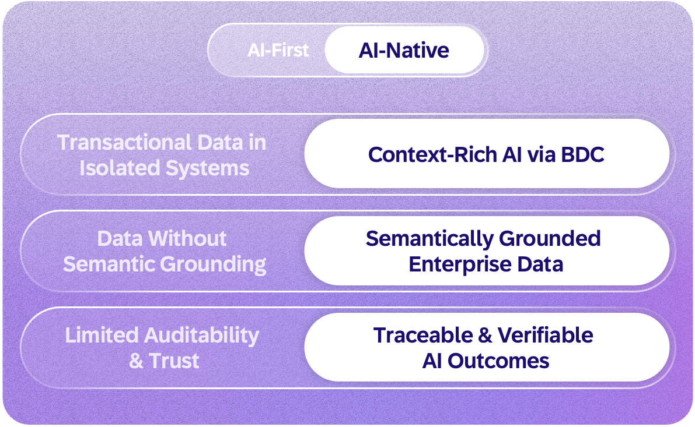
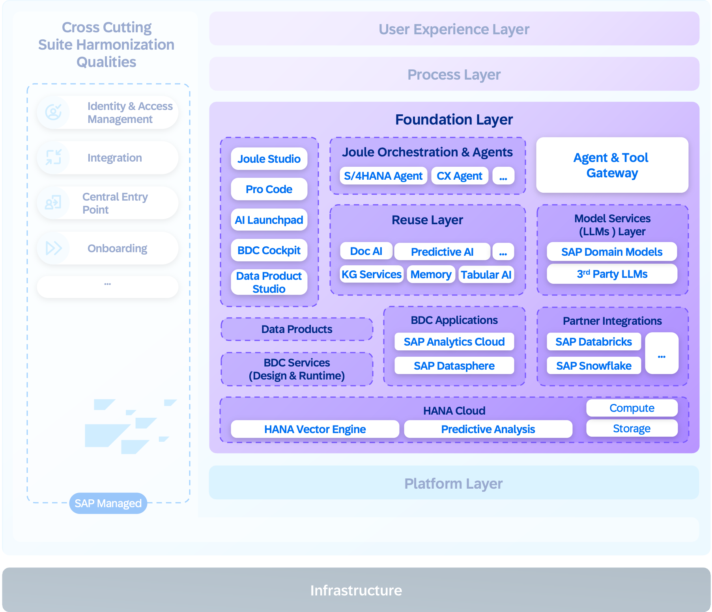
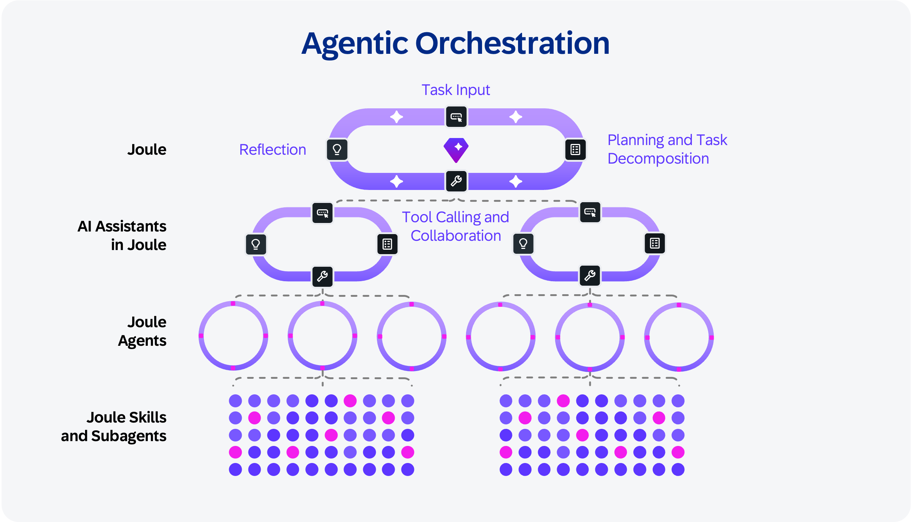
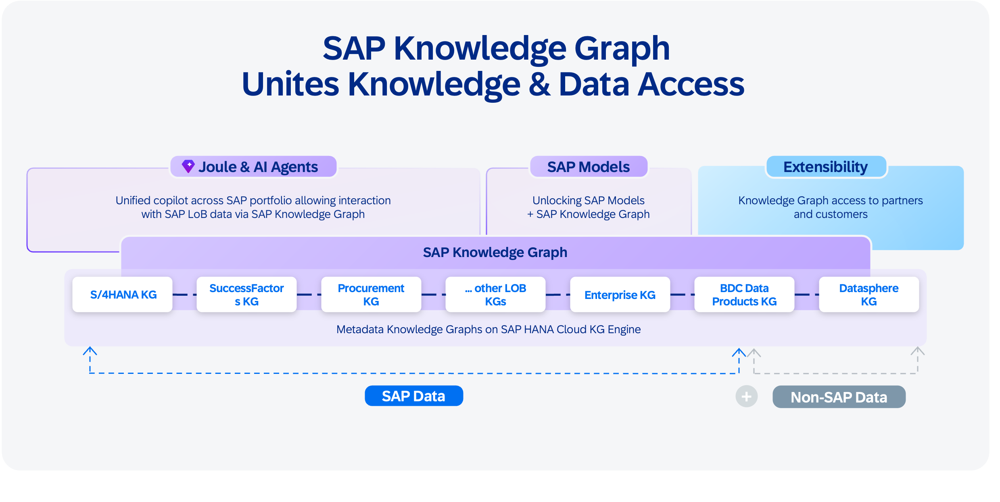

The foundation layer is where data and AI come together as the intelligent core of enterprise processes, giving every SAP customer a compounding advantage built on SAP’s five decades of business data, process knowledge, and domain expertise. With the AI-first approach, data and intelligence remain largely separate: models run without business context, and data sits in silos without reasoning over it.

The shift from AI-first to AI-native redefines how enterprise intelligence is built, grounded, and improved.

In the AI-native model, orchestration, reasoning, and model services power the AI side. Governed data and semantic grounding, supported by SAP Business Data Cloud and SAP Knowledge Graph, provide context. Together, they store and compound enterprise knowledge that grows with each interaction. This enables intelligent systems to operate natively inside enterprise processes, with built-in guardrails for ethics, security, compliance, governance, and efficiency.

**The following capabilities define how this layer works:**

**Orchestration**: Joule orchestrates agents and tools to solve user requests, managing the lifecycle of both low-code and pro-code agents, scheduling their actions, and aligning execution with workflow goals. Agent execution is coordinated across conversational, API-based, and event-driven triggers. This includes routing each request to the right agent, evaluating response quality, and resolving conflicts when multiple capabilities apply, helping ensure users get trusted answers and not just fast ones. For complex goals, Joule will decompose the task and delegate to domain-specific agents that execute in parallel and report results back for coordination. Agents are increasingly equipped with self-verification: internal feedback loops that check accuracy during execution, not just in post-hoc evaluation, reducing the error buildup that has been the primary obstacle to scaling multistep workflows.

**Model services**: The specialized code base and domain knowledge of SAP represent a strategic advantage that general-purpose models cannot access. Frontier models have never seen SAP’s internal code, architecture patterns, or business logic. SAP-trained models combine continuous pretraining on internal code bases with fine-tuning and in-context learning, providing deep understanding of how procurement workflows connect to finance, how supply chain exceptions trigger approvals, and how your specific business rules work in production.
 
The models are hosted through a generative AI hub. The hub provides grounding services, to keep AI aligned with enterprise semantics, and optimization services (prompt optimization, test-time scaling, fit-for-purpose model selection), to improve efficiency and reduce inference overhead.

Alongside SAP’s own models, the generative AI hub provides access to leading third-party models, including frontier large language models and open-source alternatives, giving customers the flexibility to choose the right model for each task without code changes. It is one hub with many models and consistent governance.

This includes the SAP-RPT-1 AI model, built specifically for structured business data and trained on relational enterprise data, such as financial ledgers, transaction records, and supply chain tables, to deliver predictions without requiring customer-specific model training.

Rather than having each team host models independently, this consolidation helps ensure consistent model lifecycle management, usage tracking, reduced environmental impacts, and capacity planning across SAP.

**Reusable intelligence**: Core cognitive capabilities such as document understanding, tabular analysis, and visual inspection are implemented once and exposed as composable skills, helping ensure consistency and reduce duplication across applications and agents while minimizing redundant compute and infrastructure usage.
 
**Data and semantic grounding**: SAP Business Data Cloud provides enterprise data, and the SAP Knowledge Graph provides semantic grounding, together enabling agents with the trusted, context-rich, and efficient data and business context they need to reason, act, and learn. 

**SAP Business Data Cloud** helps connect data from across the enterprise into a single, governed landscape: cloud and on-premises solution systems from SAP, customer-managed legacy systems, third-party sources, and partner ecosystems. At its core are data products: curated, governed datasets with clear ownership, schema, authorization rules, and lifecycle management. Data products are the primary governed interface between SAP data and everything that wants to use it—whether it is a dashboard, a data science platform, or an AI agent.

Data products follow an authorization model and are accessible through multiple channels: SAP Analytics Cloud to create business dashboards and enhance planning, the SAP Datasphere solution for use in semantic data modeling, partner platforms such as those from Databricks Inc. and Snowflake Inc. for data science, and AI agents supported by Joule that access data through natural-language-to-SQL generation grounded in SAP Knowledge Graph. SAP Business Data Cloud will integrate tightly with the SAP AI Core foundation to train machine learning models and ground large language models, enabling the creation of new data products from the resulting insights.

To help ensure agents have data access immediately, major SAP application tenants are provisioned with an embedded data foundation that provides auto-generated data products. These data products are based on application metadata, removing the barrier of limited data product availability, so Joule and agents can query across application boundaries from day one.

**SAP Knowledge Graph** is the semantic backbone of the AI-native architecture. It links natural language inputs to SAP’s structured metadata while reducing hallucinations, opening access to tens of thousands of APIs, data models, and business entities across SAP. When a user asks to “show me overdue orders,” SAP Knowledge Graph automatically discovers the right API, identifies the correct filter parameters, and constructs an accurate query, achieving accuracy that surpasses model-only approaches.

SAP Knowledge Graph connects multiple layers of enterprise knowledge:
- **API and service metadata**: Definitions, endpoints, parameters, and relationships across SAP applications
- **Business semantics**: What “revenue” means, how “customer” relates to “order,” how processes connect across domains
- **Data product metadata**: Schema, lineage, freshness, and authorization rules for datasets
- **Customer-specific extensions**: Custom fields, custom APIs, and tenant-specific configurations layered on top of SAP’s base knowledge

The long-term vision is a **customer-specific knowledge graph** with a shared enterprise ontology, where domain-specific knowledge graphs maintain autonomy while connecting via shared concepts, presenting a single logical view across the SAP solution landscape.

**Context engineering and memory**: Every time an agent starts, it is incredibly smart but has zero context. It cannot do anything useful without identity, memory, and skills. Context engineering solves this by assembling the right slice of enterprise information for each interaction while filtering out redundant, outdated, or unauthorized data, so agents can operate on context that is relevant and proportionate to the task while reducing unnecessary retrieval and energy-intensive inference calls.

Consider two customers with identical profiles: the same industry, tenure, and deal size. A system of record shows different discounts but not why. A system of context captures the exceptions, escalations, and precedents that shaped each decision, so the next agent facing a similar situation proposes the right action, not the average one. Over time, the system moves beyond responding to requests and begins anticipating the next business action.

Agents persist context and reasoning artifacts across interactions, capturing decision lineage: what was known, what was considered, what was chosen, and what resulted. Each human correction becomes a structured decision trace. Together with SAP Knowledge Graph, these traces form a context graph: a living representation of enterprise knowledge that connects semantics, decision history, and operational context.

**Data was the moat of the last decade. Context is the moat of the next.**

**Continuous Improvement**: Agent quality is maintained through structured evaluation cycles that span technical assessment of individual agents (goal completion, tool call efficiency), process KPIs, and financial and operational outcomes. This helps ensure agents are measured not just on technical performance but on business impact. As Goodhart’s Law warns: “When a measure becomes a target, it ceases to be a good measure.” As an example, when an agent is given "resolve disputes faster" as its objective, speed becomes the target. The agent optimizes resolution time at the cost of customer retention. Evaluation is, therefore, a multiobjective optimization problem: rather than optimizing a single variable, the agent optimizes across multiple constraints such as resolution time, retention, and resolution quality. Business KPIs measure how each constraint shifts when the agent is involved, and those measurements become the feedback signal the agent uses to iteratively improve itself toward a stable optimum.

The path forward lies in metalearning, where agents refine not just their outputs but also their learning methods. These advances move toward systems that evolve through ongoing interaction, turning workflows into cumulative assets that grow stronger with each cycle.

The foundation layer builds the enterprise intelligence. Running it reliably, securely, responsibly, and at enterprise scale requires a platform purpose built for agents.