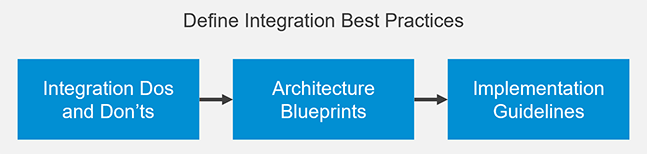

<!-- loiof8483683f43b4dd9a3fab212df68aa16 -->

# Define Integration Best Practices

After you’ve designed your hybrid integration platform in the previous phase, you continue with defining integration best practices for implementing the respective integration scenarios.

***

<a name="loiof8483683f43b4dd9a3fab212df68aa16__section_vbb_gnk_swb"/>

## Description

The SAP Integration Solution Advisory Methodology describes vendor-agnostic concepts for integration best practices, which have been proven as most useful and valuable by SAP customers and partners. These are complemented with examples in an SAP context.

This phase consists of the following steps:

The first task is to describe integration dos and don’ts which is a set of most important rules to follow when designing and implementing integration scenarios. The second task is to create architecture blueprints as reusable designs for relevant integration use case patterns. These describe the scope of integration technologies and services, their interactions among each other and together with business applications. The last task is to prepare implementation guidelines that cover your organization’s technology and business requirements.

***

<a name="loiof8483683f43b4dd9a3fab212df68aa16__section_mp5_jnk_swb"/>

## Goal

The objective of this phase to govern and safeguard the implementation of integration scenarios. Documented and shared best practices are especially useful for integration development teams, which are organized in a decentral or distributed fashion. These help to agree on joint integration standards which increases the organization’s integration maturity level.

***

<a name="loiof8483683f43b4dd9a3fab212df68aa16__section_xtt_knk_swb"/>

## Deliverables

At the end of this phase, you’ll have created the following set of assets:

-   List of integration dos and don’ts
-   Architecture blueprints \(enterprise architecture diagrams\)
-   Integration development guidelines for integration technologies that are in use

***

<a name="loiof8483683f43b4dd9a3fab212df68aa16__section_b3v_nnk_swb"/>

## Personas

-   Integration architect

-   **[Specify Your Integration Dos and Don’ts](specify-your-integration-dos-and-don-ts-5478c29.md "Define “golden rules” for integration development to standardize integration scenarios
		at higher quality.")**  
Define “golden rules” for integration development to standardize integration scenarios at higher quality.
-   **[Create Your Architecture Blueprints](create-your-architecture-blueprints-c6bac95.md "Describe the scope of integration technologies, including relationships and
		characteristics with the help of architecture diagrams. ")**  
Describe the scope of integration technologies, including relationships and characteristics with the help of architecture diagrams.
-   **[Create Tailored Development Guidelines](create-tailored-development-guidelines-2442284.md "Provide integration developers detailed guidance by creating development guidelines for
		integration technologies.")**  
Provide integration developers detailed guidance by creating development guidelines for integration technologies.

