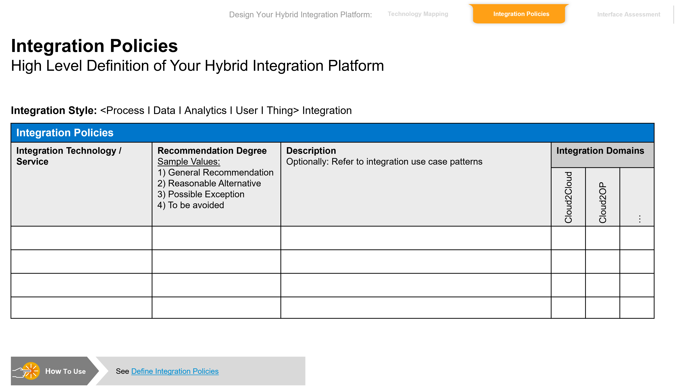

<!-- loioe3639621e9984c45830faec98623c7fd -->

# Define Your Integration Policies

Define guardrails for integration developers that help them to select the right integration technology of the hybrid integration platform for a given integration requirement.

***

<a name="loioe3639621e9984c45830faec98623c7fd__section_csz_xqj_swb"/>

## Context

After you have defined the scope of your hybrid integration platform with the help of the technology mapping, you specify one or more policies for each technology. These act as guardrails for the integration developers and can help them to identify the appropriate technologies for a new integration requirement.

You can specify integration policies for integration domains and integration styles. If needed, you can add applicable integration use case patterns, too. When defining such policies, you should also consider customer context factors \(if existing\).

The SAP Integration Solution Advisory Methodology foresees different recommendation degrees for the policies: These include general recommendations, reasonable alternatives, possible exceptions, and techniques that you would like to avoid in your organization.

|Recommendation degree of an integration policy|Description|
|----------------------------------------------|-----------|
|General recommendation|Assign this degree to your default recommendation for a specific integration style and/or use case pattern. By doing so, you can standardize your integration approach companywide.|
|Reasonable alternative|Assign this degree to possible alternatives that are valid for specific integration scenarios. By doing so, you can also define integration recommendations on a more detailed level than on integration styles and/or use case patterns.|
|Possible exception|Assign this degree to possible exceptions for your general recommendations that you would like to allow for restricted use cases. By doing so, you can better govern and document deviations.|
|To be avoided|Assign this degree to explicitly cover integration techniques/approaches that you wouldn’t like to be further used for new integration scenarios. By doing so, you can gradually phase out some nonstrategic integration technologies in your organization.|

Integration architects define such integration policies. In this role an enterprise architect oversees the current integration technologies in an organization.

***

<a name="loioe3639621e9984c45830faec98623c7fd__section_od5_prj_swb"/>

## Procedure

1.  Templates-based approach

      
      
    **Integration Policy Template**

    

    1.  Download the "Integration Policy Template" and fill it out for each integration style that has been identified as relevant as part of your enterprise integration strategy:
        -   In **column"Integration Technology/Service"** you can select the relevant integration technology for which you want to define an integration policy guideline \(such as the Cloud Integration capability within SAP Integration Suite\).
        -   In **column"Recommendation Degree"**, you can define the recommendation degree that you would like to assign to the integration technology within your organization \(such as general recommendation\).
        -   In **column"Description"**, you can further describe your integration policy, optionally by referring to the relevant integration use case patterns.
        -   **Column"Integration Domains"** allows you to assign the integration technology to the relevant integration domains, such as Cloud2OnPremise or Cloud2Cloud.

    2.  If needed, you can also adjust the integration policy template to your specific needs, for instance by adding further columns for additional selection criteria.

2.  Tool-based approach

    Perform this step using the Integration Assessment capability within SAP Integration Suite. For more information, see: [Analyze and Edit Integration Policies](https://help.sap.com/docs/SAP_INTEGRATION_SUITE/51ab953548be4459bfe8539ecaeee98d/fb4bc24faec44bdb9cdc1d02d9b5ca99.html?q=Integration%20Assessment#analyze-and-edit-integration-policies).

**Related Information**  

[Download the Integration Policy Template](https://d.dam.sap.com/a/RPWxw1a?rc=10)

