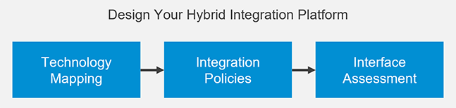

<!-- loioe6f5a607e5e84c27829101544b693980 -->

# Design Your Hybrid Integration Platform

Use technology mapping, integration policies, and interface assessment to design your future hybrid integration platform.

***

<a name="loioe6f5a607e5e84c27829101544b693980__section_hx4_ppn_rwb"/>

## Description

In this phase, you design your future hybrid integration platform. In regard to the SAP Integration Solution Advisory Methodology, the term “hybrid” isn’t limited to the support of hybrid deployment models but also includes the ability to support all relevant integration domains and styles. Furthermore, a hybrid integration platform needs to address the needs of different personas such as integration experts, application developers, and lines of business users as needed.

As a first step you conduct a technology mapping to determine the scope of your future hybrid integration platform. Next, you define integration policies that describe when to choose which technology of this platform. The third step – to conduct an interface assessment – is a continuous activity, which is typically done by integration developers: Whenever a new integration scenario is needed the interface assessment helps integration developers to determine the right integration technology or technologies.

***

<a name="loioe6f5a607e5e84c27829101544b693980__section_ubz_5pn_rwb"/>

## Goal

The objective of the second phase is to have the scope of relevant integration technologies defined which will form your organization’s hybrid integration platform. Furthermore, you’ll have defined integration policies that can help integration developers to identify the best fitting integration technologies for a new integration requirement as part of an interface assessment.

***

<a name="loioe6f5a607e5e84c27829101544b693980__section_g2j_wpn_rwb"/>

## Deliverables

As part of the second phase of the SAP Integration Solution Advisory Methodology you create the following assets:

-   Technology mapping describing which integration technologies to choose for each integration style and use case pattern that are in scope
-   List of integration policies, which are defined for each integration technology in use
-   Interface assessment using the Integration Assessment capability within SAP Integration Suite

***

<a name="loioe6f5a607e5e84c27829101544b693980__section_stb_jyn_rwb"/>

## Personas

-   Enterprise architect
-   Integration architect
-   Integration developer

-   **[Perform a Technology Mapping](perform-a-technology-mapping-58d1656.md "Define the high-level scope of your hybrid integration platform with the help of a
		technology mapping.")**  
Define the high-level scope of your hybrid integration platform with the help of a technology mapping.
-   **[Define Your Integration Policies](define-your-integration-policies-e363962.md "Define guardrails for integration developers that help them to select the right
		integration technology of the hybrid integration platform for a given integration
		requirement.")**  
Define guardrails for integration developers that help them to select the right integration technology of the hybrid integration platform for a given integration requirement.
-   **[Assess Your Interfaces](assess-your-interfaces-57a7941.md "Integration developers determine the right integration technology by assessing
		interfaces of business applications to integrate with.")**  
Integration developers determine the right integration technology by assessing interfaces of business applications to integrate with.

