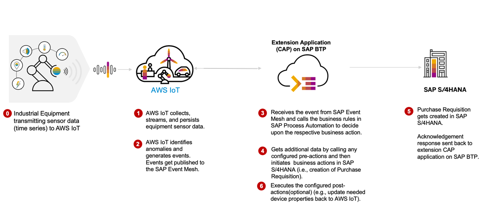

## Scenario

This describes a sample business scenario for building a reference application based on the event-driven application architecture.It extends the platform agnostic reference architecture to show how to integrate events from AWS IoT Core with SAP S/4HANA enterprise system using message brokers and events.

In this reference application use-case, events from AWS IoT core are published to SAP Integration Suite, advanced event mesh or SAP Event Mesh. The Node.js extension application deployed in SAP BTP subscribes to the advanced event mesh queue and executes the action that is required to be taken based on the event details. SAP Event Mesh capability in SAP Integration Suite can also be leveraged for integration. The choice of the eventing service can be based on the scenario and volume of events to be handled.

## Business Process Flow

In this event-driven scenario, based on the real-time data from IoT Devices getting captured in AWS IoT Core, actionable events are sent to SAP BTP to decide on the critical business actions to be taken in the SAP Enterprise Business systems based on business rules defined in SAP BTP.

1. Data from IoT Devices are sent to AWS IoT Core.

2. Rules in AWS IoT Core trigger, and the event is published to SAP Event Mesh via Amazon SQS and Amazon EventBridge in case of any actions that need attention. This is defined in IoT Rules for devices.

3. The extension application subscribes to the events.

4. The extension application is configured with all necessary actions, for example, calling SAP Business Rules API to read the decision tables and decide on the action to be taken, configuring the OData API call to be executed, and service call back to the device, to be taken.

5. The extension application executes the business actions.

6. For this sample application, based on the fill level of the waste container a new Purchase Order Requisition is created in SAP S/4HANA.

## Solution Architecture

The key services used by AWS are AWS IoT Core, Amazon SWS and Amazon EventBridge. The services used by SAP BTP are the Cloud Foundry Runtime, SAP Integration Suite, advanced event mesh or SAP Event Mesh, SAP Connectivity service, SAP Private Link service, SAP Build Process Automation and SAP Destination service.

The following steps depict the information flow across systems

1. An application administrator logs into the SAP BTP Extension application based on Events to Business Actions Framework via SAP Build Work Zone, advanced edition, to configure the business rules, decisions, and the business actions that need to be triggered in the business systems.

2. An event is triggered from the AWS IoT via Amazon SQS and Amazon EventBridge to SAP Integration Suite, advanced event mesh.

3. These events are published to SAP Integration Suite, advanced event mesh. As the processor module's (part of the Events-to-Business-Action framework) endpoint subscribes to advanced event mesh, the event is received.

4. The Processor module (part of the Events-to-Business-Action framework) leverages the Decisions capability of SAP Build Process Automation to derive business action (for example, purchase order requisition creation in SAP S/4HANA) based on certain characteristics of incoming events.

5. The defined action is triggered in SAP S/4HANA using the SAP Destination service and SAP Connectivity service leveraging a cloud connector setup. In case SAP S/4HANA and SAP BTP are on the same Hyperscaler, communication with SAP S/4HANA happens via the SAP Private Link service.

## List of Services and Components

These are the technical prerequisites for integration between AWS IoT Core, SAP BTP and SAP S/4HANA. 

### SAP BTP Services
- **Cloud Foundry Runtime**
    - Foundation for running the CAP extension application for translating events to business actions.
- **Authorization and Trust Management Service**
    - Required for securing the extension application in SAP BTP
- **SAP Integration Suite, Advanced Event Mesh or Event Mesh**
    - Required to receive events from Amazon AWS IoT
- **SAP HANA Cloud**
    - Required to store action configuration and logs for the CAP application
- **SAP Build Process Automation**
    - Develop and manage the decision logic in tabular, spreadsheet-like decision tables.

### AWS Cloud Products
- **A valid Amazon AWS subscription**
- **AWS IoT Core**
    - Connect devices to the cloud. Required for connecting IoT deveices and routing messages to AWS servcies without managing infrastructure.
- **Amazon Simple Queue Service (SQS)**
    - Managed message queues.FIFO queues to make sure messages sent to the sytem are published in the correct order. Required to receive events from AWS IoT Core.
- **Amazon EventBridge**
    - Serverless event bus for SaaS apps and AWS Services. Required to send events from Amazon SQS to SAP Event Mesh.

For detailed step by step information and to try out the integration, visit the SAP Discovery Center mission [Build Events-to-Business Actions with Amazon Web Services](https://discovery-center.cloud.sap/missiondetail/4172/4422/)