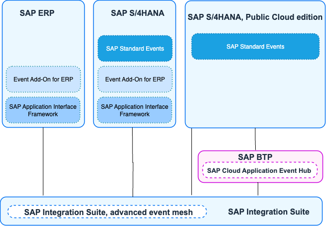
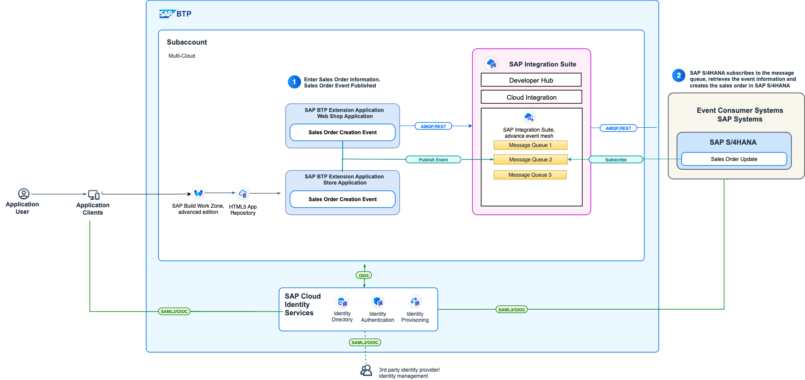
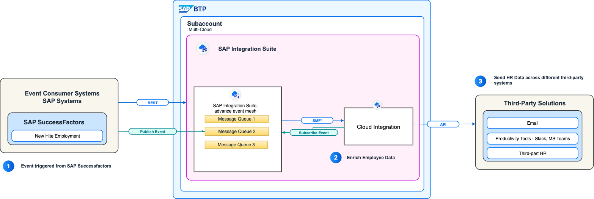
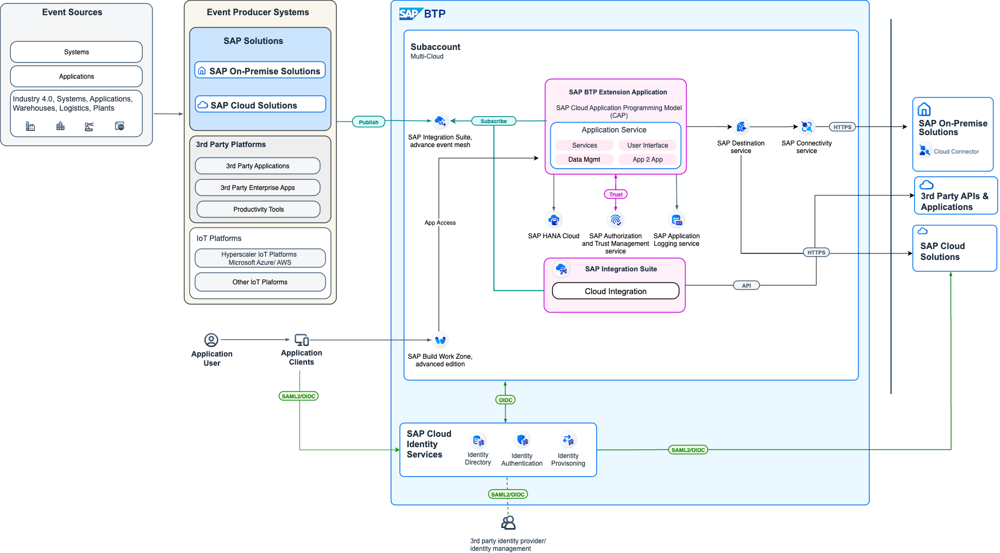
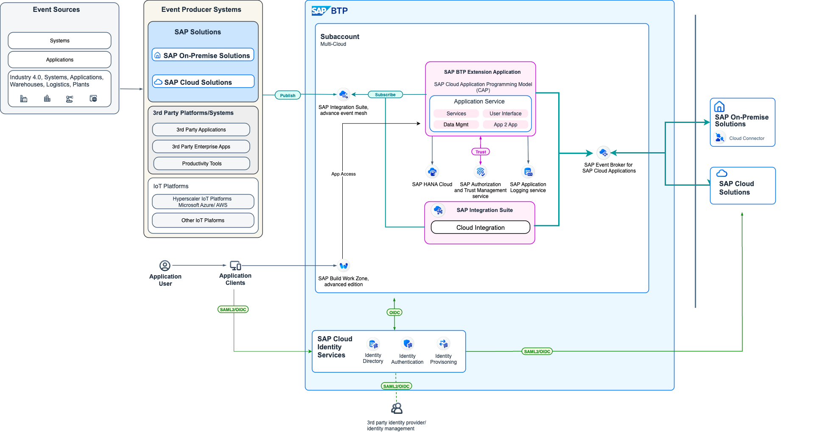

Event-driven architecture use cases are crucial because they highlight real-world applications of this technological strategy. Understanding specific use cases reveals how this architecture is crucial for services that require real-time operations, high responsiveness, and asynchronous communication. 

## Event Sources and Event Enablement for SAP ERP Systems

SAP systems generate a variety of business events that can be consumed by other applications or services. Common event sources include:
- SAP ERP
- SAP S/4HANA
- SAP S/4HANA, Public Cloud Edition

The following sections illustrate how these event source systems are enabled to produce events that can be consumed by SAP and non-SAP systems. 

- SAP ERP
  - Using SAP Application Interface Framework (AIF) or Event Add-on for ERP, custom events can be defined and published to SAP Event Mesh or SAP Cloud Application Event Hub.
  - Supports notifications and data events
  - Supports Inbound and Outbound events
  - CloudEvents Format

- SAP S/4HANA
  - 600+ SAP standard business events available out-of-the-box covering various modules like Finance, Sales, Procurement, Manufacturing, etc.
  - Supports Events Extensibility to create custom events using SAP Cloud Application Programming Model (CAP) or ABAP.
  -Custom events using SAP AIF or Event Add-on for S/4HANA

- SAP S/4HANA, Public Cloud Edition
  - 600+ SAP standard business events based on ABAP RESTful application programming model.
  - Supports Events Extensibility to create custom events using SAP Cloud Application Programming Model (CAP

To build end to end use case for EDA for SAP Enterprise systems, below are the various event enablement options available in SAP ecosystem and the supporting versions for each of the options

## Sample Use Case Scenarios 

Below are some sample use case scenarios demonstrating the application of event-driven architecture patterns in SAP environments.

### Use Case 1: Real-time Order Processing in SAP S/4HANA

### Use Case 2: Event-Based SAP SuccessFactors Integration

### Use Case 3: Third-Party Events to SAP S/4HANA Integration via SAP BTP Extension Application

### Use Case 4: Event processing from SAP BTP Extension Application to SAP S/4HANA via SAP Cloud Application EventHub

Note: Refer to additional use case patterns in [SAP Learning Journey -Discovering Event-Driven Integration with SAP Integration Suite,advanced event mesh](https://learning.sap.com/learning-journeys/discovering-event-driven-integration-with-sap-integration-suite-advanced-event-mesh/presenting-event-driven-architecture-use-cases_babe31d3-d20d-4370-8f02-2f277f8033d5)