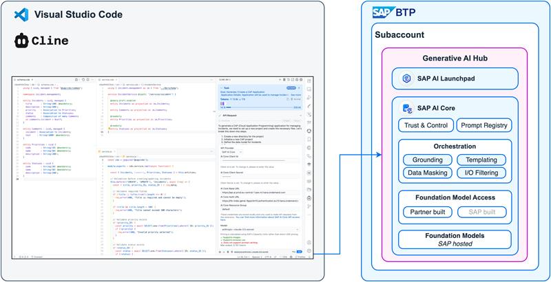

## Introduction to Vibe Coding

Vibe coding flips traditional development into a streamlined **prompt-first** loop: you describe the feature, the AI writes the code, and you iterate. To transform this “vibe” into a reliable engineering practice, you must master **context engineering**—the art of supplying the model with exactly the right information (requirements, APIs, tests, style guides, enterprise knowledge) at call-time so it can respond deterministically and cost-effectively.

### Core Principles

* **Prompt-Driven Development** – Describe functionality in plain language; the AI scaffolds the solution.
* **Context Engineering** – Curate precise, minimal, and authoritative context (task instructions, examples, multimodal artifacts, MCP knowledge graphs, etc.) for every request.
* **TDD Meets AI** – Let the AI generate tests first to set a verifiable contract; code is then produced to satisfy those tests.
* **Human-in-the-Loop Governance** – Developers and Architects remain the final gatekeepers for compliance, performance, and security.
* **Productivity Amplified** – Routine boilerplate is offloaded so teams can focus on high-value architectural decisions.

## Cline + SAP AI Core Integration

**Cline** is an autonomous coding agent right in your IDE, capable of creating/editing files, executing commands, using the browser, and more with your permission every step of the way. Learn more in the [Cline Docs](https://docs.cline.bot/getting-started/what-is-cline).

Cline now ships with a native **SAP AI Core** provider integration, giving you enterprise-grade access to foundation models from Claude, Gemini, and OpenAI under your organization’s compliance and cost controls.

With this integration, Cline forwards your requests, along with relevant local context, to your foundation models on SAP AI Core. 

:::tip Quick Setup

To get started with Cline and SAP AI Core:

1. Install the [Cline Plugin](https://docs.cline.bot/getting-started/for-new-coders#%F0%9F%9A%80-getting-started) for VS Code.
2. Create a service key for SAP AI Core in SAP BTP—this key contains the credentials that let Cline connect to your deployed models, follow the tutorial [Set up Generative AI Hub in SAP AI Core](https://developers.sap.com/tutorials/ai-core-genaihub-provisioning.html) for step-by-step instructions.

### Configure Cline for SAP AI Core

Once you have your SAP AI Core service key, you need to configure the following settings in Cline:

1.  **API Provider**: Select `SAP AI Core`.
2.  **API Core Client ID**: Your client ID from the service key.
3.  **API Core Client Secret**: Your client secret from the service key.
4.  **AI Core Base URL**: The `AI_API_URL` from your service key.
5.  **AI Core Auth URL**: The `url` from your service key.
6.  **AI Core Resource Group**: The resource group you want to use.
7.  **Model**: The model you want to use (e.g., `anthropic--claude-4-sonnet`, `gemini-2.5-pro`, `gpt-4.1`). You must have a [deployment](https://help.sap.com/docs/sap-ai-core/sap-ai-core-service-guide/create-deployment-for-generative-ai-model-in-sap-ai-core) for this model in SAP AI Core.

With these settings configured, you are ready to start "vibe-coding" with Cline and SAP AI Core.
:::

#### Reference Implementation

See the end-to-end **[SAP CAP Vibe Coding with Cline and SAP AI Core Example](https://github.com/SAP-samples/btp-cap-demo-usecases/tree/vibe-coding-with-cline)** for a sample scenario.