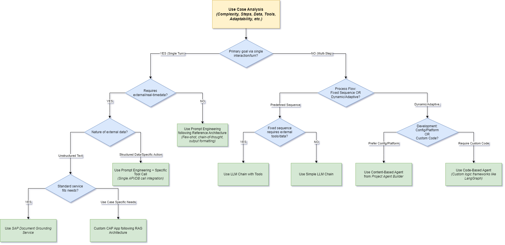

<em></em>

## Why AI Agents?
Modern enterprises grapple with complex, non-linear workflows that span multiple systems, data sources, and decision points. Traditional automation and single-turn LLM interactions, while powerful, often fall short when tasks require adaptive reasoning, conditional logic, or orchestration across heterogeneous environments. AI Agents address this gap by autonomously executing multi-step processes, dynamically adjusting their strategy based on real‑time context, and integrating seamlessly with enterprise services.

## What are AI Agents?
AI Agents are autonomous systems built atop foundation models—most commonly LLMs that go beyond passive prompt‑response behavior. Rather than simply generating text, they interpret user intent, execute a dynamic sequence of actions, and invoke specialized tools to accomplish goals. These tools might include document searches, web searches, code execution sandboxes, API calls, database queries, SAP system operations, or even interactions with other agents.

## Elements of AI Agents
To understand the inner workings of an AI Agent, consider its five core components explained below.

- **LLM - Reasoning Engine**
Processes inputs, plans steps, and generates natural‑language or structured outputs.

- **Knowledge**
Contextual information from structured and unstructured sources to guide agent decision-making.

- **Memory - State**
Retains intermediate results and past interactions, ensuring continuity and statefulness across multi‑step workflows.

- **Tools**
Enable agents to perform actions. The agent selects and invokes tools based on the current context and goal.

- **Recipe - Orchestration Logic**
A recipe guides the agent's workflow and defines how the LLM, knowledge, memory, and tools interact.

## Beyond Linear Processes

Unlike linear pipelines such as RAG which strictly follow “retrieve → generate → respond”, or even fixed LLM chains with predetermined steps, Agents employ iterative reasoning. They continuously assess intermediate outputs, choose the next best tool or action, and adapt their strategy on the fly. This dynamic loop empowers agents to solve non‑linear problems, handle exceptions, and manage layered business workflows.

## Agent Streams

Within a broad landscape, two commonly adopted patterns have emerged to define agent development strategies *Content Based Agents* and *Code Based Agents*.

**Content Based Agents**

They utilize structured business content and pre-defined semantic rules to drive agent behavior. They integrate off-the-shelf tools and capabilities to perform multi-step reasoning and dynamic decision-making with minimal custom coding. This approach enables quick configuration and seamless integration of business data into automated workflows.

**Code Based Agents**

*<solution diagram - coede based agents>*

Code Based Agents offer a highly customizable solution through bespoke logic and tailored development. They leverage developer-defined workflows on frameworks like LangGraph, AutoGen, CrewAI & smolagents to provide fine-grained control over agent operations. This model is ideal for scenarios that demand precise, code-level intervention to meet complex business requirements.

## Project Agent Builder

*Project Agent Builder (PAB)* is SAP’s centralized platform for creating, managing, and consuming intelligent **Contend Based Agents** as reusable services on SAP BTP.

*<solution diagram - content based agents>*

It eliminates the need for custom agent runtimes by enabling no-code, configuration-based creation of LLM-powered agents. These agents support multi-step reasoning, tool orchestration, and RAG, with seamless integration into SAP products, BTP services, and third-party applications via REST or OData APIs. The platform leverages SAP AI Core for LLM access, anonymization, and metering, and ensures enterprise-grade security by acting on behalf of users with inherited roles. Built on LangChain, it combines open-source innovation with custom enterprise tools and flows. With a marketplace-driven approach for extensibility and deep integration with SAP Joule, Project Agent Builder lays the foundation for scalable & secure agent-based automation across the SAP ecosystem.

## Selecting the Right Approach

Not all use cases require the same level of orchestration or intelligence. Depending on factors like interaction complexity, the need for real-time data, and the nature of the underlying process, different design strategies are optimal ranging from simple prompt engineering to agents.

The decision tree below serves as a practical guide to determine the most suitable implementation pattern for your scenario be it prompt-based, tool-integrated, or agentic.

