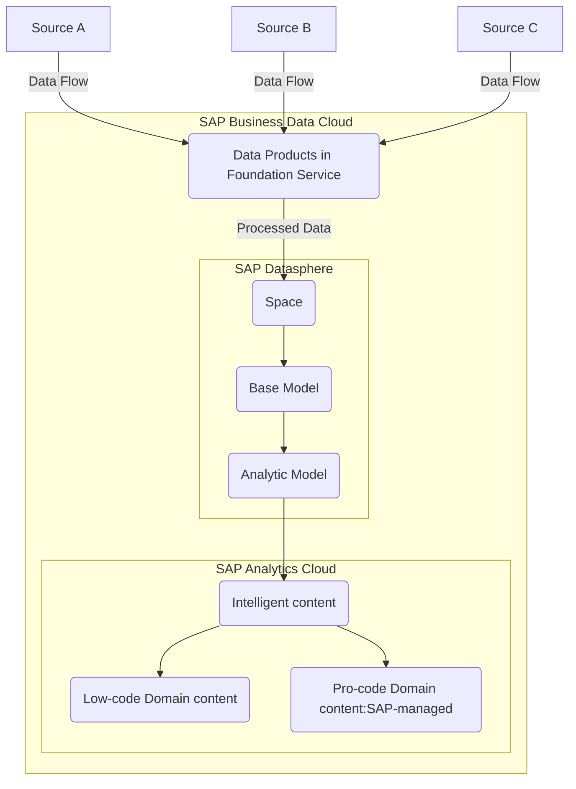

### Overview

SAP BDC Intelligent packages are the commercial offerings of adaptive and AI-powered applications, intelligent vusiness content and SAP managed data products. These are fully sap-managed analytical content and data products.
Intelligent content is a suite of adaptive, AI-powered applications that learn from your data, understand business context, and act on your behalf.

SAP Business Data Cloud provides the trusted data foundation that powers pre-built intelligent content for every line of business. This intelligent content delivers data products, semantic models, analytical models, and dashboards aligned to specific use cases from each line of business (e.g. workforce planning for HCM, working capital for Finance, etc.)

### Intelligent Package and Intelligent Content

An Intelligent package for a given line of business/industry is a set of intelligent content along with all the requisite components. SAP delivers the below list of intelligent packages:

- Cloud ERP Intelligence Private (released 2025)
- People Intelligence (released 2025)
- Finance Intelligence (controlled availability as of January 2026)
- Spend Intelligence
- Supply Chain Intelligence
- Revenue Intelligence
- Travel & Expense Intelligence
- Retail Intelligence
- Consumer Products Intelligence

### Key Components of Domain Content

| **Component**            | **Description**                                                                  |
| ------------------------ | -------------------------------------------------------------------------------- |
| **Visualization Object** | SAP Analytics Cloud story for dashboards and reports. 
| **Analytic Models**      | SAP Datasphere models that prepare and expose data for visualization.            |
| **Data Products**        | Data sets integrated into the analytic models, derived from Foundation Services. |
| **Foundation Services**  | Backend services for data replication and transformation.                        |
| **Roles**                | Scoped roles generated for access to relevant spaces.                            |

### Formation Setup for Domain content

To enable or develop Intelligent Content, the required landscape includes SAP Datasphere tenant, SAP Analytics Cloud tenant, prepared SAP S/4HANA PCE tenant, SAP Databricks(optional) must operate in a formation. 

High-Level Object Structure of Intelligent content consist of:

- **Visualization Objects**:
    - SAP Analytics Cloud stories serve as dashboards.
    - Interactive elements such as diagrams, tables, and charts.

- **Underlying Models**:
    - SAP Datasphere-based analytic models and views.
    - Automated data replication and transformation services.

The domain content in installed from SAP BDC Cockpit. An alternative option to directly activate a data package and execute data product installation and subsequently create SAP Datasphere models and SAP Analytics Cloud stories. 

**Data Flows**

The following diagram shows how raw source data is enriched as it moved through SAP BDC components until being surfaced in an Intelligent Application.

- Single Sign-On

    - Seamless navigation between tenants of SAP Business Data Cloud, SAP Analytics Cloud, and SAP Datasphere.
    - Enabled via [SAP Cloud Identity Services](https://help.sap.com/docs/cloud-identity-services) and Identity Authentication.

- Live Data Connection

    - SAP-managed live data connections link SAP Datasphere objects to SAP Analytics Cloud for Intelligent Applications usage.

### Life Cycle Management for Domain Content, Applications, and Data Packages

**1. Installation of Data Package/Product and Domain content**

Search and Install

    - Log in to SAP Business Data Cloud cockpit.
    - Browse available Intelligent Applications and their associated documentation.

Automated Setup

    - Installation generates SAP-managed objects, including:
        - Associated Data Products.
        - Replication flows, tables, views, and analytic models in SAP Datasphere.
        - Scoped roles for the relevant spaces.

**2. Dashboard Creation**
A dashboard is deployed as an SAP Analytics Cloud story for visualization.

**3. Visualization**

-   Intelligent Applications provide interactive dashboards based on live data connections to SAP Datasphere.
-   Users can apply filters, select members or dimensions, and set variable values (e.g., target currency).

### Customization and Enhancement

**Copying Content**

-   SAP-managed Intelligent Applications and their dependencies cannot be directly edited but components can be copied and adapted, as needed.
-   Users can copy SAP Analytics Cloud stories to enhance or adjust them for their needs.

**Enhancing Models**

-   For advanced use cases, users can copy and modify the underlying analytic models.
-   Changes to models affect both original and copied stories.

### Governance and Security

The **SAP Business Data Cloud catalog** enables to discover, understand and consume data products. It allows to govern access to data products by the administrator and to be consumed by SAP Datasphere and SAP Databricks based on delta share protocols
Any data products coming from SAP Databricks can be managed via the SAP BDC catalog. Security is managed decentralized in SAP BDC for admin and viewer roles, in SAP Datasphere, SAP Analytics Cloud, SAP Databricks and SAP BW for their respective users and roles

### Conclusion

Intelligent Content simplify the visualization and analysis of data in SAP Business Data Cloud. By leveraging SAP Analytics Cloud for dashboards and SAP Datasphere for data preparation, Intelligent Applications offer pre-configured, SAP-managed solutions that reduce complexity and enhance usability. Their architecture integrates Data Products, Foundation Services, and analytic models, ensuring seamless deployment and scalability while allowing customization for advanced scenarios.