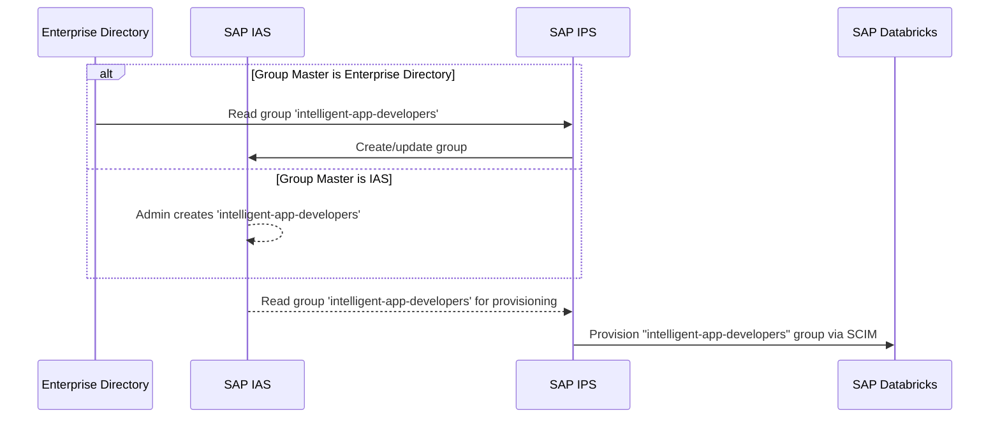
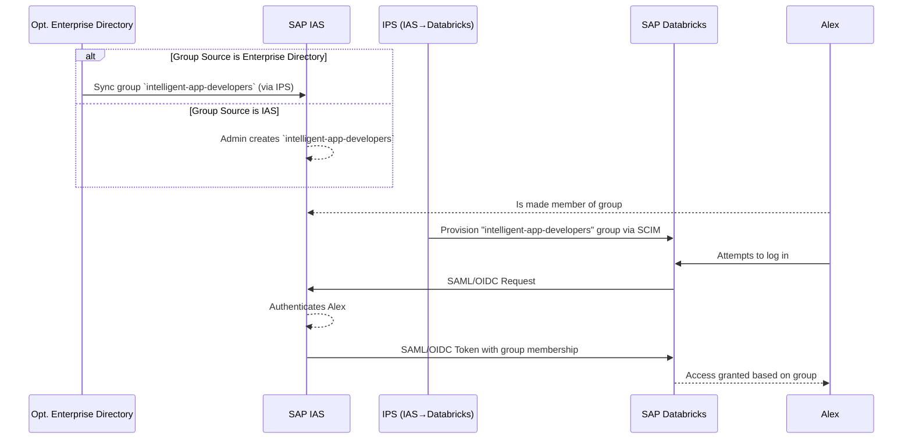

This reference architecture proposes a solution to unify access across the client's landscape with SAP Business Data Cloud (BDC), including SAP Analytics Cloud, SAP Datasphere, and SAP Databricks. By leveraging **SAP Cloud Identity Services (CIS)**—including IAS for SSO and IPS for provisioning—you can establish a single source of truth for user identities, groups of access, streamline access control, and enhance security. 

## Why Unified Identity: Key Outcomes

- **Improved Governance and Consistency**: A unified identity model ensures that access policies are consistently applied across all systems, reducing the risk of security breaches and simplifying audits.
- **Increased Business Agility**: By automating the user lifecycle, you can onboard new users and grant them access to the resources they need in a timely manner, accelerating time-to-value.
- **Reduced Operational Costs**: Centralizing identity management reduces the administrative overhead associated with managing multiple systems, freeing up IT resources to focus on more strategic initiatives.
- **Enhanced Security Posture**: A unified identity model provides a single source of truth for user identities, making it easier to detect and respond to security threats.
- **Future-Proof Architecture**: By leveraging open standards such as SAML, OIDC, and SCIM, you can ensure that your identity management solution is able to adapt to changing business needs and new technologies.

### User Journey: Intelligent App Developer (Alex)

To ground the architecture in a real use case, we introduce the persona "Alex," an intelligent app developer. We use this persona to clarify why unified identity is needed and to illustrate the end-to-end journey across SAP BDC, from first assignment to governed data access.

:::note[Introducing Alex]
Alex builds data-driven apps that combine using multiple tools, including SAP Analytics Cloud (SAC), governed data products from BDC, and advanced AI notebooks (SAP Databricks). As a member of the `intelligent-app-developers` enterprise group, he expects **consistent privileges** across every tool—meaning the same group yields the same effective rights in SAC roles, Datasphere spaces/roles, SAP BTP role collections, Databricks workspace entitlements, and Unity Catalog data access. He also expects one login (SSO via IAS), immediate workspace access (pre-provisioned via IPS/SCIM), and zero ticket waiting time (IGA-approved automated JML), with MFA and conditional access enforced uniformly and auditable access with centralized logs.
:::

## Architecture and Design Principles for Unified Identity

Our approach uses SAP Cloud Identity Services (IAS and IPS) as a central broker to create a consistent identity and authorization model across all platforms. This is guided by the following core principles:

- **Central Governance**: Establish a single source of truth for identities to enforce the principle of least privilege.
- **Separation of Duties**: Create clear boundaries between platform administration and data governance roles.
- **Zero Trust**: Treat every access request as untrusted. Enforce MFA and conditional access at the network edge.
- **Audit & Remediate**: Log all access, regularly audit for unauthorized changes, and automate remediation.
- **Open Standards**: Leverage SAML, OIDC, and SCIM to ensure a flexible and future-proof architecture.

## Architecture

The architecture positions SAP Cloud Identity Services as the central hub for identity management. It unifies access by connecting to an authoritative source of truth, which can be an Enterprise IdP or a core business system like **SAP SuccessFactors** (for employee lifecycle) or **SAP S/4HANA** (identity data or business roles). Any such system that can be integrated with SAP Identity Provisioning Service (IPS) and serve as the authoritative source for user lifecycle events. CIS then provides single sign-on (SSO) and user provisioning to SAP BDC.

### Key Components

- **SAP Cloud Identity Services (CIS)**: The core of this architecture, providing a unified identity and access management solution.
- **SAP Identity Authentication Service (IAS)**: Acts as the central SSO broker, handling authentication requests and federating to other Enterprise IdPs as needed.
- **SAP Identity Provisioning Service (IPS)**: Automates user lifecycle management, ensuring that identities and access groups are consistent across all connected systems.
- **SAP BTP Subaccount**: The Cloud Foundry environment hosting the native BDC applications. It serves as the central provisioning target, where IPS syncs users and groups. These identities are then available to all applications within the subaccount, like SAP Analytics Cloud, SAP Datasphere, and the BDC Cockpit. Authorization is managed here via Role Collections.
- **SAP Databricks**: The data and AI platform, which is provisioned to separately. It has its own account-level SCIM directory for user provisioning and uses workspace entitlements and Unity Catalog for authorization.

## Providing unified access for SAP BDC

:::note[Our persona: IPS pre-provisions Alex's access across SAP BDC (SCIM)]
IPS automatically syncs Alex's IAS group memberships to each target system. When Alex signs in via IAS, his token maps directly to the correct BTP role collections, Databricks workspace entitlements, and Unity Catalog grants.
:::

For Alex, seamless access across SAP Business Data Cloud means one secure sign-on through IAS and pre-provisioned, group-based authorization via IPS applied consistently in SAP Analytics Cloud, SAP Datasphere, and SAP Databricks. The following flow diagrams use SAP Databricks as an example, but the same identity patterns and governance model apply across BDC applications.

### Access Provisioning Flow

1. **Group Definition**: A group, **`intelligent-app-developers`**, is defined. This can be in the Enterprise Directory and replicated via IPS, or created directly in the IAS user store.
2. **User Assignment**: Alex is made a member of the `intelligent-app-developers` group.
3. **Provisioning to Databricks**: An IPS job is configured with IAS as the source and SAP Databricks as the target. It reads the `intelligent-app-developers` group and its members.
4. **SCIM Synchronization**: IPS provisions the group and its members to the SAP Databricks account-level SCIM directory.

:::note[Key Takeaways]
- **Proactive Entitlements**: Groups are provisioned to Databricks *before* users log in for the first time.
- **Automated Access**: New members of the `intelligent-app-developers` group automatically get access without manual intervention.
- **Flexible Governance**: Group management can be centralized in your Enterprise Directory or managed directly within SAP Cloud Identity Services. For SAC, Datasphere, and the BDC Cockpit, admins typically map SAP BTP role collections to IAS groups once per application/role collection. This mapping only needs updates when new role collections or groups are introduced, names change, or governance requirements evolve.
:::

### Authentication & Authorization Flow

:::note[User Journey: Single sign-on across SAP BDC (IAS SSO)]
Alex signs in once with IAS (SAML/OIDC). IAS can broker to the enterprise IdP as needed, so one login grants seamless access across BDC apps.
:::

1. **Single Sign-On**: Alex launches the SAP Databricks or any BDC application (e.g., SAP Analytics Cloud, SAP Datasphere), which redirects to IAS for authentication.
2. **Authentication**: Alex signs in. This may be federated to an Enterprise IdP or handled directly by IAS.
3. **Token Issuance**: IAS issues a SAML or OIDC token containing Alex's group memberships, including **`intelligent-app-developers`**.
4. **Accessing Databricks**: The token is presented to SAP Databricks.
5. **Authorization**: Databricks recognizes the `intelligent-app-developers` group (which has been pre-provisioned) and grants Alex the appropriate permissions within the workspace and Unity Catalog.

### Databricks Identity Types

In a CIS-centered architecture, Databricks identities are integrated via IAS for SSO (SAML/OIDC) and IPS for SCIM provisioning. The same three types apply, but their lifecycle and authorization are governed by IAS/IPS:

- **Users (human identities)**:  
  - **Source of truth**: Enterprise Directory (e.g., SuccessFactors/AD) synchronized into IAS, or IAS-native users.  
  - **Authentication**: Single sign-on via IAS (SAML or OIDC), with federation to the Enterprise IdP as needed. Enforce conditional access and MFA in IAS.  
  - **Provisioning**: IPS pushes user objects to the Databricks account-level SCIM directory. Ensure email/username normalization and disable local invites to keep Databricks aligned with IAS.  
  - **Authorization**: Users inherit access through pre-provisioned IAS groups that IPS syncs to Databricks. Effective rights materialize as workspace entitlements and Unity Catalog privileges granted to those groups.

- **Service principals (non-human identities)**:  
  - **Purpose**: CI/CD pipelines, scheduled jobs, automation tooling without interactive login.  
  - **Provisioning**: Prefer SCIM-based creation via IPS where supported; alternatively create in Databricks and bind access through IAS-managed groups that IPS syncs.  
  - **Credentials**: Favor OAuth client credentials or cloud-native identities over PATs. Store and rotate secrets via platform vaults; scope to least privilege in Unity Catalog.  
  - **Governance**: Treat as privileged identities with dedicated approval flows and separation from human-user groups.

- **Groups (authorization control plane)**:  
  - **Mastering**: Define groups in IAS (or Enterprise Directory) and synchronize to Databricks via IPS SCIM.  
  - **Mapping**: Align IAS groups to Databricks workspace entitlements (e.g., “Can Use”, “Workspace Admin”) and to Unity Catalog grants on catalogs/schemas/tables.  
  - **Design**: Use clear naming conventions that tie business roles to technical privileges; keep groups atomic; avoid direct user grants in Databricks—favor group-based RBAC (and ABAC with tags, where applicable).

## Audit & Monitoring

SAP Cloud Identity Services (IAS for SSO, IPS for provisioning) serve as the central identity and lifecycle control plane, anchoring audit and monitoring across the BDC landscape. 

- **Unified identity context** — Understand who accessed and under which policies; resource-level details (e.g., which story, space, data product or table) come from SAC, Datasphere, and Databricks logs correlated with CIS.  
- **Consistent policy enforcement** — One set of SSO and conditional access controls (IAS) to monitor for compliance and zero trust.  
- **Lifecycle traceability** — Provisioned users and groups (IPS) reflect business intent, making access changes explainable and auditable.  
- **Cross-platform governance** — A common identity model aligns application and data platform events to business roles.  
- **Faster detection and response** — Correlated identity and authorization signals shorten time to detect, investigate, and prove compliance.

## Deployment Scenarios

:::note[User Journey: Alex]
Select the rollout option that keeps him productive, whether greenfield or enterprise-brokered.
:::

The following scenarios are designed to help you choose the best deployment strategy for your organization, based on your size and existing identity landscape.

### Greenfield Scenarios

**For Small to Medium-Sized Enterprises (SMEs):**

*   **Scenario A: SAP Cloud Identity Services as the Primary Enterprise IdP**
    *   **Description**: In this scenario, SAP Cloud Identity Services (CIS) is used as the central Enterprise IdP for both SSO and user provisioning. This is the simplest and most straightforward approach for organizations that do not have an existing Enterprise IdP.
    *   **Recommendation**: This is the recommended approach for SMEs that are starting from scratch with their identity management solution.

**For Large Enterprises:**

*   **Scenario B: Enterprise IdP with SAP Cloud Identity Services as a Broker**
    *   **Description**: In this scenario, the organization's existing Enterprise IdP is used as the authoritative source for user identities, and CIS is used as a broker to provide SSO and user provisioning to SAP BDC and Databricks.
    *   **Recommendation**: This is the recommended approach for large enterprises that have an existing Enterprise IdP and want to leverage their existing investment.

### Brownfield Scenarios

**For Small to Medium-Sized Enterprises (SMEs):**

*   **Scenario C: Hybrid Approach**
    *   **Description**: In this scenario, a hybrid approach is used, where some applications are integrated directly with the Enterprise IdP, while others are integrated with CIS. This approach can be used to migrate to a fully unified identity management solution over time.
    *   **Recommendation**: This approach is recommended for SMEs that have an existing Enterprise IdP but are not yet ready to migrate all of their applications to a unified identity management solution.

**For Large Enterprises:**

*   **Scenario D: Phased Rollout**
    *   **Description**: In this scenario, a phased rollout is used, where the unified identity management solution is implemented for a small number of applications and then gradually rolled out to the rest of the organization.
    *   **Recommendation**: This approach is recommended for large enterprises that want to minimize the risk of disruption to their business operations.

## Best-Practice Checklist

- **Least Privilege** – Grant only required role-collections and Unity Catalog privileges.  
- **MFA Everywhere** – Enforce multi-factor authentication via IAS conditional access.  
- **Centralized Logging** – Stream all IAS, IPS, BTP, and BDC audit logs into SIEM and review routinely.  
- **Access Certification** – Conduct regular reviews with business data owners.

## Conclusion
:::note[User Journey: Alex]
Unified identity gives instant access, consistent privileges, and lets him focus on building apps—not chasing permissions.
:::
This reference architecture has provided a comprehensive overview of how to implement a unified identity and access management solution for SAP Business Data Cloud and SAP Databricks. By leveraging SAP Cloud Identity Services, you can establish a single source of truth for user identities, streamline access control, and enhance security.

The deployment scenarios and recommendations provided in this document are designed to help you choose the best approach for your organization, based on your size and existing identity landscape. By following the guidance in this document, you can implement a robust and scalable identity management solution that will help you deliver analytics and AI confidently at scale.

## References
-   [SAP Cloud Identity Services](https://discovery-center.cloud.sap/serviceCatalog/cloud-identity-services?region=all)
-   [SAP Identity Authentication Service (IAS) documentation](https://help.sap.com/docs/identity-authentication)
-   [SAP Identity Provisioning Service (IPS) documentation](https://help.sap.com/docs/identity-provisioning)
-   [SAP Business Data Cloud overview](https://www.sap.com/products/technology-platform/business-data-cloud.html)
-   [SAP BTP Authorization and Trust Management](https://help.sap.com/docs/btp/sap-business-technology-platform/sap-authorization-and-trust-management-service-in-cloud-foundry-environment?q=Authorization+Service+)
-   [Create or Modify a Bundled SAP Cloud Identity Services Tenant](https://help.sap.com/docs/business-data-cloud/administering-sap-business-data-cloud/create-or-modify-bundled-sap-cloud-identity-services-tenant)
