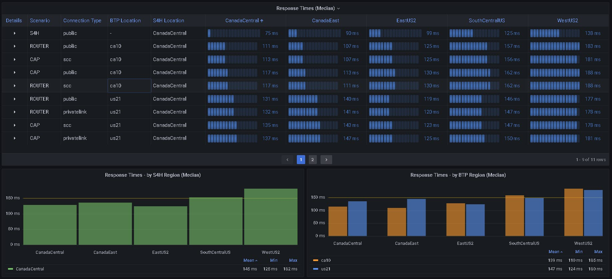

---
############################################################
#                Beginning of Front Matter                 #
############################################################
#                     [DO NOT MODIFY]                      #
############################################################
id: id-ra0014
slug: /ref-arch/97da66ca6c
sidebar_position: 14
sidebar_custom_props:
    category_index: aws, azure, gcp, appdev, integration, security
############################################################
#     You can modify the front matter properties below     #
############################################################
title: Testing and Understanding Network Performance Implications in a Multi-Regional Solution Setup
description: Designing and operating cloud based solutions in a multi-regional setup are technically advanced tasks. The solution and application design, usage of different network providers and last but not least the geographical placement of services have an impact on the overall performance.
sidebar_label: Testing and Understanding Network Performance Implications in a Multi Regional Solution Setup
keywords: [sap, BTP, rise, grow, hyperscaler, S/4 HANA, aws, azure, gcp, odata, privatelink, wan, internet]
image: img/logo.svg
tags: [aws, azure, gcp, appdev, integration]
hide_table_of_contents: false
hide_title: false
toc_min_heading_level: 2
toc_max_heading_level: 4
draft: false
unlisted: false
contributors:
    - uklasing
    - kshanth
    - AjitKP91
last_update:
    date: 2025-05-07
    author: user-97da66ca6c
############################################################
#                   End of Front Matter                    #
############################################################
---

<!-- Add the 'why?' for this architecture. Why do we have it? What is its purpose -->

Cloud infrastructures are distributes systems by default, caused by the fact that multiple systems are connected via a network to execute a desired task. A distributed system design massively increases the complexity of building and operating these solutions. In the introduction of the famous [Distributed Systems Course MIT 6.824](https://www.youtube.com/@6.824/videos) there is already this kind of ironic warning "...if you can possibly solve it on a single computer ... without building a distrinbuted system you should do it that way". Having an honest assessment of our situation this warning is definitely a bit late for us. 

Looking at typical enterprise solutions consisting of different SAP SaaS Cloud products of the SAP Business Suite like S/4 HANA, SuccessFactors, Ariba, SAP Sales Cloud,... SAP Legacy Solutions on-premise or operated on Infrastructure as a Service (IaaS), 3rd party solutions and last but not least the SAP Business Technology Platform (BTP) you automatically end up in a massively distributed system. To make things even harder, these systems could be spread out to very different locations, spanning even different continents. In the context of hyperscalers (Infrastructure and platform providers like Amazon Web Service, Google Cloud Platform or Microsft Azure), these locations are referred to as "regions". 

However, the distribution of services to different locations is not just an obstacle to deal with, often there are valid business reasons behind using certain datacenter locations, like regulatory requirements, security and cost considerations and, you might guess it, performance requirements. 
Many SAP customers do business in a vast number of countries, running services and solutions in different locations and regions becomes a business requirement and imperative.
Designing such a global network of services for a certain customer specific solution and fitting it into an overarching enterprise architecture is a complex undertaking. As with any architectural concept, the ability of making intelligent tradeoffs is a most required skill.

This document will have a look at the performance impact of wide area network connections and the effects of using different services for the connections. Instead of guessing the performance we will use a distributed measurement system to understand the impact of different architectural decisions. In the final section we will discuss the findings and results from former tests that have been executed using the distributed measurement environment and will derive some best practices and rules of thumb that can help architects in designing their distributed system landscape for SAP solutions.

# Definition of network performance:
From [Wikipedia, the free encyclopedia](https://en.wikipedia.org/wiki/Network_performance):  
> Network performance refers to measures of service quality of a network as seen by the customer. ...
> 
> The following (performance) measures are often considered important:
> 
> * **Bandwidth** commonly measured in bits/second is the maximum rate that information can be transferred
> * **Throughput** the actual rate that information is transferred
> * **Latency** the delay between the sender and the receiver decoding it, this is mainly a function of the signals travel time, and processing time at any nodes the information traverses
> * **Jitter** variation in packet delay at the receiver of the information
> * **Error rate** the number of corrupted bits expressed as a percentage or fraction of the total sent

To get a deeper understanding of the measures refer to the wikipedia article mentioned above. 

## Architecture

The architecture describes a distributed testing landscape that can be used to measure network performance aspects in a multi-regional, multi-provider setup. Although it can be used with all kinds of different network payloads the focus is currently on OData calls which is a common protocol that many SAP products and soultions use to connect user interface frontends (UI) with the respective backends. It is the default communcation method for UIs with SAP S/4 HANA and for any apps that have built using the SAP Cloud Application Programming Model (CAP) on SAP BTP.
In the existing example the OData services from the "Manage Sales Orders" SAP Fiori were used to request data from an S/4 HANA Private Cloud Edition instance.

<!-- The drawio "image" should appear right after the Solution Diagram SVG image -->
<!-- Note: [PLACEHOLDER] Please update the drawio with your architecture's drawio  -->

The solution architecture consists of the following parts:

* **The Worker Nodes**    
Specialized Docker containers simulate UI requests by issuing OData calls to the S/4 HANA Backend system. For this purpose a docker container containing the load testing tool [Apache JMeter](https://jmeter.apache.org) has been created. 
Using a container simplifies deployment to different environments. The container can be deployed to anything from a docker desktop on a local workstation or virtual machine, to different container runtimes like AWS Elastic Container Service (ECS), Azure Container Instance (ACI) or Google Cloud Run, all kinds of Kubernetes environments like Kyma on SAP BTP and even Cloud Foundry. This deplyment flexibility makes it easy to simulate different user locations.

* **The Controller Node**  
The controller node runs another instance of JMeter. It is responsible for scheduling and controlling the load test operations on the different worker nodes. It uploads the measurement results to the dashboard.

* **The Dashboard**  
The Dashboard consists of 2 docker containers:
  * A Container running [Grafana](https://github.com/grafana/grafana)
  . According to [Wikipedia](https://en.wikipedia.org/wiki/Grafana) Grafana "is a  multi-platform open source analytics and interactive visualization web application. It can produce charts, graphs, and alerts for the web when connected to supported data sources." It is very often used for technical dashboards, e.g. in observability use cases.   

  * A Container running [InfluxDB](https://github.com/influxdata/influxdb). [Wikipedia](https://en.wikipedia.org/wiki/InfluxDB) states: "InfluxDB is a time series database (TSDB) developed by the company InfluxData. It is used for storage and retrieval of time series data in fields such as operations monitoring, application metrics, Internet of Things sensor data, and real-time analytics..."
 
   For deployment the InfluxDB container and the Grafana container should be co-located on a container runtime and orchestration system. In our example both containers are deployed as a single Kubernetes Pod on SAP's Kubernetes offering [SAP BTP, Kyma Runtime](https://discovery-center.cloud.sap/serviceCatalog/kyma-runtime?region=all) but any other Container management and runtime solution would work, too. 
   
   The Grafana dashboard is used to group and analyze the performance results that have been uploaded to InfluxDB as single records.

    
Screenshot of the Grafana Dashboard    

## Network performance of different BTP and Hyperscaler regions and connection options

Designing the location strategy for a multi-regional SAP solution setup comes with its own challenges. 
Let's have a look at a simplified scenario: 

A customer has started on their "Rise with SAP" journey. For their S/4HANA Cloud Private Edition, they have to choose an infrastructure (IaaS) provider. In many cases one of the Hyperscalers AWS, Azure or GCP would be the preferred choice. Usually, these systems will be augmented and extended by solutions on SAP BTP, e.g. SAP Integration Suite, SAP Workzone or extensions based on the SAP Cloud Application Programming Model (CAP) with HANA Cloud as a backend. 

Aspects to consider:
* Availability of a BTP service in a certain region
* Availability of a BTP service on a specific hyperscaler (IaaS provider)
* Some connection options like the SAP PrivateLink service are only availabe on some providers and require the S/4HANA Cloud system and the connected BTP subaccount to be on the same hyperscaler platform (AWS or Azure)
* User location and network distance to BTP subaccount and S/4HANA system

To understand the impact of different connection options, different test options have been developed:

The baseline (no BTP involved):
* Direct OData call from worker node to the S/4HANA system (SAP Gateway)
    * using public IPv4 address if the worker node and the S/4HANA systems are connected via the public internet (not recommend for production use)
    * you can use private IPv4 addresses if S/4HANA and the worker node are on the same private network

    

Minimal BTP scenario using Cloud Foundry App as proxy:
* Odata call from worker node to the S/4HANA system using the Cloud Foundry App Router as a proxy

    

* Odata call from worker node to the S/4HANA system using the Cloud Foundry App Router as a proxy via SAP Cloud Connector

    

* Odata call from worker node to the S/4HANA system using the Cloud Foundry App Router as a proxy via SAP Private Link service.

    

Indirect calls via BTP CAP application:
* A CAP app on a BTP subaccount is used to consume the OData service on the S/4HANA system. The CAP app converts the OData v2 service into OData v4 that is consumed by our worker node simulating the client.

<!-- corrected path error for draw.io file -->
    

* A CAP app on a BTP subaccount is used to consume the OData service on the S/4HANA system via SAP Cloud Connector.

    

* A CAP app on a BTP subaccount is used to consume the OData service on the S/4HANA system via SAP Private Link service.

    

<!-- Add your flow content here -->

## Characteristics

<!-- Add your characteristics content here -->

## Examples in an SAP context

<!-- Add your SAP context examples here -->

## Services and Components

<!-- Add your services and components here -->

## Resources

<!-- Add your resources here -->

## Related Missions

<!-- Add related missions here -->
