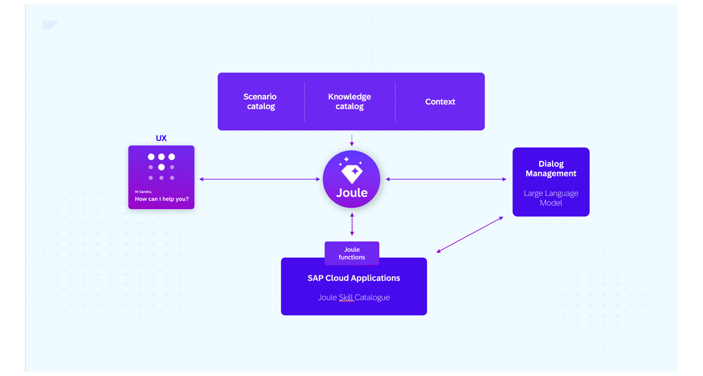

Joule is an AI-powered SAP co-pilot designed to enhance productivity and decision-making within enterprise environments.Joule is embedded across the SAP Enterprise Solutions portfolio, accessible to all users, providing contextual assistance, automating routine tasks, and delivering insights that drive better business outcomes. 

Joule provides an embedded experience across solution areas, consistent and with memory of interactions across multiple products.The interactions are achieved using advanced algorithms and large language models (LLM) for user queries and user intents. If a user posts a question to Joule, the copilot understands the intent, and with the help of the integration with your SAP Business Applications, it gives the appropriate response.

This reference architecture outlines the key components and best practices for integrating and extending Joule, enabling organizations to effectively leverage its capabilities. This architecture is designed to provide a comprehensive understanding of how to integrate unified Joule with existing enterprise systems, build custom skills and agents, and optimize its performance for specific business needs. 

## Joule Key Capabilities

Joule Capabilities are categorized into different patterns.

**Transactional Pattern:** - Provides our users a direct entry point to SAP, the backend system. Triggering and influencing business processes with the power of natural language and generative AI. E.g., purchase orders which need to be reviewed and approved, job positions which are created, OR any other CRUD (Create, Read, Update, Delete) based interactions. All our Cloud products are currently developing content packages for Joule to facilitate the most relevant user interactions.

**Navigational Pattern:** - The navigational pattern helps our users handle business processes themselves in the relevant SAP screen. Joule allows users to navigate directly to their desired application/screens. This is especially helpful for users who are not very familiar with navigating SAP applications.

**Informational Pattern:** - The informational pattern provides knowledge-based results. These are, for example, policy-related questions. This can be based on SAP-owned content, such as SAP Help Pages, or could be customer-owned content as well, by integrating the SAP Document Grounding services with Joule. 

**Analytical Pattern:** - The analytical pattern provides insights and data analysis capabilities. Users can ask questions related to business metrics, trends, and performance indicators, and Joule will provide relevant insights from the SAP Analytics Cloud system.

## Architecture

<!-- The drawio "image" should appear right after the Solution Diagram SVG image -->
<!-- Note: [PLACEHOLDER] Please update the drawio with your architecture's drawio  -->

The architecture describes the key components and interactions involved in implementing and extending Joule within an enterprise environment. To achieve a unified experience with Joule, the following architecture outlines the components and activities required for implementation.

The solution architecture consists of the following parts:

- **SAP Business Technology Platform** establishes the foundation for implementing and extending Joule capabilities with Joule and SAP Build Work Zone entitlements. System Landscape in SAP BTP the SAP Business Application systems (e.g., SAP S/4HANA, SAP SuccessFactors,…) are properly set up and configured. If the systems are under the same customer contract, this should be auto-discovered in the System Landscape; otherwise, it can be manually added.

- **SAP Cloud Identity Services** manages user authentication and authorization for secure access to your SAP Applications and Joule. SAP Cloud Identity Services is a prerequisite for all Joule integrations; therefore, a common SAP Cloud Identity Services instance (prod and non-prod) is recommended for your SAP Business Applications, utilizing a single domain URL (cloud.sap.com) for setup.  

- **SAP Enterprise Systems:** connects Joule with your cloud systems such as SAP S/4HANA Cloud, SAP SuccessFactors, SAP Ariba, SAP Concur, SAP Analytics Cloud, etc, and other third-party applications to enable seamless data exchange and process automation.

- **Third-party Identity Providers:** supports integration with external identity providers for enhanced security and user management (Optional). This will require additional configurations with SAP Cloud Identity Services to establish trust and enable single sign-on (SSO) capabilities.

## Flow

The application flow for Joule interactions typically involves the following steps:

1. The users start with their queries in the natively integrated Joule client embedded in our respective SAP cloud applications.

2. Each incoming request is processed and orchestrated based on what is available. Joule takes three categories into consideration:

    - Joule analyzes if the user-prompt is relevant for Joule’s Scenario Catalog. This catalog contains metadata of all available scenarios, functions, and skills of SAP cloud applications.

    - Joule conducts an informational filtering based on the Knowledge Catalog. This contains SAP-knowledge as well as the customer-owned knowledge. This process is based on Retrieval Augmented Generation for enterprise (RAGe) and lets the LLM generate an answer based and grounded on dedicated text that was previously retrieved.

    - Joule is aware of the user's context and history. This includes information about which SAP cloud application the respective user is using and which additional SAP application the customer has licensed and activated with Joule. Also, Joule is aware of the user's role(s) and permissions. This means a user cannot access information or adjust business processes they couldn't do directly in the SAP cloud application without using Joule. Lastly, Joule understands a user's chat history and context, ensuring that the best possible answers are provided in response to questions asked shortly before.

3. Joule takes all of this contextual information and provides a much richer query to the LLM which is responsible for the dialog management. This LLM is based on a rich ecosystem of technology partner LLM offerings also available directly via SAP Business Technology Platform's AI Foundation and the SAP Generative AI Hub. Here we are leveraging the latest LLMs and innovations available in the market under strict contractual agreements with SAP's partners which prohibits them from training any of their AI-models on any customer data. 

4. The LLM provides a grounded response back to the Joule service or identifies the need to leverage Joule functions which includes the Joule scenarios of our SAP Cloud Applications. Joule calls the respective SAP backend system to proceed with the requested query, e.g. requesting time off. 

5. The response is then filtered as appropriate, and the customer gets a response knowing the conversation and output has been processed all with enterprise security, data privacy, and responsible AI considered.
 
 

## Characteristics

<!-- Add your characteristics content here -->
- **Revolutionize User Experience:** Joule transforms how users interact with SAP applications by providing contextual assistance, automating routine tasks, and delivering insights that drive better business outcomes.

- **End-User Interactions:** Joule enhances end-user interactions by accelerating every process with a single AI copilot, providing comprehensive insights and enabling tasks across all your SAP solutions.

- **Seamless Integration and Reliable Insights from Enterprise Systems:** Joule seamlessly integrates with existing enterprise systems with native access to your data, providing data context with role-based access to ensure reliable insights and recommendations.

- **Customizable and Extensible:** Organizations can build custom skills and agents using Joule Studio and SAP BTP, tailoring the copilot's capabilities to meet specific business needs.

- **Security and Compliance:** Joule adheres to stringent security and compliance standards, ensuring that sensitive business data is protected throughout the interaction process.

- **Human-centric governance:** Built-in responsible AI to safeguard against inappropriate content and ensure compliance with organizational policies. SAP AI ethics policy adopts the 10 guiding principles of the UNESCO Recommendation on the Ethics of Artificial Intelligence. The principles aim to ensure that AI technologies are developed and used in ways that respect human rights, promote fairness, and contribute to sustainable development.

## Examples in an SAP context

<!-- Add your SAP context examples here -->

- [SAP Business AI - Joule Capabilities](https://discovery-center.cloud.sap/ai-catalog/?quickFilter=joule)

## Services and Components

<!-- Add your services and components here -->

-   [SAP Build, Joule Studio](https://discovery-center.cloud.sap/ai-feature/e93aa292-e7f4-449d-9586-f1a8510d5ab6/)
-   [SAP Build](https://discovery-center.cloud.sap/serviceCatalog/sap-build/?region=all)
-   [SAP AI Core](https://discovery-center.cloud.sap/serviceCatalog/sap-ai-core/?region=all)
-   [Document Grounding](https://discovery-center.cloud.sap/ai-feature/fedeca14-3e69-472c-a0ea-82396735c35f/)
-   [SAP Build Process Automation](https://discovery-center.cloud.sap/serviceCatalog/sap-build-process-automation?region=all)
-   [SAP Cloud Identity Services](https://discovery-center.cloud.sap/serviceCatalog/cloud-identity-services?region=all)
-   [SAP Connectivity service](https://discovery-center.cloud.sap/serviceCatalog/connectivity-service?region=all)
-   [SAP Destination service](https://discovery-center.cloud.sap/serviceCatalog/destination?region=all)

## Resources

<!-- Add your resources here -->

- [Joule Product Page](https://help.sap.com/docs/joule)
- [Joule (sap.com)](https://www.sap.com/india/products/artificial-intelligence/ai-assistant.html)
- [SAP Community](https://community.sap.com/topics/joule)
- [SAP Learning Journey - Provisioning and Implementing Joule](https://learning.sap.com/learning-journeys/provisioning-and-implementing-joule)

## Related Missions

<!-- Add related missions here -->
- [SAP Discovery Center Missions - Joule](https://discovery-center.cloud.sap/missionCatalog/?search=joule)
