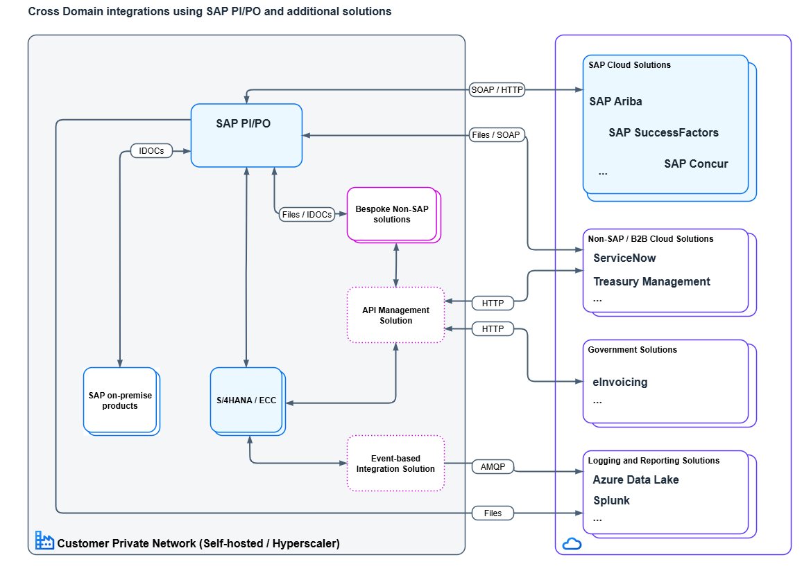

---
############################################################
#                Beginning of Front Matter                 #
############################################################
#                     [DO NOT MODIFY]                      #
############################################################
id: id-ra0025-1 
slug: /ref-arch/5f84ec80cc/1
sidebar_position: 1
sidebar_custom_props:
    category_index:
############################################################
#     You can modify the front matter properties below     #
############################################################
title: SAP PI PO to BTP Integration Suite
description: SAP Process Integration / Process Orchestration is a Netweaver based solution for meeting cross domain integration needs that serve both intra- and inter-company scenarios. As it approaches end of standard maintenance, customers need to migrate to modern integration solution that offers robust, scalable and secure integration capabilities. SAP BTP Integration Suite is an ideal solution that meets this criteria as well as provides feature parity for seamless transition from SAP PI/PO.
sidebar_label: SAP PI PO to BTP Integration Suite
keywords: [integration]
image: img/logo.svg
tags: [integration]
hide_table_of_contents: false
hide_title: false
toc_min_heading_level: 2
toc_max_heading_level: 4
draft: false
unlisted: false
contributors:
    - abklgithub
last_update:
    date: 2025-08-02
    author: abklgithub
############################################################
#                   End of Front Matter                    #
############################################################
---

<!-- Add the 'why?' for this architecture. Why do we have it? What is its purpose -->
SAP Process Integration / Process Orchestration is a Netweaver based solution for meeting cross domain integration needs that serve both intra- and inter-company scenarios. As it approaches end of standard maintenance in the end of 2027, customers need to plan migrations to a modern integration solution that offers robust, scalable and secure integration capabilities. Customers do have an option to extend the maintenance till 2030 after which SAP support comes to and end.

The challenge is to identify a solution that preferably fits to all existing scenarios or at least one that addresses majority of the scenarios. The remaining minority can then be migrated to another suitable solution.

SAP BTP Integration Suite is an Integration Platform as a Service (iPaaS) offering from SAP through its multi-cloud Business Technology Platform. It is ideal solution in SAP portfolio that can be leveraged by SAP customers looking to migrate from SAP PI/PO. 

### Benefits of an iPaaS
BTP Integration Suite provides feature parity with SAP PI/PO and thus is an excellent candidate seamless transition and migration from SAP PI/PO. It is important to note that SAP Integration Suite provides lot more capabilities than SAP PI/PO. For instance, EDA based integrations are met by (Advanced) Event Mesh, while API Management meets the modern requirements like request throtelling (rate limiting) and API monetization. The biggest benefit of this is simplification of the integration landscape. Instead of managing several tools for different integration needs in the landscape, organizations can consolidate the integration workloads on BTP Integration Suite which offers capabilities that serve all modern integration requirements. Integration Suite capabilities range from process integration (Cloud Integration product) and service mediation (API Management product) to EDA based integration (the Event Mesh products). The capabilities can be switched on as needed. The simplification through consolidation brings benefits of reducing  technological spread, which in turn reduces the need to maintain diverse skillset and dedicated administration and support teams per technology. Integration Suite comes equipped with centralized Integration Monitoring feature that simplifies in observability and troubleshooting. All of this leads to reduction in TCO, without any reduction in performance. Being an SAP product, customers have the benefit of leveraging the existing relationship with SAP through the contractual agreements.

### Coverage of integration domains
Integration Suite is ideal for integrations that cover cloud to cloud and cloud to on-premise domains. For integration that cover on-premise only domain, customers can consider opting for Edge Integration Cell (EIC). EIC provides same runtime as that of Integration Suite, which has several advantages. Firstly existing Integration Suite skills in the organization can be leveraged. Next, this allows deployment of same iFlow with differnt configuration in Integration Suite and EIC to suit the business needs, which reduces test, maintenance and upgrade efforts. As the administration of EIC and Integration Suite is available via the BTP cockpit, this makes the overall administration simpler.

It is important to recognize that here 'on-premise' doesn't necessarily mean self-hosted data centers. The term 'on-premise' is used to refer private landscapes which can be data centers owned and operated by organizations, or private networks on Hyperscalers. See other sections of Architecture Center that elaborate on EIC deployment options on the Hyperscalers. 

### Migration from PI/PO
As both SAP Integration Suite and SAP PI/PO are SAP products, SAP provides a detailed migration guide. In addition to the guide, SAP provides tools like Migration Assessment to estimate the technical effort involved in the migration process and evaluates how various integration scenarios might be migrated. Furthermore, SAP provides Migration Tooling as part of Cloud Integration capability that has a wizard-based step by step migration mechanism for integration objects residing in SAP PI/PO. These tools help not just in the evaluation and planning stages of the migration project but also help in performing semi-automated migration of artifacts. This enables a robust foundation fostering a more predictable, and thus, successful migration. 

Migration Assessment is a standalone capability of BTP Integration Suite and Migration Planning is integral part of the Cloud Integraion capability. In other words, these are available to BTP Integration Suite customers as part of the subscription.

There are dedicated missions on Discovery Center (see resources section below) that provide step by step guidance on using Migration Assessment and Migration Tooling, as well as SAP partner tools to support the test efforts in the migration project.

## Architecture

### As-is architecture

### To-be architecture

## Flow

### Integration landscape with SAP PI/PO (and other solutions)
SAP PI/PO is part of the private solution landscape of the organization and integrates bi-directionally with on-premise SAP products like SAP S/4HANA, Central Finance, etc. on one side and SAP or third party solutions within as well as outside the private landscape. The low level networking details involving DMZ and firewall rules that enable cross domain traffic are implicit and not shown in the diagram. SAP PI/PO support integration over various protocols and adapters.

The organization uses a dedicated solutions for API Management and an event broker for EDA-based integrations. While these are hosted on the customer private network, they are used exclusively for cross-domain integrations with cloud based solutions owned by suppliers and customers of the orgazation, government compliance solutions, or event stream storage employed for observability and reporting.

### Integration landscape with BTP Integration Suite and Edge Integration Cell
The BTP Integration Suite takes center stage in managing cross domain integrations between the solution hosted on the customer private network and cloud based solutions. The different capabilities of Integration Suite integrate securely with the solution on customer private landscape through SAP Cloud Connector in HA setup (not depicted) after routing through the BTP Destination and Connectivity services. This setup provide reliable and secure connectivity while reducing the number of firewall exceptions needed in customer private network.

The Integration Suite capabilities connect to the cloud based systems via the BTP Destination service. As Integration Suite is a cloud based service, its IP addresses are publicly available and static in nature. This eases the integration with third parties, especially with entities that allow connections only by IP addresses.

For integration scenarios that exclusively invovle systems within the customer private network, organization uses Edge Integration Cell. It allows to keep the intra-company traffic within the customer private network. If all solutions integrated by EIC are within the same region of a single hyperscaler, this setup leads to avoidance of ingress and egress costs.

## Characteristics

- Clear migration path with suitable tools, migration tools and estimates
- Clear segregation of solutions for cross domain and on-premise only integrations
- Simplification of landscape and operational complexity
- Build once deploy anywhere approach 
- Central administration and monitoring

## Services and Components

1. [SAP Integration Suite](https://discovery-center.cloud.sap/serviceCatalog/integration-suite?]region=all)
2. [Cloud Integration](https://help.sap.com/viewer/368c481cd6954bdfa5d0435479fd4eaf/Cloud/en-US/9af2f05c7eb04457aee5906fd8553e00.html)
3. [Edge Integration Cell](https://help.sap.com/docs/integration-suite/sap-integration-suite/what-is-sap-integration-suite-edge-integration-cell)

## Resources

1. [Migration Guide for SAP Process Orchestration](https://help.sap.com/docs/migration-guide-po/migration-guide-for-sap-process-orchestration/migration-guide-sap-process-orchestration)
2. [Migration Assessment](https://help.sap.com/docs/integration-suite/sap-integration-suite/migration-assessment)
3. [Migration Tooling](https://help.sap.com/docs/integration-suite/sap-integration-suite/migration-tooling)
4. [Operating Edge Integration Cell](https://help.sap.com/docs/integration-suite/sap-integration-suite/operations-cockpit)

## Related Missions

1. [Get Started with Migration to SAP Integration Suite](https://discovery-center.cloud.sap/missiondetail/4408/4694/)
2. [Automate the Migration from SAP Process Integration to SAP Integration Suite with Figaf](https://discovery-center.cloud.sap/missiondetail/3717/3760/)
3. [Automate over 65% of your SAP Integration Suite migration with Int4 solutions](https://discovery-center.cloud.sap/missiondetail/4196/4449/)