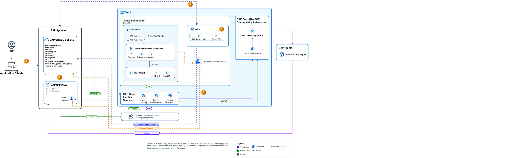

---
############################################################
#                Beginning of Front Matter                 #
############################################################
#                     [DO NOT MODIFY]                      #
############################################################
id: id-ra0027
slug: /ref-arch/4173e60b83
sidebar_position: 27
sidebar_custom_props:
    category_index:
############################################################
#     You can modify the front matter properties below     #
############################################################
title: Implementing and Extending SAP Joule
description: Explore key topics for implementing and extending SAP Joule, from enterprise integration with systems like SAP S/4HANA and SAP SuccessFactors to building custom skills and agents with Joule Studio and SAP BTP
sidebar_label: Implementing and Extending SAP Joule
keywords: 
  - sap
image: img/logo.svg
tags: 
  - sap
hide_table_of_contents: false
hide_title: false
toc_min_heading_level: 2
toc_max_heading_level: 4
draft: true
unlisted: false
contributors:
    - anbazhagana-uma
    - pra1veenk
last_update:
    date: 2025-10-29
    author: anbazhagana-uma 
############################################################
#                   End of Front Matter                    #
############################################################
---

<!-- Add the 'why?' for this architecture. Why do we have it? What is its purpose -->
Joule is an AI-powered co-pilot designed to enhance productivity and decision-making within enterprise environments. 
It revolutionizes how you interact with SAP applications, making every touchpoint count and every task simpler. Joule is embedded across SAP Enterprise Solutions portfolio accessible to all users, providing contextual assistance, automating routine tasks, and delivering insights that drive better business outcomes.

Joule interactions are achieved using advanced algorithms and large language models (LLM) for user queries and user intents. If a user posts a question to Joule, the copilot understands the intent and with the help of the integration with your SAP Business Applications, it gives the appropriate response.

This reference architecture outlines the key components and best practices for implementing and extending SAP Joule, enabling organizations to leverage its capabilities effectively. This architecture is designed to provide a comprehensive understanding of how to integrate Joule with existing enterprise systems, build custom skills and agents, and optimize its performance for specific business needs.

## Joule Key Capabilities

Joule Capabilities are categorized into different patterns.

**Transactional Pattern:** - Provides our users a direct entry point to SAP the backend system. Triggering and influencing business processes with the power of natural language and generative AI. E.g. purchase orders which need to be reviewed and approved, job positions which are created, OR any other CRUD (Create, Read, Update, Delete) based interactions. All our Cloud products are currently developing such content packages for Joule for the most relevant user interactions.

**Navigational Pattern:** - The navigational pattern helps our users handle business processes themselves in the relevant SAP screen. Joule allows users to navigate directly where they want to go. This is especially helpful for users who are not very familiar with navigating SAP applications.

**Informational Pattern:** - The informational pattern provides knowledge-based results. These are for example policy related questions. This can be based on SAP-owned content or could be customer-owned content as well using Document Grounding.

**Analytical Pattern:** - The analytical pattern provides insights and data analysis capabilities. Users can ask questions related to business metrics, trends, and performance indicators, and Joule will provide relevant insights based on the integrated datasources.

## Architecture

<!-- The drawio "image" should appear right after the Solution Diagram SVG image -->
<!-- Note: [PLACEHOLDER] Please update the drawio with your architecture's drawio  -->

The architecture describes the key components and interactions involved in implementing and extending SAP Joule within an enterprise environment. In order to achieve unified experience with Joule, the below architecture outlines the list of components and the activities required for implementation.

## Flow

The solution architecture flow for implementing and extending SAP Joule involves several key steps:

- **SAP BTP** , Joule and SAP Build Workzone entitlements establish the foundation for implementing and extending Joule capabilities. This serves as the foundation for Joule to interact with SAP Business Applications and other integrated systems.System Landscape, the SAP Business Application systems (e.g., SAP S/4HANA, SAP SuccessFactors) are properly set up and configured. If the systems are under the same customer contract, this should be auto-discovered in the System Landscape or else this can be manually added. 

- **SAP Cloud Identity Services** manages user authentication and authorization for secure access to Joule and integrated systems. A common SAP Cloud Identity Services for multiple SAP Business Applications with common domain URL is recommended.

- **SAP Enterprise Systems:** connects Joule with existing enterprise systems such as SAP S/4HANA, SAP SuccessFactors, and other third-party applications to enable seamless data exchange and process automation.

- **Third-party Identity Providers:** supports integration with external identity providers for enhanced security and user management. (Optional)

The application flow for Joule interactions typically involves the following steps:

1. Users interact with Joule through natural language queries or commands within the SAP Business Application interface. 

2. Joule UI forwards the user's request to the Joule Service hosted on SAP BTP.

3. Joule processes the user input using advanced algorithms and large language models (LLM) to understand the intent behind the query.

4. Joule uses pre-configured Destination in SAP BTP and based on the recognized intent, Joule retrieves relevant data from the connected SAP Business Applications via Connectivity Service in SAP BTP and calls the OData API to fetch the required information.

5. Joule generates a response based on the retrieved data and the user's intent, providing insights, recommendations, or actions as needed.

## Characteristics

<!-- Add your characteristics content here -->
- **Revolutionize User Experience:** Joule transforms how users interact with SAP applications by providing contextual assistance, automating routine tasks, and delivering insights that drive better business outcomes.

- **End User Interactions:** Joule enhances end-user interactions by accelerating every process with single AI copilot to get comprehensive insights and perform tasks across all your SAP solutions.

- **Seamless Integration and Reliable Insights from Enterprise Systems:** Joule seamlessly integrates with existing enterprise systems with native access to your data, providing data context with role-based access to ensure reliable insights and recommendations.

- **Customizable and Extensible:** Organizations can build custom skills and agents using Joule Studio and SAP BTP, tailoring the copilot's capabilities to meet specific business needs.

- **Security and Compliance:** Joule adheres to stringent security and compliance standards, ensuring that sensitive business data is protected throughout the interaction process.

- **Human-centric governance:** Build-in responsible AI to safeguard against inappropriate content and ensure compliance with organizational policies.SAP’s AI ethics policy adopts the 10 guiding principles of the UNESCO Recommendation on the Ethics of Artificial Intelligence. The principles aim to ensure that AI technologies are developed and used in ways that respect human rights, promote fairness, and contribute to sustainable development.

## Examples in an SAP context

<!-- Add your SAP context examples here -->

- [SAP Business AI - Joule Capabilities](https://discovery-center.cloud.sap/ai-catalog/?quickFilter=joule)

## Services and Components

<!-- Add your services and components here -->

-   [SAP Build, Joule Studio](https://discovery-center.cloud.sap/ai-feature/e93aa292-e7f4-449d-9586-f1a8510d5ab6/)
-   [SAP Build](https://discovery-center.cloud.sap/serviceCatalog/sap-build/?region=all)
-   [SAP AI Core](https://discovery-center.cloud.sap/serviceCatalog/sap-ai-core/?region=all)
-   [Document Grounding](https://discovery-center.cloud.sap/ai-feature/fedeca14-3e69-472c-a0ea-82396735c35f/)
-   [SAP Build Process Automation](https://discovery-center.cloud.sap/serviceCatalog/sap-build-process-automation?region=all)
-   [SAP Cloud Identity Services](https://discovery-center.cloud.sap/serviceCatalog/cloud-identity-services?region=all)
-   [SAP Connectivity service](https://discovery-center.cloud.sap/serviceCatalog/connectivity-service?region=all)
-   [SAP Destination service](https://discovery-center.cloud.sap/serviceCatalog/destination?region=all)

## Resources

<!-- Add your resources here -->

- [SAP Joule Product Page](https://help.sap.com/docs/joule)
- [SAP Joule (sap.com)](https://www.sap.com/india/products/artificial-intelligence/ai-assistant.html)
- [SAP Joule Community](https://community.sap.com/topics/joule)
- [SAP Learning Journey - Provisioning and Implementing Joule](https://learning.sap.com/learning-journeys/provisioning-and-implementing-joule)

## Related Missions

<!-- Add related missions here -->
- [SAP Discovery Center Missions - Joule](https://discovery-center.cloud.sap/missionCatalog/?search=joule)

