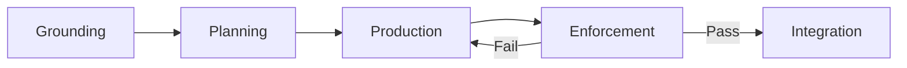

AI coding agents generate code rapidly, but the cost of ungrounded generation compounds across quality, security, rework and time to value. Without authoritative sources they produce code on top of incorrect APIs, deprecated patterns and insecure dependencies. Agentic engineering with context engineering addresses this by connecting coding agents to an infrastructure of SAP knowledge sources, automated quality pipelines and governed model access so that generated code is produced rapidly with enhanced quality for the enterprise.

This reference architecture defines the system that makes agentic engineering accelerate BTP extensions while keeping the S/4HANA core clean. Context engineering is central: humans and agents co-create specifications before code generation begins, agents follow authoritative SAP knowledge, code is produced in parallel on isolated worktrees, and LiteLLM with SAP Generative AI Hub provides the enterprise foundation for model access.

## Key Outcomes

- **Faster Time to Value**: Parallel code production across specialized agents compresses delivery timelines from weeks to days for standard BTP extensions.
- **Higher Code Quality**: Grounding through SAP MCP servers eliminates hallucinated APIs, deprecated syntax and incorrect annotation patterns at generation time rather than at review time.
- **Reduced Rework**: Specifications co-created before generation ensure alignment between requirements and implementation, catching misunderstandings before code exists.
- **Governed Model Access**: A single proxy endpoint enforces enterprise compliance, content filtering and audit logging across all foundation model interactions.
- **Compounding Returns**: Every fix, edge case and workaround feeds back into the knowledge infrastructure, making each subsequent generation more accurate than the last.

### User Journey: SAP Developer (Alex)

:::note[Introducing Alex]
Alex is a senior CAP developer building S/4HANA side-by-side extensions on SAP BTP. His team delivers 3-4 extensions per quarter and has adopted agentic engineering to accelerate delivery without sacrificing quality. Alex expects **grounded code** that uses current CAP and Fiori APIs from day one, **parallel execution** across backend and frontend concerns, **deterministic quality gates** that catch regressions before review, and **governed model access** through SAP Generative AI Hub. He wants to focus on architecture decisions and acceptance criteria, not on fixing hallucinated annotations or chasing deprecated APIs.
:::

## Design Principles

- **Grounded by Construction**: Context engineering ensures agents consult authoritative SAP sources before every generation decision. MCP servers, persistent rules and context-activated skills compound to eliminate hallucinated APIs, deprecated syntax and incorrect annotation patterns.
- **Deterministic Enforcement**: The quality pipeline executes automatically at lifecycle hooks without relying on agent judgment. A hook that blocks a commit on test failure cannot be reasoned away or bypassed.
- **Unified Model Access**: The foundation model proxy normalizes provider differences behind a single endpoint, enabling cross-model review and strength-based routing while enforcing enterprise compliance through SAP Generative AI Hub.
- **Progressive Trust**: The coding agent operates under least-privilege defaults. Permission scopes widen only after the agent passes defined quality thresholds, balancing safety with development velocity.
- **Federated Governance**: The skill registry controls which skills and MCP servers are available to agents across the organization. Version pinning, approval workflows and a deprecation lifecycle align agent behaviors with enterprise security and compliance requirements.
- **Compounding Knowledge**: Every fix, edge case and workaround feeds back into the context engineering layer as updated specifications, project rules, skills or persistent memory. Reusable behaviors publish to the skill registry, turning project-local knowledge into organization-wide assets.

## Architecture

The architecture comprises five components with the agent harness as the central actor.

| Component | Role |
|---|---|
| Agent Harness | Hosts the coding agent and its grounding context: project specifications, persistent rules and skills loaded from the skill registry. Orchestrates specialized agents across isolated worktrees |
| SAP Build MCP Servers | Exposes authoritative CAP and Fiori patterns to the agent at generation time, overriding stale training data |
| Fiori MCP Server | Provides current annotation schemas and Fiori Elements patterns for UI generation |
| UI5 Web Components MCP Server | Exposes UI5 component APIs and usage patterns for frontend code generation |
| Skill Registry | Governs reusable agent behaviors with version pinning, approval workflows and cross-team distribution |
| Quality Pipeline | Deterministic enforcement boundary that treats all agent-generated code as untrusted. Executes linters, tests, security scans and browser verification at commit, push and CI hooks without agent involvement |
| Foundation Model Proxy | LiteLLM hosted on SAP BTP routes requests through SAP AI Core and SAP Generative AI Hub for strength-based routing, compliance filtering and model normalization |
| SAP BTP Runtime | Deployment target for CAP-based side-by-side extensions preserving the clean S/4HANA core |
| SAP HANA Cloud | Provides the managed persistence layer for CAP services and vector storage for grounding use cases |
| SAP Integration Suite | Connects extensions to S/4HANA and other systems via events and APIs |
| SAP BTP Audit Log Service | Records model interactions and agent actions for enterprise compliance and auditability |

## Development Lifecycle

:::note[User Journey: Alex]
Alex writes the acceptance criteria, approves the plan, and reviews the final PR. The agents handle everything in between: grounding, decomposition, parallel generation, and quality enforcement.
:::

1. **Grounding** - The developer loads project skills from the governed registry, connects SAP MCP servers for CAP, Fiori and UI5, and co-creates a markdown specification capturing requirements, test cases, acceptance criteria and non-functional constraints.
2. **Planning** - The coding agent decomposes the specification into a dependency-mapped plan and assigns tasks to specialized agents (backend, frontend, testing) operating in isolated worktrees. The developer approves the plan before execution begins.
3. **Production** - Specialized agents execute tasks concurrently, querying SAP MCP servers for authoritative patterns that override training data, coordinating interface contracts through the agent harness, and updating the specification when encountering implementation gaps.
4. **Enforcement** - The quality pipeline treats all agent-generated code as untrusted, executing the test suite, linters, security scans and browser-based verification against the full codebase. Non-conforming code returns to agents for correction.
5. **Integration** - A reviewer agent pre-screens the consolidated pull request, flagging code that does not trace to a specification requirement. The developer validates against acceptance criteria, and the reviewed branch merges with semantic commits carrying testing evidence and requirement traceability.

## Deployment Scenarios

:::note[User Journey: Alex]
Alex's team started brownfield: they retrofitted agentic engineering into an existing CAP extension project, adding MCP servers and quality gates incrementally over two sprints.
:::

### Greenfield

**Scenario A: Full Agentic Setup from Day One**

For new BTP extension projects starting without existing code. The team provisions the complete infrastructure upfront: skill registry, MCP server connections, quality pipeline hooks, LiteLLM configuration and SAP Generative AI Hub integration. This approach delivers maximum velocity from the first sprint but requires initial investment in infrastructure setup.

**Recommendation**: Best for teams with prior agentic engineering experience or dedicated platform engineering support.

**Scenario B: Incremental Adoption**

For new projects where the team is learning agentic engineering practices. Start with a single coding agent, one MCP server (CAP or Fiori) and basic pre-commit hooks. Add the skill registry, multi-agent orchestration and strength-based routing as the team builds confidence.

**Recommendation**: Best for teams adopting agentic engineering for the first time on a new project.

### Brownfield

**Scenario C: Retrofit into Existing BTP Extension**

For active projects with established codebases. Introduce agentic engineering incrementally: first add project rules and persistent instructions that encode existing conventions, then connect MCP servers for grounding, then layer in quality pipeline hooks. The existing test suite becomes the initial enforcement boundary.

**Recommendation**: Best for teams that want to accelerate an in-flight project without disrupting current delivery cadence.

**Scenario D: Phased Rollout Across Teams**

For organizations adopting agentic engineering across multiple projects. A platform team provisions shared infrastructure (skill registry, LiteLLM proxy, MCP server hosting) and onboards project teams in waves. Each wave produces validated skills and rules that feed the registry for subsequent teams.

**Recommendation**: Best for enterprise-scale adoption where governance, consistency and knowledge sharing across teams are priorities.

## Examples in an SAP Context

- **CAP Application Grounded by MCP**: Skills route every CDS decision through the CAP MCP server and every annotation through the Fiori MCP server. The quality pipeline runs the UI5 linter and Fiori annotation validator before any commit advances, producing code that follows current best practices from the first generation.
- **On-Premise Extension with Cloud AI**: Foundation model access connects an S/4HANA on-premise extension to models on SAP AI Core through SAP Generative AI Hub. The on-premise system retains its existing deployment while the extension gains AI-assisted development capabilities without requiring migration to Rise or public cloud.
- **Multi-Agent Team Delivery**: The coding agent assigns backend, frontend and testing concerns to specialized agents, each operating in an isolated git worktree. Agents execute tasks within dependency waves, communicating through the built-in task coordination system. Features converge through pull requests gated by the quality pipeline.
- **Cross-Model Review**: Foundation model access routes CAP service generation to one model, annotation review to a second and structured output validation to a third. SAP Generative AI Hub ensures every model is enterprise-approved. No agent code changes are required to switch or add models.

## Best-Practice Checklist

- **Spec Before Code** - Co-create specifications with acceptance criteria before any agent generates code. Ambiguous requirements produce ambiguous output.
- **Ground Every Decision** - Connect MCP servers for every SAP framework in use. Ungrounded generation defaults to training data, which drifts from current APIs.
- **Treat Agent Output as Untrusted** - Run the full quality pipeline on every commit regardless of which agent produced it. No exceptions, no bypasses.
- **Least-Privilege Defaults** - Start agents with minimal permissions. Expand scope only after quality thresholds are met.
- **Pin Skill Versions** - Lock skill and MCP server versions per project. Uncontrolled updates propagate breaking changes across teams.
- **Semantic Commits** - Require detailed commit messages that explain what changed and why. Agents use commit history as a knowledge source for future generations.
- **Isolate Worktrees** - Each agent operates in its own git worktree. Shared working directories create merge conflicts and race conditions.
- **Feed Back Learnings** - After every fix or edge case, update project rules, skills or specifications. Knowledge that stays in a developer's head does not compound.
- **Review the Spec, Not Just the Code** - When a PR fails review, update the specification with the feedback before re-entering the production cycle.
- **Audit Model Usage** - Monitor SAP Generative AI Hub logs for cost, latency and compliance. Strength-based routing is only effective when informed by usage data.

## Conclusion

:::note[User Journey: Alex]
With agentic engineering in place, Alex's team delivers extensions faster with fewer defects. He focuses on architecture and acceptance criteria while agents handle grounded code production, and the quality pipeline ensures nothing reaches main without passing every gate.
:::

Agentic engineering transforms how SAP development teams build BTP extensions. By connecting coding agents to authoritative SAP knowledge through context engineering, enforcing quality through deterministic pipelines, and governing model access through SAP Generative AI Hub, organizations can accelerate delivery while improving code quality. The architecture scales from a single developer with one coding agent to enterprise teams with federated governance, and the knowledge infrastructure compounds value with every session.

## Services and Components

- [SAP AI Core](https://discovery-center.cloud.sap/serviceCatalog/sap-ai-core)
- [SAP Generative AI Hub](https://help.sap.com/docs/sap-ai-core/sap-ai-core-service-guide/generative-ai-hub-in-sap-ai-core)
- [SAP Cloud Application Programming Model](https://cap.cloud.sap/docs/)
- [SAP HANA Cloud](https://discovery-center.cloud.sap/serviceCatalog/sap-hana-cloud)
- [SAP Integration Suite](https://discovery-center.cloud.sap/serviceCatalog/integration-suite)
- [SAP Business Technology Platform](https://www.sap.com/products/technology-platform.html)
- [SAP Build MCP Servers](https://community.sap.com/t5/technology-blog-posts-by-sap/sap-build-introduces-new-mcp-servers-to-enable-agentic-development-for/ba-p/14205602)
- [Fiori MCP Server](https://www.npmjs.com/package/@sap-ux/fiori-mcp-server)
- [UI5 Web Components MCP Server](https://github.com/UI5/webcomponents-mcp-server)
- [SAP BTP Audit Log Service](https://help.sap.com/docs/btp/sap-business-technology-platform/audit-log-service)

## Resources

- [SAP Build Introduces New MCP Servers](https://community.sap.com/t5/technology-blog-posts-by-sap/sap-build-introduces-new-mcp-servers-to-enable-agentic-development-for/ba-p/14205602)
- [LiteLLM SAP Provider Documentation](https://docs.litellm.ai/docs/providers/sap)
- [Set Up Generative AI Hub in SAP AI Core](https://developers.sap.com/tutorials/ai-core-genaihub-provisioning.html)
- [Claude Code Documentation](https://docs.anthropic.com/en/docs/claude-code/overview)
- [Cline Documentation](https://docs.cline.bot/getting-started/what-is-cline)
- [SAP Architecture Center](https://architecture.learning.sap.com/)
- [Context Hub](https://github.com/andrewyng/context-hub)
- [SAP Cloud Application Programming Model (CAP)](https://cap.cloud.sap/docs/)
- [SAP Cloud SDK for AI](https://help.sap.com/docs/sap-ai-core)
- [Building Effective Agents (Anthropic)](https://www.anthropic.com/research/building-effective-agents)
- [OpenSpec: Spec-Driven Development](https://github.com/Fission-AI/OpenSpec)
- [Fiori MCP Server](https://www.npmjs.com/package/@sap-ux/fiori-mcp-server)
- [UI5 Web Components MCP Server](https://github.com/UI5/webcomponents-mcp-server)

## Related Missions
