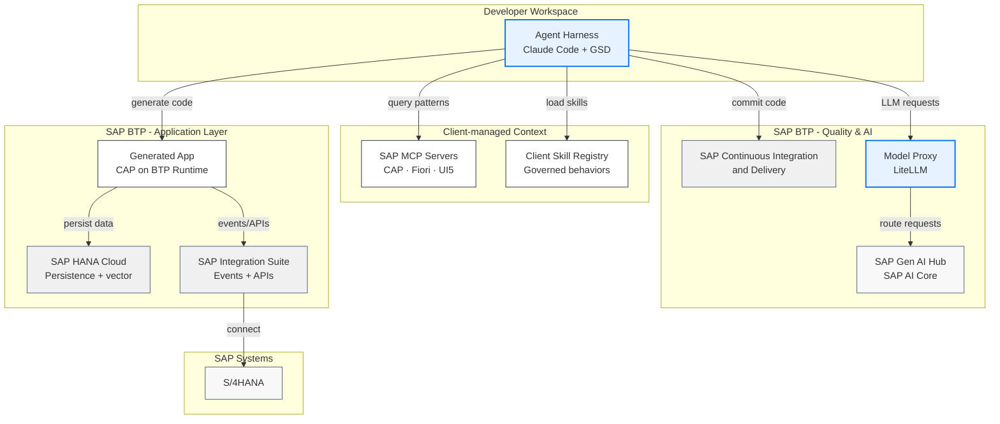

AI coding agents generate code rapidly, but ungrounded generation compounds costs across quality, security, rework and time to value. Without authoritative sources these agents produce code based on incorrect APIs, deprecated patterns and insecure dependencies. Agentic engineering with context engineering addresses this by connecting coding agents to an infrastructure of SAP knowledge sources, automated quality pipelines and governed model access. Generated code is produced rapidly with quality appropriate for enterprise deployment.

This reference architecture defines the system that enables agentic engineering to accelerate BTP extensions while preserving the clean S/4HANA core. Context engineering is central: humans and agents co-create specifications before code generation begins, agents follow authoritative SAP knowledge sources, code is produced in parallel across isolated worktrees, and LiteLLM with SAP Generative AI Hub provides the enterprise foundation for model access.

### User Journey: SAP Developer (Alex)

:::note[Introducing Alex]
Alex is a senior CAP developer building S/4HANA side-by-side extensions on SAP BTP. His team has adopted agentic engineering to accelerate delivery while maintaining quality. Alex expects grounded code that uses current CAP and Fiori APIs, parallel execution across backend and frontend concerns, deterministic quality gates that catch regressions before review, and governed model access through SAP Generative AI Hub. He focuses on architecture decisions and acceptance criteria rather than on fixing hallucinated annotations or tracking deprecated APIs.
:::

## Architecture

The architecture comprises several components with the agent harness as the central actor.

### Component Details

-   **Agent Harness:** Coding agent produces code in grounded context containing project specifications, skills and orchestrates specialized agents across isolated worktrees.
-   **Client-managed MCP Servers:** Expose authoritative CAP and Fiori patterns to the agent at generation time, overriding stale training data. Includes SAP Build MCP Servers, Fiori MCP Server, and UI5 Web Components MCP Server.
-   **Client-managed Skill Registry:** Governs reusable agent behaviors with version pinning, approval workflows and cross-team distribution.
-   **Quality Pipeline:** Deterministic enforcement boundary that executes linters, tests, security scans and CI hooks. Implemented through SAP Continuous Integration and Delivery service on BTP.
-   **Foundation Model Proxy:** LiteLLM hosted on SAP BTP routes requests through SAP AI Core and SAP Generative AI Hub for strength-based routing, compliance filtering and model normalization.
-   **SAP BTP Runtime:** Deployment target for CAP-based side-by-side extensions preserving the clean S/4HANA core.
-   **SAP HANA Cloud:** Provides the managed persistence layer for CAP services and vector storage for grounding use cases.
-   **SAP Integration Suite:** Connects extensions to S/4HANA and other systems through events and APIs.

## Flow

:::note[User Journey: Alex]
Alex writes the acceptance criteria, approves the plan that grounds the agent. The agents handle everything in between: task decomposition, parallel generation with increased code quality.
:::

1. **Grounding:** The developer loads project skills from the governed registry, connects SAP MCP servers for CAP, Fiori and UI5, and co-creates a markdown specification capturing requirements, test cases, acceptance criteria and non-functional constraints.
2. **Planning:** The coding agent decomposes the specification into a dependency-mapped plan and assigns tasks to specialized agents (backend, frontend, testing) operating in isolated worktrees. The developer approves the plan before execution begins.
3. **Production:** Specialized agents execute tasks concurrently, querying SAP MCP servers for authoritative patterns that override training data, coordinating interface contracts through the agent harness, and updating the specification when encountering implementation gaps.
4. **Enforcement:** The quality pipeline treats all agent-generated code as untrusted and executes without agent involvement. Test suites, linters, security scans and browser-based verification run against the full codebase at commit, push and CI hooks. Non-conforming code returns to agents for correction.
5. **Integration:** A reviewer agent pre-screens the consolidated pull request, flagging code that does not trace to a specification requirement. The developer validates against acceptance criteria, and the reviewed branch merges with semantic commits carrying testing evidence and requirement traceability.

## Characteristics

-   **Specification-Driven Grounding:** Humans and agents co-create specifications before code generation begins. Spec-driven development tools such as GSD and Superpowers enhance specifications by identifying gaps and increasing detail, providing agents with complete instructions that eliminate ambiguity. MCP servers, persistent rules and context-activated skills deliver authoritative SAP sources at generation time, eliminating hallucinated APIs, deprecated syntax and incorrect annotation patterns.
-   **Unified Model Access:** The foundation model proxy normalizes provider differences behind a single endpoint, enabling cross-model review and strength-based routing while enforcing enterprise compliance through SAP Generative AI Hub.
-   **Zero Trust:** The coding agent operates under the least-privilege principle. Permission scopes widen only after the agent passes defined quality thresholds, balancing safety with development velocity.
-   **Deterministic Enforcement:** The traditional quality pipeline remains in place and runs automatically at git hooks and CI/CD gates without relying on agent judgment. Linters, tests, security scans and required status checks enforce correctness mechanically, independent of what the agent produces or suggests.
-   **Federated Governance:** The skill registry controls which skills and tools including MCP servers are available to agents across the organization. Version pinning, approval workflows and a deprecation lifecycle align agent behaviors with enterprise security and compliance requirements.
-   **Compounding Knowledge:** Every fix, edge case and workaround feeds back into markdowns as updated specifications, project rules, skills or persistent memory. Reusable behaviors publish to the skill registry, turning project-local knowledge into organization-wide assets.

## Business Problem

Accelerating S/4HANA extension delivery with coding agents while maintaining enterprise requirements for security, performance and reliability requires addressing the knowledge barrier inherent in CAP, Fiori Elements and UI5. Annotation semantics, OData wiring and CDS conventions appear correct after implementation by the coding agent but fail silently at runtime, producing blank pages, empty columns and non-functional UI elements that require extensive debugging cycles to identify and correct.

### Solution

Connecting coding agents to SAP MCP servers for CAP, Fiori and UI5 reduces architectural error rates by grounding generation in authoritative sources that override stale training data. Specifications co-created before generation, quality pipelines treating all output as untrusted, and model access routed through SAP Generative AI Hub transform debugging cycles that previously consumed days per feature into rapid delivery with elevated code quality.

## Key Outcomes

-   **Faster Time to Value:** Parallel code production across specialized agents compresses delivery timelines from weeks to days for standard BTP extensions.
-   **Higher Code Quality:** Grounding through SAP MCP servers eliminates hallucinated APIs, deprecated syntax and incorrect annotation patterns at generation time rather than at review time.
-   **Reduced Rework:** SAP-grounded specifications co-created before generation ensure alignment between requirements and implementation, catching misunderstandings before code exists.
-   **Governed Model Access:** A single proxy endpoint enforces enterprise compliance, content filtering and audit logging across all foundation model interactions.
-   **Compounding Returns:** Every fix, edge case and workaround feeds back into the knowledge infrastructure, making each subsequent generation more accurate than the last.

:::note[User Journey: Alex]
With this architecture, Alex's team delivers BTP extensions for S/4HANA faster with agentic engineering. He focuses on architecture and acceptance criteria while agents handle grounded code production, and the quality pipeline ensures nothing reaches main without passing every gate.
:::

Agentic engineering transforms how development teams build BTP extensions. By connecting coding agents to authoritative SAP knowledge through context engineering, enforcing quality through deterministic pipelines, and governing model access through SAP Generative AI Hub, organizations accelerate delivery while improving code quality. The architecture scales from a single developer with one coding agent to enterprise teams with federated governance, and the knowledge infrastructure compounds value with every session.

## Resources

- [LiteLLM SAP Provider Documentation](https://docs.litellm.ai/docs/providers/sap)
- [SAP CAP MCP Server](https://github.com/cap-js/mcp-server?tab=readme-ov-file#cli-usage)
- [Fiori MCP Server](https://www.npmjs.com/package/@sap-ux/fiori-mcp-server)
- [UI5 Web Components MCP Server](https://github.com/UI5/webcomponents-mcp-server)
- [SAP AI Core](https://discovery-center.cloud.sap/serviceCatalog/sap-ai-core)
- [SAP Generative AI Hub](https://help.sap.com/docs/sap-ai-core/sap-ai-core-service-guide/generative-ai-hub-in-sap-ai-core)
- [SAP Cloud Application Programming Model](https://cap.cloud.sap/docs/)
- [SAP HANA Cloud](https://discovery-center.cloud.sap/serviceCatalog/sap-hana-cloud)
- [SAP Integration Suite](https://discovery-center.cloud.sap/serviceCatalog/integration-suite)
- [SAP Business Technology Platform](https://www.sap.com/products/technology-platform.html)
- [SAP Cloud Application Programming Model (CAP)](https://cap.cloud.sap/docs/)
- [SAP Cloud SDK for AI](https://help.sap.com/docs/sap-ai-core)