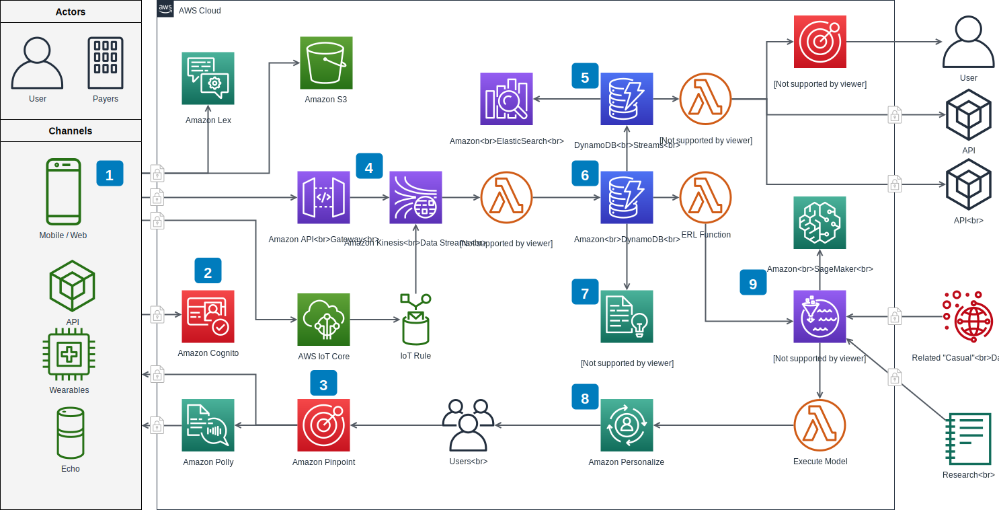

## Architecture Principles for building EDA Application

We will add a drawio here


How about an image now?



Cool some tables

| headd | ha | asd |
| --- | --- | --- |
| asd | asdf | asd |
| asd | asd | asd |

```
Code Block
```

> SOme Quoation

:::info
This is an info btw
:::

