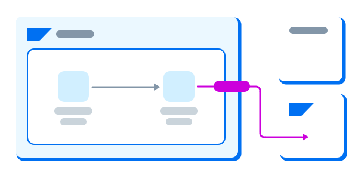

# SAP Reference Architectures: Building Blocks for Business Success

## What are SAP Reference Architectures?

SAP Reference Architectures are blueprints for business transformation. They are standardized templates that show how SAP applications, data services, and AI technologies connect across the enterprise. By presenting proven patterns, these architectures reduce complexity, accelerate adoption, and ensure consistency.

Instead of building solutions from scratch, organizations can apply SAP Reference Architectures to guide decisions and align projects. They represent SAP’s best practices in action, combining cloud, on-premises, and partner technologies into a unified approach. This ensures every design is focused on business outcomes while maintaining technical integrity.

Reference architectures also help businesses align their strategic goals with technology execution. They provide clarity for decision-makers, architects, and business leaders, ensuring that innovation happens within a framework of stability. By establishing a common foundation, SAP Reference Architectures help enterprises remain agile, reduce risk, and respond quickly to new challenges.

SAP’s approach to reference architectures is also designed for hybrid and multi-cloud landscapes. Whether operating in regulated industries, managing global supply chains, or adopting advanced analytics, reference architectures give organizations a secure and consistent foundation. They balance innovation with governance, ensuring solutions can scale and evolve while remaining compliant with global standards.

## Why SAP Reference Architectures Matter

Reference architectures are more than diagrams. They represent a strategic framework that links business objectives with the systems that deliver them. They highlight how SAP solutions interact across landscapes and give leaders the insights they need to balance innovation with governance.

Adopting SAP Reference Architectures means gaining:

- A common foundation for projects across geographies and industries.  
- A clear path to leveraging solutions like SAP Business Technology Platform (SAP BTP)  
- A repeatable framework that evolves with SAP’s innovation roadmap.  
- A shared vocabulary that unites business and technical teams.  
- A risk-reducing approach that accelerates adoption while maintaining compliance.  

This holistic approach ensures that efficiency, scalability, interoperability, and standardization are built into every solution from the start.

<em></em>

## Efficiency in SAP Reference Architectures

### Defining Efficiency
Efficiency is the ability to achieve maximum results with minimal effort or wasted resources. Within SAP Reference Architectures, efficiency means optimizing processes, aligning business needs with technology, and avoiding unnecessary complexity.

### Efficiency in Business Processes
By applying structured templates, organizations can reduce delays, minimize redundancies, and ensure resources are applied where they add the most value. Business processes such as finance, supply chain, and customer engagement are streamlined when guided by reference architectures.

### Efficiency in Governance
Efficiency also improves long-term governance. Standardized designs reduce the overhead of audits, compliance checks, and maintenance activities. This makes operations leaner and more predictable.

### Efficiency for Enterprise Agility
In a rapidly changing market, efficiency also represents adaptability. SAP Reference Architectures give organizations the agility to adjust processes and adopt innovations without lengthy redesigns. This ensures that efficiency is not just about reducing effort today but about maintaining responsiveness to change over time.

## Scalability for Business Growth

### Defining Scalability
Scalability is the capacity of a system to grow smoothly as demand increases. SAP Reference Architectures are designed with growth in mind, ensuring that organizations can add users, data, and functionality without disruption.

### Technical Scalability
SAP Reference Architectures describe patterns that prepare systems for additional workloads and services. Cloud-native capabilities in SAP BTP allow organizations to expand infrastructure without major redesigns.

### Data Scalability
As data volumes expand, scalability ensures that analytics and AI services continue to perform effectively. Reference architectures highlight how to structure solutions so that data flows remain consistent even at scale.

### Organizational Scalability
Growth often involves expanding into new markets or adding new business units. With SAP Reference Architectures, enterprises can extend operations globally while maintaining consistent governance and design.

### Scalability as Business Resilience
Scalable architectures also support regulatory compliance and business continuity. As organizations grow, they must manage diverse regulations, markets, and customer expectations. Scalability ensures that growth happens without compromising performance or compliance.

## Interoperability Across SAP Solutions

### Defining Interoperability
Interoperability is the ability of different systems to work together and exchange information seamlessly. In the SAP landscape, interoperability ensures that processes connect across applications, data flows remain consistent, and collaboration is possible across ecosystems.

### Process Interoperability
SAP Reference Architectures show how processes such as procurement, finance, and human resources align across solutions. Interoperability guarantees that workflows span departments without silos or duplication.

### Data Interoperability
Consistent data exchange is critical for analytics and reporting. Reference architectures define how SAP applications, partner systems, and external services share data securely and reliably.

### Semantic Interoperability
Interoperability also includes ensuring that data carries the same meaning across systems. SAP Reference Architectures clarify definitions and structures so that insights remain accurate across platforms.

### Interoperability as Industry Collaboration
For enterprises that operate across industries and borders, interoperability creates a foundation for cooperation. SAP Reference Architectures support integration with partners and regulators, ensuring consistency across industries and compliance environments.

## Standardization for Consistency

### Defining Standardization
Standardization means applying consistent frameworks, rules, and templates across all designs. In SAP Reference Architectures, standardization ensures repeatability, reliability, and ease of governance.

### Standardization in Governance
When solutions are standardized, compliance checks, audits, and security practices are easier to enforce. This strengthens governance and reduces risks in complex landscapes.

### Standardization Across Industries
SAP Reference Architectures bring consistency even in diverse industries. Whether applied to manufacturing, retail, or finance, the same principles ensure that deployments align with global standards while supporting industry-specific needs.

### Standardization Across Teams and Regions
Large enterprises often operate across multiple geographies. Standardization ensures that all teams follow the same approach, making collaboration smoother and reducing the risks of fragmented system designs.

### Standardization as a Catalyst for Innovation
By creating a predictable foundation, standardization frees organizations to innovate. New SAP capabilities can be adopted quickly because the underlying structure remains consistent. Innovation can flourish without destabilizing the environment.

## Best Practices Built into SAP Reference Architectures

SAP Reference Architectures embed best practices derived from decades of experience. These include:

- Consistent alignment with global standards.  
- Frameworks that reduce risks during deployment.  
- Templates that accelerate the adoption of SAP capabilities.  
- Designs that evolve alongside SAP’s innovation cycles.  

Best practices ensure that organizations not only adopt SAP solutions effectively but also stay prepared for future advances.

## How SAP Reference Architectures Support Digital Transformation

Digital transformation is a top priority for businesses worldwide. SAP Reference Architectures provide the foundation for these initiatives by aligning technology with business outcomes.

- **Cloud adoption:** architectures show how to migrate and optimize solutions on SAP BTP.  
- **AI and automation:** frameworks support the integration of intelligent services into daily operations.  
- **Sustainability:** standardized designs help organizations track and improve resource efficiency.  
- **Customer experience:** interoperability across applications creates seamless digital journeys.  
- **Global operations:** scalable architectures support expansion into new markets with consistency.  

SAP Reference Architectures make digital transformation more achievable by combining efficiency, scalability, interoperability, and standardization into a single framework.

## Why Choose SAP Reference Architectures?

Enterprises that adopt SAP Reference Architectures benefit from:

- **Agility:** frameworks built on SAP BTP that allow rapid innovation.  
- **Reliability:** grounded in proven global standards.  
- **Business focus:** designed to support SAP processes in every industry.  
- **Future alignment:** continuously updated to reflect SAP’s innovation roadmap.  

SAP Reference Architectures are more than technical diagrams. They are strategic enablers that connect business strategy with technology execution, making them central to successful transformation.

## Conclusion

SAP Reference Architectures deliver efficiency, scalability, interoperability, and standardization in one unified approach. They provide clarity for decision-makers, reduce complexity for teams, and establish a strong foundation for digital transformation.

By adopting these architectures, organizations accelerate outcomes, remain resilient in fast-changing markets, and ensure their SAP landscape evolves with confidence.

SAP Reference Architectures are not only patterns of design. They are the building blocks of business success, helping enterprises align strategy with execution, optimize performance, and prepare for the future of SAP solutions.

Looking forward, SAP Reference Architectures will continue to evolve alongside advances in AI, automation, and sustainability. By combining efficiency, scalability, interoperability, and standardization, they will remain at the center of how organizations achieve digital transformation and create lasting value.