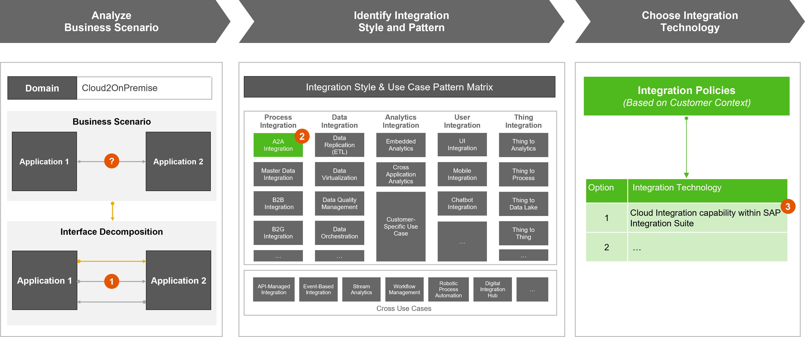
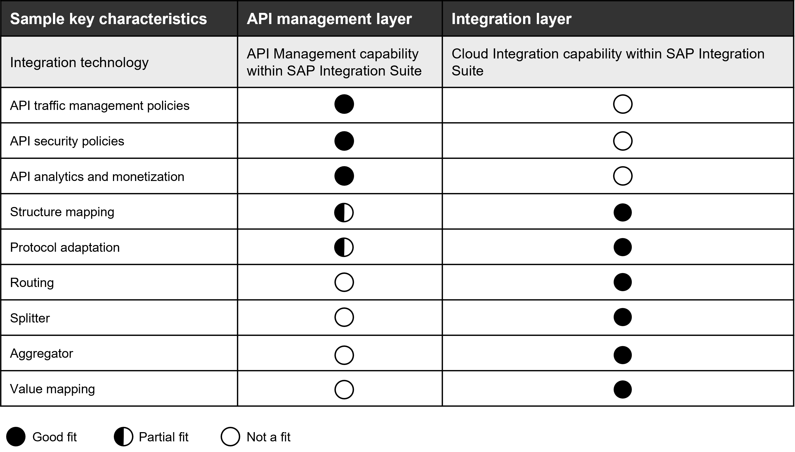

<!-- loio57a7941b790b46e399e66553a4c25463 -->

# Assess Your Interfaces

Integration developers determine the right integration technology by assessing interfaces of business applications to integrate with.

***

<a name="loio57a7941b790b46e399e66553a4c25463__section_mhn_ysj_swb"/>

## Context

A typical task of integration developers in implementation projects is to blueprint integration scenarios between two business applications \(see ? in the image below\). Typically, a business scenario is broken down into technical interfaces. Next, an integration developer needs to classify/assess the technical interface whether it belongs to a process-, data-, analytics-, user-, or thing-centric integration style \(see 1 in the image below\) followed by the applicable integration use case pattern \(see 2 in the image below\). An integration developer can select the appropriate integration technology with the help of the defined integration policies \(see number 3 in the image below\).

For identifying the integration style and use case pattern, the first phase of the SAP Integration Solution Advisory Methodology provides a set of characteristics.

In addition to that, it also offers detailed guidance for integration developers on selected topics where more than one implementation option exists. The following example compares the API management and the integration layer with the help of sample characteristics. Depending on the required characteristics, an integration developer can make a sound decision about which implementation option to choose.

Typically integration developers conduct such interface assessments.

***

<a name="loio57a7941b790b46e399e66553a4c25463__section_x5q_ftj_swb"/>

## Procedure

You should use the Integration Assessment capability within SAP Integration Suite for interface assessments: It offers a questionnaire-based approach which helps integration developers to determine the best fitting integration technology \(or a combination of several integration technologies\) for a specific integration requirement. Integration Assessment includes recommendations for SAP integration technologies that you can also adapt to reflect customer context factors. These recommendations are updated by SAP on a regular basis. It also documents the technology decisions made. You can also define your own questionnaires for enabling more tailored and/or detailed recommendations for your integration developers.

1.  Templates-based approach

    Not available. Leverage the Integration Assessment capability within SAP Integration Suite instead \(see below\).

2.  Tool-based approach

    Perform this step using Integration Assessment. For more information, see: [Determine an Integration Technology](https://help.sap.com/docs/SAP_INTEGRATION_SUITE/51ab953548be4459bfe8539ecaeee98d/69b6daede23544c5bf90bac10a7c76aa.html?locale=en-US).

