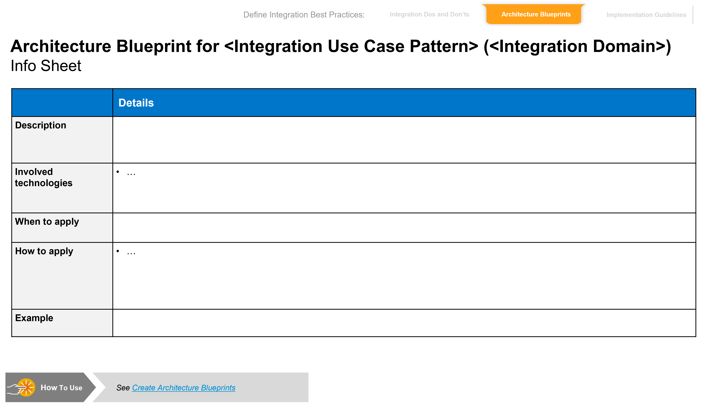

<!-- loioc6bac952bb464f97b6cece3eec9cfd5f -->

# Create Your Architecture Blueprints

Describe the scope of integration technologies, including relationships and characteristics with the help of architecture diagrams.

***

<a name="loioc6bac952bb464f97b6cece3eec9cfd5f__section_b5s_spq_swb"/>

## Context

Architecture blueprints provide a template solution of an architecture for a particular domain. For the domain of enterprise integration, an architecture blueprint is a visual representation that maps out the components of an integration architecture, including their relationship and integration touch points with business applications. Other details such as interface technologies, security features and data types used should be added if these are essential for an IT architecture.

Following the concepts of this methodology you create your architecture blueprints on the level of an integration use case pattern and an integration domain. Sometimes more than one architectural option for an integration architecture may exist, for instance because of a business specific or infrastructure-specific solution design.

The following graphic shows an architecture blueprint sample of the cross-use case pattern “digital integration hub” for the integration domain Cloud2OnPremise.

  
  
**Architecture Blueprint \(Example\)**

")

Furthermore, you complemented each architecture blueprint with a set of characteristics that can help integration developers to identify the most appropriate architecture for an integration requirement.

***

<a name="loioc6bac952bb464f97b6cece3eec9cfd5f__section_j43_wpq_swb"/>

## Procedure

For creating architecture blueprints in an SAP context, it’s recommended that you use the official icons and samples for SAP Business Technology Platform Solution Diagrams. These include a comprehensive set of official SAP Business Technology Platform service icons, capability icons, graphical design elements and a set of sample diagrams. You use these tools also to design architecture blueprints for enterprise integration, which illustrate the work of SAP Business Technology Platform, its services, solutions and SAP products, and the ways of their use.

With the official set of icons, design guidelines and sample diagrams you can create your own SAP Business Technology Platform solution diagrams by using Microsoft PowerPoint or an enterprise architecture / diagramming tool of your choice.

1.  Templates-based approach

      
      
    **Architecture Blueprint Description Template**

    

    1.  Download the Microsoft PowerPoint slide deck SAP Business Technology Platform Solution Diagrams & Icons Guideline.
    2.  Download the SAP Business Technology Platform icons collection ZIP file \(icons in PNG or SVG format\) for use inside architecture blueprints.
    3.  Follow the Terms Of Use for the SAP Business Technology Platform Solution Diagrams, Design Elements & Icons.
    4.  Find the icon, diagram design elements, and sample diagrams that you need.
    5.  Create your own architecture blueprints for enterprise integration.
    6.  Download the “Architecture Blueprint Description Template” and do the following:
        -   On the first slide: Add the architecture blueprint diagram you’ve created before and supply it with a set of characteristics/selection criteria.
        -   On the second slide \(info sheet\) add the following information:
            1.  Description: Describe the purpose of the architecture blueprint.
            2.  Involved technologies: List mandatory and conditional technologies
            3.  When to apply: Describe the business context.
            4.  How to apply: Refer to implementation information, such as how-to guides, tutorials.
            5.  Example: Add a concrete example about an implementation of this blueprint in your organization.

2.  Tool-based approach

    This step is not supported by the Integration Assessment capability within SAP Integration Suite. Please leverage the templates-based approach \(see above\).

**Related Information**  

[Download the SAP Business Technology Platform Solution Diagrams & Icons Guideline](https://d.dam.sap.com/a/JPUXye?rc=10)

[Download the SAP Business Technology Platform icons collection](https://d.dam.sap.com/a/s9tyyJJ?rc=10)

[Download the Architecture Blueprint Description Template](https://d.dam.sap.com/a/oLUK36M?rc=10)

[Download the Terms of Use for the SAP Business Technology Platform Solution Diagrams, Design Elements & Icons](https://d.dam.sap.com/a/nXJJmw/SAP%20Business%20Technology%20Platform%20Diagrams%20and%20Icons%20Terms%20of%20Use.pdf?rc=10)

