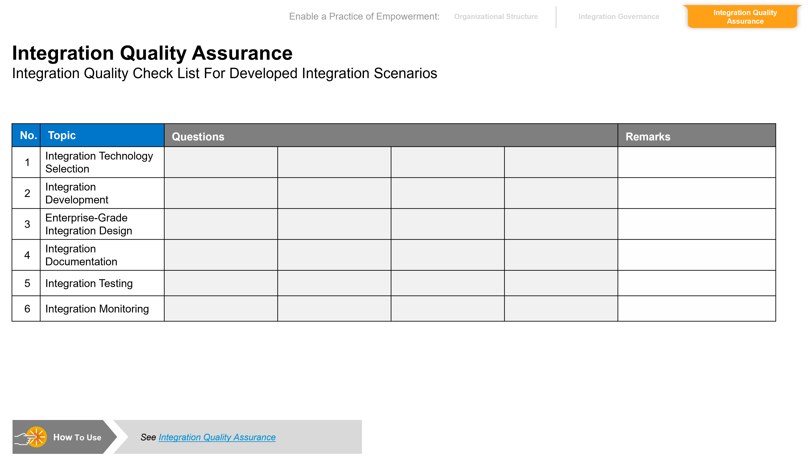

<!-- loio510460779ea2460ca158d78e1747dc66 -->

Enrich existing quality assurance measures with a lightweight integration checklist to coach integration developers, too.

***

<a name="loio510460779ea2460ca158d78e1747dc66__section_egd_rks_swb"/>

## Context

Most organizations have quality assurance methods for their IT projects in place to ensure compliance against defined standards such as security, performance and usability standards. Integration is an integral part of most IT projects like implementing a new business application or upgrading/migrating an existing one. In this way, integration aspects need also be reflected as part of those quality assurance methods. Quality assurance measures are ideally part of every stage of an IT project, ranging from the requirements gathering, design, implementation, testing, go-live, and operations.

The SAP Integration Solution Advisory Methodology is an ideal means for supporting the quality assurance measures in an organization: It helps you to define certain standards for integration scenarios, for instance by propagating integration best practices, and to introduce integration governance.

An integral part of quality assurance measures is testing. Here again, integration developments are supposed to follow the general testing approach for software developments in an organization. These cosist of different testing types such as unit, integration, and regression testing and techniques such as manual or automated tests that may cover requirements that are functional or non-functional \(such as performance, updates\). The table below shows test types which are common for enterprise integration.

|Test type|Description|Example in an integration context|
|---------|-----------|---------------------------------|
|Unit testing|Verify the functional correctness of individual software modules. Tests are conducted by the respective developer.|-   Testing connectivity \(configured APIs, connectors\)
-   Testing mapping programs

|
|Integration testing|Verify the interfaces between components against a software design.|-   Testing of an integration scenario
-   Testing of replication batch jobs

|
|Regression testing|Finding defects after a major code change has occurred. Specifically, it seeks to uncover software regressions, as degraded or lost features, including old bugs that have come back.|-   Retesting existing integration scenarios after the upgrade of an integrated business application

|

You can complement your existing quality assurance process with an integration quality checklist that is a questionnaire-based assessment of a developed integration scenario. The objective of this complementing measure is to increase the integration quality of developed integration scenarios while coaching integration developers at the same time. Such checks can be offered as self-service to integration development teams, including citizen integrators. The Integration Center of Excellence team should also offer to run such assessments in an interview-based style, which will allow them to coach integration developers regarding quality requirements. The results of such checks are properly documented and can be assigned to corresponding test cases.

The integration quality checklist is defined and is supervised by integration architects of the Integration Center of Excellence.

***

<a name="loio510460779ea2460ca158d78e1747dc66__section_lj2_dls_swb"/>

## Procedure

SAP offers a template of an integration quality checklist, which is meant to complement – and not to replace – classical integration testing processes within an organization. Integration testing is not supported by the Integration Assessment capability within SAP Integration Suite. However, SAP and SAP partners offer tools and services that make integration testing possible such as the Customer Test Service for the Cloud Integration capability within SAP Integration Suite.

1.  Templates-based approach

      
      
    **Integration Quality Checklist Template**

    

    Download the “Integration Quality Checklist Template” and do the following \(one time activity\):

    1.  Check the list of proposed topics: Adjust them and add your own ones if needed.
    2.  For every topic, add appropriate questions about integration quality requirements to the questions section.

    For a developed integration scenario fill this template out as follows:

    1.  Rate the fulfillment level of each requirement per question and color code the corresponding table field as follows:
        -   If the integration quality requirement is met, then apply a green background color.
        -   If the integration quality requirement isn’t met, then apply a red background color.

2.  Tool-based approach

    This step is not supported by the Integration Assessment capability within SAP Integration Suite. Please use the templates-based approach instead \(see above\) and utilize testing tools and services applicable for your specific integration technologies.

**Related Information**  

[Customer Test Service for the Cloud Integration capability within SAP Integration Suite](https://help.sap.com/docs/CLOUD_INTEGRATION/368c481cd6954bdfa5d0435479fd4eaf/756967bd4de24001b6aae504c7468662.html?q=test%20service&locale=en-US)

[Download the Integration Quality Check List Template](https://d.dam.sap.com/a/vVPmYe5?rc=10)

