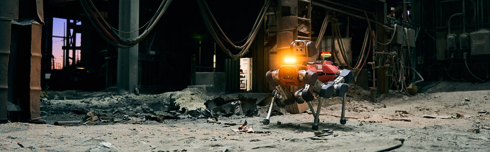

In some of the world’s most dangerous industrial environments, including oil refineries, offshore wind platforms, cement plants, and chemical facilities, human access is often limited, risky, or prohibitively expensive. 

<!-- truncate -->

ANYbotics, a Swiss robotics company, has stepped into this space with a vision to shape a safer future for industrial inspection, one where robots operate as autonomous members of the inspection team, running inspection operations integrated into plant maintenance workflows. 

This vision is embodied in the company’s “ANYmal”: a four-legged inspection robot designed specifically for heavy industry.

Unlike general-purpose robotics platforms, ANYmal is engineered to operate in “big, dirty, dusty, and dangerous” environments, says Nicole Zingg, director of Technology Partnerships at ANYbotics. Places where stairs, corrosion, heat, and unreliable connectivity are the norm, not the exception.

But hardware, Zingg says, is only one part of the puzzle that makes ANYmal indispensable to customers.

### Inspection robotics is about data
“We build a hardware platform,” Zingg explains, “but inspection robotics is really about data that is consistent and trustworthy.”

ANYmal autonomously navigates industrial sites to collect data that goes beyond what a human can collect alone. Beyond just visual inspection, its sensors also collect multi-modal data, including thermal imaging, ultrasonic leak detection, gas concentration detection, acoustic anomaly detection, and more. The observations are fed into what ANYbotics calls “inspection intelligence,” which transforms the collected data into actionable operational insights. The result is higher uptime, longer asset lifecycles, and, most importantly, safer working conditions for humans.

ANYmal can make a huge impact on operations. One offshore wind customer, Zingg says, has used ANYmal to manage all inspections and has eliminated the need to send personnel to a remote platform for months. When human intervention was eventually required, ANYmal’s data from prior inspections made all the difference. The customer already knew exactly what was wrong, which expert to send, and what equipment to bring—avoiding costly and risky trial-and-error site visits.

Yet for ANYbotics, delivering insights is not enough if those insights are not integrated in the software systems customers use.

### “SAP is where ANYbotics needs to be native”
Through extensive user research, ANYbotics discovered that many plant operators, maintenance managers, and field service teams already run their daily operations in SAP. Work orders, asset histories, performance trends, and decisions all flow through SAP systems. “If customers are using SAP, SAP is where ANYbotics needs to be native,” Zingg says.

Meanwhile, SAP’s Project Embodied AI was looking for robotics companies to partner with. The project focuses on extending the impact of SAP Business AI into physical operations by enabling robots to autonomously perform complex tasks with an understanding of the broader business context.

It was clearly a perfect fit and has delivered advantages for both companies.

On the system side, a continuous, unbroken digital thread connects ANYbotics insights from industrial inspections to data in SAP systems, helping inform key business and operational decisions across the organization.

For end users, embedding ANYmal directly into familiar SAP workflows can also help ease adoption, since introducing robotics into already stretched industrial workforces can trigger anxiety. Concerns about job security, workflow disruption, and complexity are common, but embedding ANYmal directly into familiar SAP workflows can help reduce that friction, Zingg explains.

### Treating robots as part of the workforce
The first major integration point was SAP Field Service Management. Rather than sending only human technicians, customers can now dispatch work orders directly to ANYmal as they would to any other field team member. The robot then autonomously executes inspection tasks, gathers data, and reports the results directly back into a company’s SAP system.

From there, the integration expanded into asset-related scenarios and is now moving toward broader enablement via SAP Business Technology Platform (SAP BTP), with the goal of allowing robot-generated data to land wherever customers need it in their SAP landscape.

The ambition is not to force humans to adapt to robots, but for robots to adapt to human workflows. “ANYmal has to put data in the SAP system, just like human team members,” Zingg notes. ANYmal becomes another worker in the same operational system of record.

### Project Embodied AI in practice
This combination of ANYbotics robotic technology with SAP bridges the gap between physical operations and enterprise applications and tangibly reflects the goal of Project Embodied AI.

On the SAP side, AI agents operate on ANYmal’s robotic systems to execute physical tasks, such as safety inspections.

On the ANYbotics side, ANYmal is a physical object that moves through space, perceives its environment, and acts within real-world constraints. ANYmal uses SAP historic and time-series data to inform decisions while at the same time remaining fully autonomous even in environments with no connectivity.

It’s important to note, Zingg stresses, that ANYbotics has control over ANYmal’s behavior and inspection execution, while SAP has control over the business context such as work orders, asset data, or operational priorities. It is the SAP business context that informs how ANYmal’s insights are consumed and acted upon while ANYbotics controls ANYmal’s physical interactions.

### Scaling safely and responsibly
Today, more than 200 ANYmal robots are already in productive use worldwide, with inspection deployments in heavy-industry environments that would otherwise require constant human exposure.

Safety remains central to ANYbotics. Each deployment includes extensive testing and an on-site field engineer who helps ANYmal learn and validate its environment and trains customer teams on safe operational procedures. While ANYmal is built to work independently, humans remain firmly in the loop.

### A glimpse into the future
As industries face labor shortages and aging workforces, undocumented expertise can all too often be lost. With autonomous inspection robots such as ANYmal, this knowledge is captured and turned into programs that can run day in and day out across multiple sites. The captured data flows into SAP to become organizational intelligence that survives any workforce turnover.  

ANYbotics’ partnership with SAP shows that this combination of robotics and enterprise software is moving swiftly from the experimental stage to real-world implementation.

In the future, industrial inspection will be powered by AI, not as disembodied dashboards or isolated machines, but as an integrated intelligent system where physical robots and digital workflows in SAP systems operate as one.

In that future, robots like ANYmal are no longer novelties. They are coworkers, albeit mechanical four-legged ones, quietly extending human capability into places humans were never meant to go. These robots, together with SAP, are shaping for a future where dirty, dangerous, and dusty industrial inspections are being transformed into business insights.

Alexa MacDonald

Top image courtesy of ANYbotics
